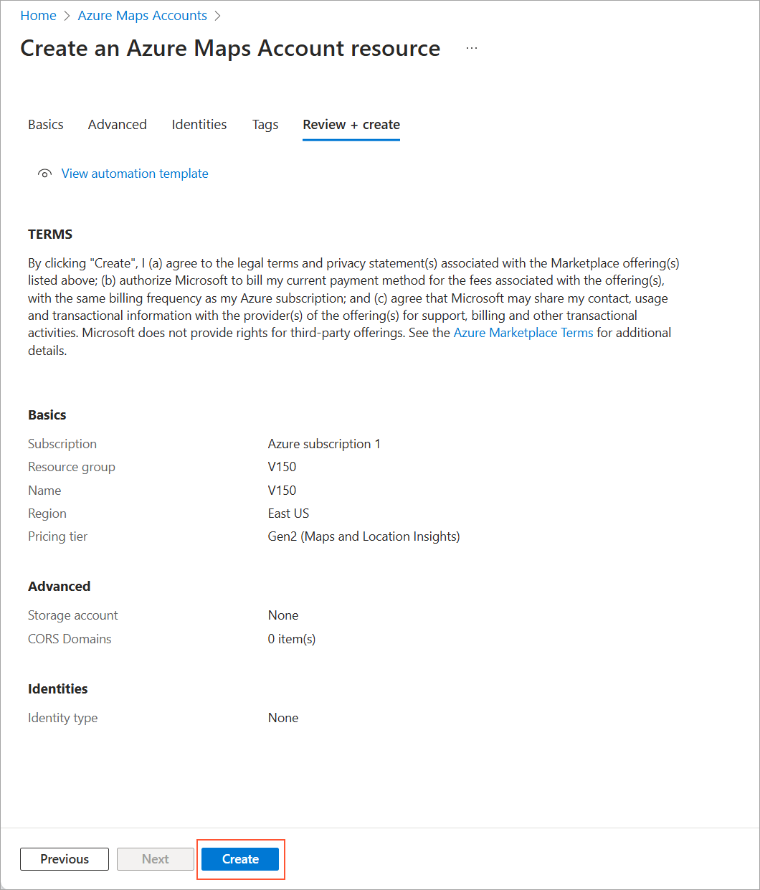
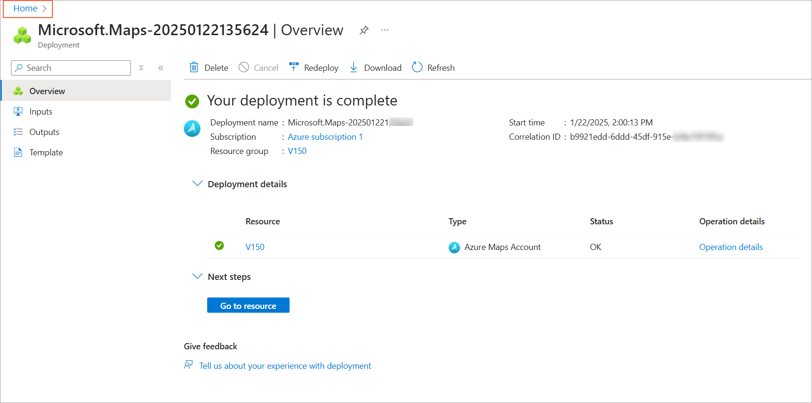
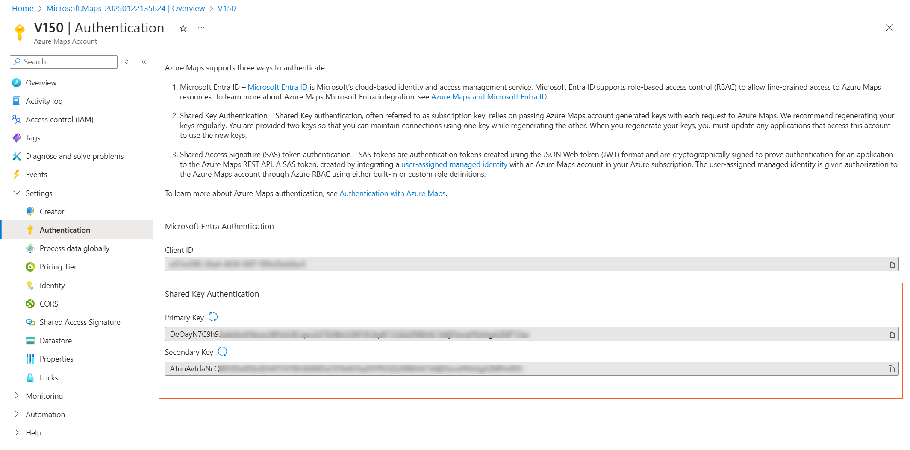
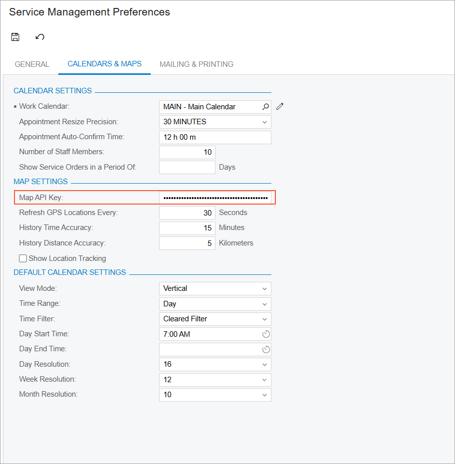

# Route Management: Implementation Activity {#_7498313c-5ca0-495e-abae-7c521b5cc6ba .task}

In this activity, you will enable the *Route Management* feature to activate its functionality. You will review the system-wide settings that affect route management and generate a map key in your Azure Maps account. Finally, you will specify this key on the [Service Management Preferences](../UserGuide/FS_10_01_00.md) \(FS100100\) form.

**Attention:** To get started with the Azure Maps, you need to have an existing Microsoft account or create a new one before you proceed.

## Story {#section_cc4_jp1_ldc .section}

Suppose that you are an administrative user of the SweetLife Service and Equipment Sales Center. You are configuring the minimum required functionality to prepare the system for the route management functionality to be used.

## Configuration Overview { .section}

In the *U100* dataset, the following tasks have been performed for the purposes of this activity:

1.  The service management functionality has been prepared, as described in [Basic Service Management Configuration: Implementation Activity](config_ServMgmt_with_Inventory_Implem_Activity.md).
2.  The order management configuration has been implemented, as described in [Configuration of Order Management: Implementation Checklist](config_InvMgmt_Basic_Implem_Checklist.md).
3.  On the [Numbering Sequences](../UserGuide/CS_20_10_10.md) \(CS201010\) form, the numbering sequences to be used for equipment entities have been created.
4.  On the [Enable/Disable Features](../UserGuide/CS_10_00_00.md) \(CS100000\) form, the *Service Management* feature has been enabled.

## Process Overview {#section_hfh_b41_ldc .section}

On the [Enable/Disable Features](../UserGuide/CS_10_00_00.md) \(CS100000\) form, you will enable the *Route Management* feature. Then, on the [Route Management Preferences](../UserGuide/FS_10_04_00.md) \(FS100400\) form, you will review the basic route management settings. Finally, you will generate a map key on the [https://portal.azure.com](https://portal.azure.com) website and specify this key on the [Service Management Preferences](../UserGuide/FS_10_01_00.md) \(FS100100\) form.

## System Preparation {#section_xyr_cbv_3dc .section}

Before you start setting up the route management functionality, do the following:

1.  On the Acumatica ERP website, sign in to a company with the *U100* dataset preloaded as a system administrator. You should sign in by using the *gibbs* username and the *123* password.
2.  On the Company and Branch Selection menu on the top pane of the Acumatica ERP screen, select the *SWEETEQUIP - Service and Equipment Sales Center* branch.

## Step 1: Enabling the Route Management Feature {#section_uyc_mp1_ldc .section}

Perform the following instructions:

1.  On the [Enable/Disable Features](../UserGuide/CS_10_00_00.md) \(CS100000\) form, click **Modify**.
2.  Under **Service Management**, select the **Route Management** check box.
3.  On the toolbar, click **Enable**.

## Step 2: Reviewing the Route Management Preferences {#section_qxq_mp1_ldc .section}

Do the following:

1.  Open the [Route Management Preferences](../UserGuide/FS_10_04_00.md) \(FS100400\) form.
2.  On the **General** tab, review the settings as follows:
    -   In the **Route Numbering Sequence** box, ensure that the *FSROUTE* numbering sequence is specified.

        This numbering sequence will be used to assign identifiers to route executions.

    -   Ensure that the **Calculate Route Statistics Automatically** check box is selected.

        When this check box is selected, route executions are automatically calculated by the Azure Maps service.

## Step 3: Creating the Map API Key {#section_thg_np1_ldc .section}

The distances and travel times for each executed route are calculated by using the Azure Maps service. If a user rearranges the order of appointments within a route, Azure Maps replots and recalculates the route automatically. Using Azure Maps, you can easily track executed routes and their associated appointments for specific days, as well as the staff members assigned to execute those routes. To create and specify an Azure map key, follow these steps:

1.  Sign in to your Azure account on the Azure portal. If you don’t have an account, click **Try Azure for Free** at [https://portal.azure.com/](https://portal.azure.com/) to create one.

    **Important:** You must have a Microsoft account to sign in and create an Azure account. If you already have an Azure account, use your credentials to log in.

2.  On the main page, click **Azure Maps Accounts**.
3.  On the **Azure Maps Accounts** page, click **Create** in the top left corner.
4.  On the **Create an Azure Maps Account resource** page, fill in all required fields. For **Resource group**, click **Create new**. At the bottom, click **Review + create**.
5.  On the screen that appears, review the provided details and click **Create** \(as shown in the following screenshot\).

    

    An informational message will indicate that the keys are being developed.

6.  Once the process is complete, click **Home** \(shown in the screenshot below\), then **Settings**, and navigate to **Authentication**.

    

    On the page that opens, find the generated keys in the **Shared Key Authentication** section \(shown in the following screenshot\).

    

7.  Copy the value in the **Primary Key** box.
8.  Open the [Service Management Preferences](../UserGuide/FS_10_01_00.md) \(FS100100\) form. In the **Map API Key** box of the **Calendars &amp; Maps** tab, paste the copied value \(as shown in the following screenshot\).

    

9.  On the form toolbar, click **Save** to complete the setup.

**Parent topic:**[Configuring Route Management](../ImplementationGuide/config_RouteMgmt_Mapref.md)

