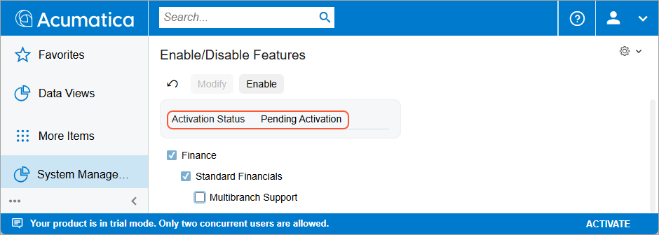
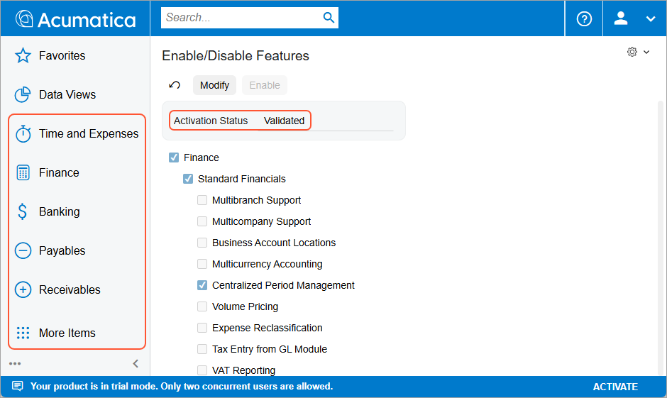
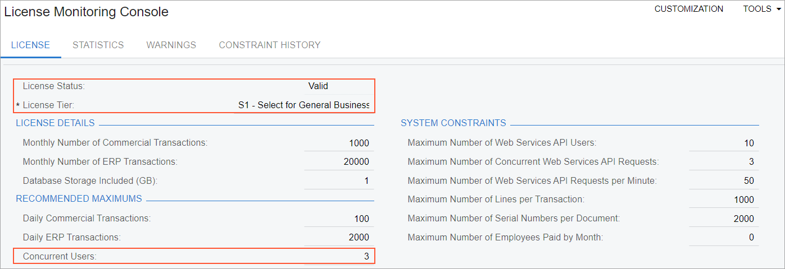

# Preparing an Instance: To Enable Features and Activate the License {#_9d9e039a-59ff-4b03-9246-68bcb75e4395 .task}

In the following activity, you will learn how to enable features in Acumatica ERP, activate the license, and review the license information.

## Story { .section}

Suppose that the SweetLife Fruits &amp; Jams company has purchased an Acumatica ERP subscription in Acumatica Business Cloud. The instance has been installed by SaaS engineers. You, as a system administrator, have received the instance URL and the credentials to the *admin* user. Now you need to prepare the instance for implementation. You are the first one to sign in to the instance, and activate and license it with the product key you have obtained from the sales representative. The company has purchased the S1 license tier with three concurrent users and five tenants. In addition to the default set of features, your company has purchased the basic functionality associated with the *Inventory and Order Management* group of features.

## Process Overview { .section}

To begin using the system after the installation, you will use the [Enable/Disable Features](../UserGuide/CS_10_00_00.md#) \(CS100000\) form to enable the standard set of features, which gives you the ability to access the [Activate License](../UserGuide/SM_20_15_10.md#) \(SM201510\) form. When you enable the features, you are still in trial mode. To remove the restrictions of the trial mode, you need to activate the license and enable the features that you bought in addition to the standard set.

## System Preparation { .section}

Before you perform the steps of this activity, make sure that the following tasks have been performed:

1.  You have installed an unlicensed Acumatica ERP instance in a tenant without any preloaded dataset \(out-of-the-box\).
2.  You make sure that the port 443 is open on the computer that is running the Acumatica ERP instance. You may have to open port 443 if the computer has a firewall enabled.
3.  You have signed in to Acumatica ERP with the following credentials:

    -   Username: *admin*
    -   Password: *setup* or the one provided to you by the person who did the installation
    **Tip:** When you sign in for the first time, the system requires you to change the password.

## Step 1: Enabling Features for the First Time { .section}

To enable features in Acumatica ERP for the first time, do the following:

1.  Open the [Enable/Disable Features](../UserGuide/CS_10_00_00.md#) \(CS100000\) form.

    Notice that a number of features are selected by default and the activation status is *Pending Activation*, as shown in the following screenshot.

    

2.  On the toolbar, click **Enable** to activate the selected features.

    The activation status of the currently selected set of features is now *Validated*. On the main menu \(the panel on the left side of the screen\), notice that new workspace menu items \(**Time and Expenses**, **Finance**, **Banking**, **Payables**, and **Receivables**\) have appeared that correspond to the features you have enabled, as the following screenshot demonstrates. You can now navigate to the forms in these workspaces.

    

## Step 2: Activating the License { .section}

To activate the license, do the following:

**Important:** Before you proceed with license activation on a real website, make sure that all Acumatica ERP users have saved their work and signed out of the system. During license activation, the Acumatica ERP instance will be restarted, and any unsaved work will be lost.

1.  Open the [Activate License](../UserGuide/SM_20_15_10.md#) \(SM201510\) form and do the following:

    1.  On the form toolbar, click **Enter License Key**.
    2.  In the **Activate New License** dialog box, enter the `918B-A728-0569-7FC6-D058` license key.
    3.  Click **OK** at the bottom of the dialog box.
    The system contacts the licensing server and validates the license online.

    **Attention:** The license key used in this activity is for training purposes only. The license will be deactivated in 24 hours and the instance will return to the trial mode. The license can be applied to an instance only once.

2.  In the **Agree to Proceed** dialog box, which opens, click the link to read the software license agreement, and if you agree to the terms of the agreement, click **Agree** to proceed with activation. The dialog box will close.
3.  In the Summary area of the form, review the license status \(*Valid*\), its validity period, and the number of users and tenants.
4.  In the table, review the features that this license supports.

    **Tip:** You can use the column filter for the **Activated** column to filter activated features.

5.  On the form toolbar, click **Apply License** to activate your license, and the system will restart the instance.

## Step 3: Enabling Additional Features { .section}

To enable additional features in Acumatica ERP, do the following:

1.  Open the [Enable/Disable Features](../UserGuide/CS_10_00_00.md#) \(CS100000\) form.

    Notice that the list of features is narrowed to the features allowed by the applied license.

2.  On the form toolbar, click **Modify**.
3.  In the list of features, select the check box next to the **Inventory and Order Management** feature.
4.  On the toolbar, click **Enable** to activate the selected features.

    The status of the currently selected feature set is now *Validated*. On the main menu, notice that new workspace menu items \(**Sales Orders**, **Purchases**, and **Inventory**\) have appeared that correspond to the feature you have enabled. You can now navigate to the forms in these workspaces.

## Step 4: Reviewing the License Information { .section}

To review the license information—which includes the license status and limitations, statistics about the commercial transactions, warnings, and statistics for constraints—do the following:

1.  Open the [License Monitoring Console](../UserGuide/SM_60_40_00.md#) \(SM604000\) form.
2.  On the **License** tab, which is shown in the screenshot below, review the information about your license.

    -   In the **License Status** read-only box, verify that the license status is *Valid*, which means that the instance is licensed and has been activated.
    -   In the **License Details** section, review the instance limitations.
    -   In the **Recommended Maximums** section, notice that the value in the **Concurrent Users** box is set to *3*. This means that three users can work in the system at the same time.
    

**Parent topic:**[Preparing an Instance for Implementation](../ImplementationGuide/config_SA_Prep_Instance_for_Implem_Mapref.md)

