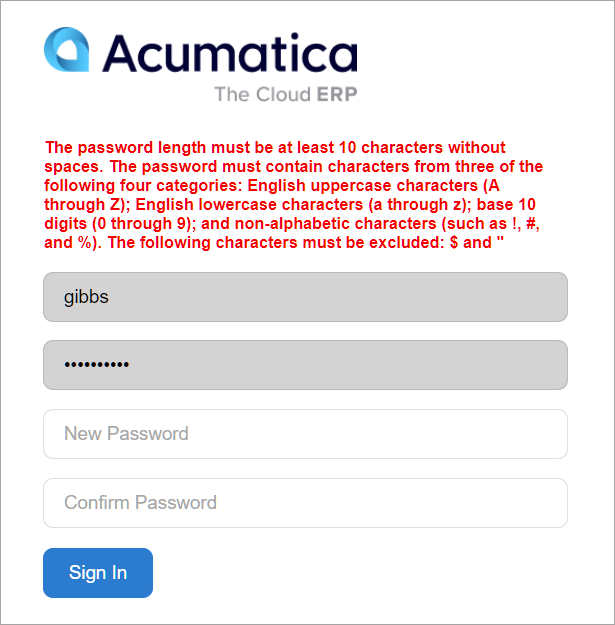
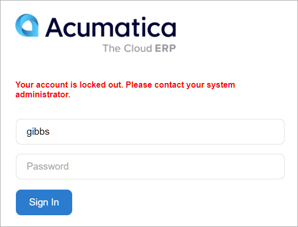

# Preparing an Instance: To Configure Secure Access for Implementers {#_47c45a6f-9d7a-4e61-85d7-66e7316676fb .task}

In the following activity, you will learn how to configure system-wide password and lockout policies and how to create user accounts for implementers.

## Story { .section}

Suppose that the SweetLife Fruits &amp; Jams company has purchased a cloud subscription for Acumatica ERP. You, as a system administrator, need to configure the secure access for the production tenant of the Acumatica ERP instance.

The company has the following security requirements:

-   Users should change their passwords twice a year—that is, every 180 days.
-   The minimum password length is 10 symbols without spaces.
-   A password must include Latin uppercase and lowercase letters, digits, or special characters, except for *$* and *"*.
-   A user has three attempts to enter a valid password; if an invalid password is entered on the fourth attempt, the user will be locked out for 15 minutes.
-   The system should reset the lockout counter when it has been 10 minutes since the first failed sign-in. That is, if a user enters the third invalid password 11 minutes after the first failed attempt, the system will not lock out the user, because the count of failed attempts was restarted 10 minutes after the first failed attempt.

The following people are to be involved in the implementation process:

-   You—Kimberly Gibbs, the system administrator with the SweetLife Fruits &amp; Jams company
-   Jerry Prado, who is an implementation consultant with the Adaptabiz company, one of Acumatica's partners

## Process Overview { .section}

To configure system-wide security policies, you will use the settings on the [Security Preferences](../UserGuide/SM_20_10_60.md) \(SM201060\) form. To meet character exception requirements, you will use a validation mask in addition to the password length and complexity requirements, and set up a custom alert message for incorrect passwords.

Then you will add the requested user accounts on the [Users](../UserGuide/SM_20_10_10.md) \(SM201010\) form. You will use your user account to validate the configured policies.

## System Preparation { .section}

Before you perform the steps of this activity, make sure that the following tasks have been performed:

1.  You have installed an Acumatica ERP instance with a tenant without any preloaded dataset \(out-of-the-box\).
2.  You have signed in to Acumatica ERP with the following credentials:
    -   Username: *admin*
    -   Password: The new password that you specified during the first sign-in
3.  You have enabled the default set of features on the [Enable/Disable Features](../UserGuide/CS_10_00_00.md#) \(CS100000\) form, as described in [Preparing an Instance: To Enable Features and Activate the License](config_SA_Prep_Instance_for_Implem_To_License_Activate.md).

## Step 1: Configuring the Password Policy { .section}

To configure the system-wide password policy, do the following:

1.  Open the [Security Preferences](../UserGuide/SM_20_10_60.md) \(SM201060\) form.
2.  In the **Password Policy** section of the form, select the **Password Expiry Period in Days** check box, and type `180` into the box next to it.
3.  Make sure that the **Minimum Characters in Password** check box is selected, and type `10` into the box next to it.
4.  Make sure that the **Password Must Meet Complexity Requirements** check box is selected, which will force users to use complex passwords with uppercase letters, digits, and special characters.
5.  In the **Additional Password Validation Mask** box, type the following regular expression:

    ```
    `^(?!.*[$ "]).*$`
    ```

    The expression verifies that the entered password has no spaces and does not contain the *$* or *"* character.

6.  In the **Incorrect Password Alert** box, type the following text: `The password length must be at least 10 characters without spaces. The password must contain characters from three of the following four categories: English uppercase characters (A through Z); English lowercase characters (a through z); base 10 digits (0 through 9); and non-alphabetic characters (such as !, #, and %). The following characters must be excluded: $ and ".`

    **Tip:** The box is expandable; you may want to adjust its size to be able to view the entire message.

7.  On the form toolbar, click **Save**.

## Step 2: Reviewing Account Lockout Policies { .section}

While you are still on the [Security Preferences](../UserGuide/SM_20_10_60.md) \(SM201060\) form, in the **Account Lockout Policy** section, review the following default values inserted by the system and make sure that they match the organization’s account lockout policies:

-   **Failed Sign-In Attempts Before Account Lockout**: `3`
-   **Account Lockout Duration \(Minutes\)**: `15`
-   **Reset Interval for Failed Sign-In Attempts \(Minutes\)**: `10`

## Step 3: Adding User Accounts { .section}

To add user accounts to the system, do the following:

1.  On the [Users](../UserGuide/SM_20_10_10.md) \(SM201010\) form, add a new record.
2.  In the **Login** box of the Summary area, type `gibbs`.
3.  Clear the **Generate Password** check box.
4.  In the **Password** box, type `Welcome123`.
5.  Specify the following user information:
    -   **First Name**: `Kimberly`
    -   **Last Name**: `Gibbs`
    -   **Email**: `gibbs@sweetlife.com`
    -   **Comment**: `Senior system administrator`
6.  Specify the following settings to configure individual password policy:
    -   **Allow Password Recovery**: Cleared
    -   **Allow Password Changes**: Selected
    -   **Password Never Expires**: Cleared
    -   **Force User to Change Password on Next Login**: Selected
7.  On the **Roles** tab, assign the following roles to the user by selecting the check box in the **Selected** column:
    -   *Administrator*
    -   *Customizer*
    -   *Field-Level Audit*
    -   *Internal User*
    -   *Wiki Admin*
8.  On the form toolbar, click **Save**.
9.  Click **Add New Record** on the form toolbar to add one more user, and specify the following settings in the Summary area:
    -   **Login**: `prado`
    -   **Generate Password**: Cleared
    -   **Password**: `Welcome123`
    -   **First Name**: `Jerry`
    -   **Last Name**: `Prado`
    -   **Email**: `jprado@adaptabiz.com`
    -   **Comment**: `Adaptabiz implementation consultant`
    -   **Allow Password Recovery**: Cleared
    -   **Allow Password Changes**: Selected
    -   **Password Never Expires**: Cleared
    -   **Force User to Change Password on Next Login**: Selected
10. On the **Roles** tab, assign the following roles to the user by selecting the check box in the **Selected** column:
    -   *Administrator*
    -   *Customizer*
    -   *Field-Level Audit*
    -   *Internal User*
    -   *Wiki Admin*
11. On the form toolbar, click **Save**.

## Step 4: Verifying the Password Policy { .section}

To verify the configured password policy, do the following:

1.  In the top right corner of the screen, click the *admin admin* username, and then select **Sign Out**.
2.  On the Sign-In page, enter `gibbs` as the username and `Welcome123` as the password. The system requests that you enter and confirm a new password.
3.  Enter `welcome"123` as the new password and its confirmation, and click **Sign In**. Because this password contains the prohibited *"* character, the system clears the entered values and displays the alert message that you configured, as shown in the following screenshot.

    

4.  Enter `123Welcome` as the new password and its confirmation, and click **Sign In**. The expression you entered complies with the password policy requirements and is accepted by the system as your new password.
5.  In the top right corner of the screen, click the *Kimberly Gibbs* username, and then select **Sign Out**.

## Step 5: Verifying the Lockout Policy { .section}

To verify the lockout policy you have configured, do the following:

1.  On the Sign-In page, enter `gibbs` as the username and `Welcome123` as the password. The system requests that you enter valid credentials.
2.  Again enter the incorrect password three more times. The system warns you that your account is locked out, as shown in the following screenshot.

    

3.  On the Sign-In page, enter `prado` for the username and `Welcome123` as the password. Enter `123Welcome` as the new password and its confirmation, and click **Sign In**. You have successfully signed in as Jerry Prado.
4.  Open the [Users](../UserGuide/SM_20_10_10.md) \(SM201010\) form.
5.  In the **Login** box, select *gibbs*. In the **Status** box, notice that the user status is *Temporarily Locked*.
6.  On the form toolbar, click **Unlock User**. Notice that the user status has changed to *Active*.

**Parent topic:**[Preparing an Instance for Implementation](../ImplementationGuide/config_SA_Prep_Instance_for_Implem_Mapref.md)

