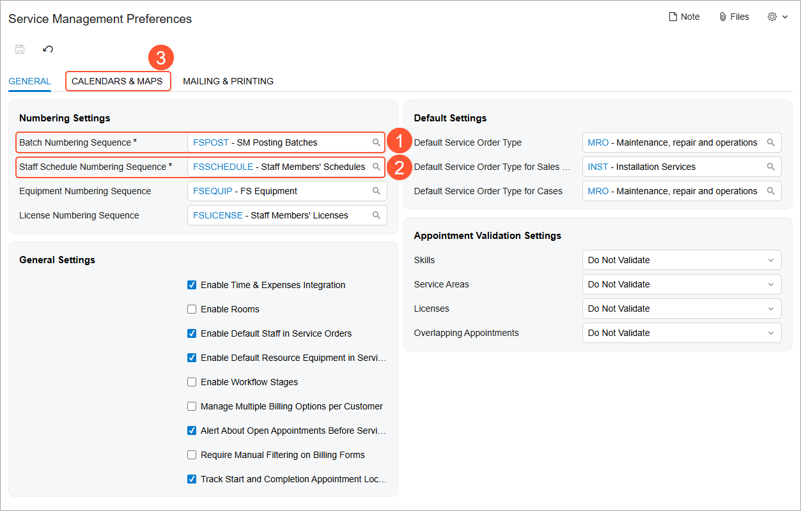

# Basic Service Management Configuration: Implementation Activity {#_41c105f2-33db-406c-bc24-a15ff54d3e4e .task}

In this implementation activity, you will learn how to enable the *Service Management* feature and review the basic service management settings.

**Attention:** This activity is based on the *U100* dataset. If you are using another dataset or if any system settings have been changed in *U100*, these changes can affect the workflow of the activity and the results of the processing. To avoid issues, restore the *U100* dataset to its initial state.

## Story { .section}

Imagine you are an administrative user of the SweetLife Service and Equipment Sales Center. Your task is to configure the essential functionality needed to prepare the system for processing service orders and for scheduling and managing appointments.

## Configuration Overview {#section_tz4_djx_cnb .section}

In the *U100* dataset, which you'll use to complete this lesson, the following setup has been configured. These settings ensure that the environment is ready for performing the activity:

-   The minimum system configuration, which is described in [Company with Branches that Do Not Require Balancing: General Information](config_Company_with_Branches_No_Balancing_GeneralInfo.md), has been performed.
-   The *SWEETLIFE* company has been created on the [Companies](../UserGuide/CS_10_15_00.md) \(CS101500\) form. This company has multiple branches created on the [Branches](../UserGuide/CS_10_20_00.md#) \(CS102000\) form, including *SWEETEQUIP \(Service and Equipment Sales Center\)*.
-   On the [Numbering Sequences](../UserGuide/CS_20_10_10.md) \(CS201010\) form, the *FSPOST - SM Posting Batches*, *FSSO - Service Orders*, and *FSSCHEDULE - Staff Members' Schedules* numbering sequences have been created.
-   On the [Work Calendar](../UserGuide/CS_20_90_00.md) \(CS209000\) form, the *MAIN* work calendar has been created to reflect the work days and times, and the unpaid break time of staff members.
-   On the [Service Management Preferences](../UserGuide/FS_10_01_00.md) \(FS100100\) form, the needed numbering sequences and work calendar have been specified.

## Process Overview { .section}

In this lesson, you will configure the basic service management settings by performing the following tasks:

1.  On the [Enable/Disable Features](../UserGuide/CS_10_00_00.md) \(CS100000\) form, you will enable the *Service Management* feature.
2.  On the [Numbering Sequences](../UserGuide/CS_20_10_10.md) \(CS201010\) form, you will review the following numbering sequences for service management entities: the numbering sequence to be used to assign identifiers to batches of billing documents, and the numbering sequence to be used for the reference numbers of the service orders of the service order types to be created in other activities of this part of the guide.
3.  On the [Work Calendar](../UserGuide/CS_20_90_00.md) \(CS209000\) form, you will review the calendar with the staff members' work days and work times for each day.
4.  On the [Service Management Preferences](../UserGuide/FS_10_01_00.md) \(FS100100\) form, you will ensure that the numbering sequences and the work calendar are specified.

## System Preparation { .section}

Before you start, launch the Acumatica ERP website, and sign in to a company with the *U100* dataset preloaded. Use the *gibbs* username and *123* password to sign in as a system administrator.

## Step 1: Enabling the Service Management Feature { .section}

To enable the *Service Management* feature, do the following:

1.  Open the [Enable/Disable Features](../UserGuide/CS_10_00_00.md) \(CS100000\) form.
2.  On the form toolbar, click **Modify**, which gives you the ability to change the set of selected features.
3.  Select the **Service Management** check box.
4.  On the form toolbar, click **Enable**. This saves your changes and enables the currently selected features.

## Step 2: Reviewing Numbering Sequences {#section_xpq_4rx_vtb .section}

To review the numbering sequences that have been created for service management batches, do the following:

1.  Open the [Numbering Sequences](../UserGuide/CS_20_10_10.md) \(CS201010\) form.
2.  In the **Numbering ID** box, select the *FSPOST* numbering sequence ID. The system uses this numbering sequence to automatically generate an ID for each GL batch created for a service document.

    Notice that this numbering sequence has the following settings:

    -   **Start Number**: `SM000001`
    -   **End Number**: `SM999999`
3.  In the **Numbering ID** box, select the *FSSO* numbering sequence ID. The system uses this numbering sequence to automatically generate a reference number for each new service order.

    Notice that this numbering sequence has the following settings:

    -   **Start Number**: `000001`
    -   **End Number**: `999999`
4.  In the **Numbering ID** box, select the *FSSCHEDULE* numbering sequence and review its settings. The system uses this numbering sequence to automatically generate an ID for each new staff members' schedule.

In Step 4 of this activity, you will make sure that the *FSPOST - SM Posting Batches* and *FSSCHEDULE - Staff Members' Schedules* sequences are specified on the [Service Management Preferences](../UserGuide/FS_10_01_00.md) \(FS100100\) form. You will specify the *FSSO - Service Orders* sequence on the [Service Order Types](../UserGuide/FS_20_23_00.md) \(FS202300\) form when you create the service order types.

## Step 3: Reviewing the Work Calendar {#section_ypq_4rx_vtb .section}

To review the work calendar, do the following:

1.  On the [Work Calendar](../UserGuide/CS_20_90_00.md) \(CS209000\) form, select *MAIN* in the **Calendar ID** box.
2.  Make sure that the following settings are specified for the calendar:
    1.  **Calendar ID**: `MAIN`
    2.  **Description**: `Main Calendar`
    3.  **Time Zone**: *\(GMT-05:00\) Eastern Time \(US &amp; Canada\)*
3.  On the **Calendar** tab, ensure that the **Monday**, **Tuesday**, **Wednesday**, **Thursday**, and **Friday** check boxes are selected, and the **Sunday** and **Saturday** check boxes are cleared.
4.  In the boxes of the **Start Time** column, ensure that *10:00 AM* is specified for all the selected days of the week.
5.  In the boxes of the **End Time** column, ensure that *6:00 PM* is specified for all the selected days of the week.

## Step 4: Reviewing the Service Management Preferences { .section}

To make it possible for the service management functionality to be used, the numbering sequences and work calendar need to be specified in the service management preferences. Do the following:

1.  Open the [Service Management Preferences](../UserGuide/FS_10_01_00.md) \(FS100100\) form.
2.  On the **General** tab \(**Numbering Settings** section\), ensure that the following settings are specified \(as shown below\):
    -   **Batch Numbering Sequence**: *FSPOST - SM Posting Batches* \(Item 1\)
    -   **Staff Schedule Numbering Sequence**: *FSSCHEDULE - Staff Members' Schedules* \(Item 2\)
3.  On the **Calendars &amp; Maps** tab \(Item 3\), in the **Calendar Settings** section, make sure that *MAIN - Main Calendar* is selected in the **Work Calendar** box.

If these configuration steps have been performed, the service management forms are available, and the system is set up for the use of the service management capabilities.

**Parent topic:**[Basic Service Management Configuration](../ImplementationGuide/config_ServMgmt_with_Inventory_Mapref.md)

