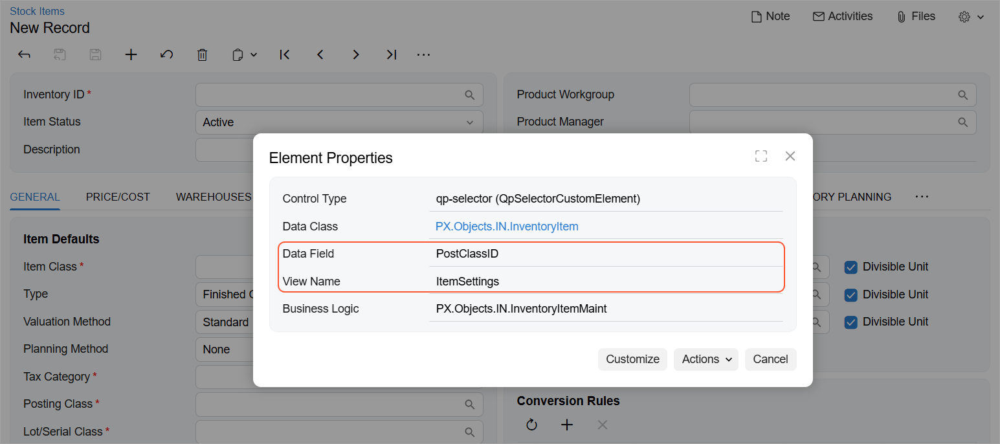

# Custom Fields {#_bd0d8a36-b00b-44c8-bdcd-b2b4e4c86fd0 .concept}

You can work with the values of the custom fields that are not included in the entity definition.

**Tip:** Custom fields can correspond to the following elements:

-   The predefined elements on an Acumatica ERP form that are not included in the entity definition
-   The elements that were added to the Acumatica ERP form in a customization project
-   The user-defined fields

To work with the needed custom field, you need to know the name of the data view that contains the corresponding custom element and the name of the field, which are described in detail below.

## Field Name and View Name { .section}

A field name is the internal name of a particular element of an Acumatica ERP form. A view name is the name of the data view to which a particular element belongs. For example, the **Posting Class** element on the **General** tab of the [Stock Items](../UserGuide/IN_20_25_00.md#) \(IN202500\) form has the `PostClassID` field name and belong to the `ItemSettings` data view.

To find out the field name and view name, on the title bar of the form, you click **Settings** &gt; **Inspect Element** and click the needed element on the form. In the **Element Properties** dialog box, which opens, you find the field name in the **Data Field** element and the view name in the **View Name** element, as shown in the following screenshot.

In the contract-based REST API, you can also find out the field name and the view name through the special URL. For details on the URL and the HTTP method, see [Retrieve the Schema of Custom Fields and Workflow Actions](IntegrationDev_RESTExample_Basic_Get_List_of_Custom_Fields.md#).

## Field Name and View Name of a User-Defined Field { .section}

For any user-defined field, the field name is `Attribute<AttributeID>`, where you replace `<AttributeID>` with the ID of the attribute that corresponds to the user-defined field. For details on how you can find out the view name, see [Retrieve the Schema of Custom Fields and Workflow Actions](IntegrationDev_RESTExample_Basic_Get_List_of_Custom_Fields.md#).

For example, suppose that on the [Sales Orders](../UserGuide/SO_30_10_00.md) \(SO301000\) form, you have added a user-defined field for the *OPERATSYST* attribute. You work with this user-defined field by using the `Document` view name and the `AttributeOPERATSYST` field name.

## Use of Custom Fields { .section}

For details on retrieving the values of custom fields by using the contract-based REST API, see [$custom Parameter](IntegrationDev_RESTExample_Parameter_custom.md) and [Retrieve a Record with Custom Fields](IntegrationDev_RESTExample_Basic_Get_Record_with_Custom_Field.md). For details on specifying the values of custom fields, see [Representation of a Record in JSON Format](IS__con_REST_Entity_Representation_in_JSON.md#) and [Create a Record with Custom Fields](IntegrationDev_RESTExample_Basic_Create_Record_with_Custom_Fields.md).

**Parent topic:**[Configuring the REST API](../IntegrationDevelopmentGuide/IS__mng_Contract_Based_Web_Services.md)

