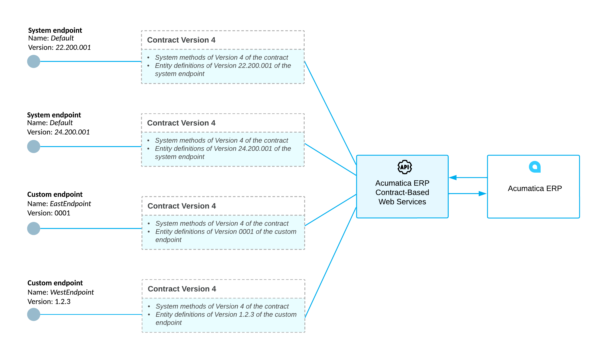

# Endpoints and Contracts {#_1a9d6f7e-8546-426b-b1ff-d712fbcfbc7b .concept}

You access the contract-based REST API through endpoints that are configured on the [Web Service Endpoints](../Shared/../UserGuide/SM_20_70_60.md) \(SM207060\) form.

## Endpoints and Contracts { .section}

An *endpoint* is an entry point to the Acumatica ERP web services. For each endpoint that the REST API provides, a *contract* of the endpoint defines the entities, along with their actions and fields, that are available through the endpoint and the methods that you can use to work with these entities.

The endpoint is identified by the URL that you use to access the web services API. You can see the name and version of an endpoint in its URL. For example, the `http://localhost/AcumaticaDB/entity/Default/25.200.001` endpoint has the *25.200.001* version and the *Default* name. The version of an endpoint defines the list of entities, along with the actions and fields that you can work with through this endpoint.

The contract of an endpoint is identified by the contract version. The version of a contract defines the list of methods for working with the entities that you can use when working with Acumatica ERP through the endpoint with this version of the contract. For details about the contract version, see [Contract Version](IS__con_Comparison_of_Contract_Versions.md#).

## System and Custom Endpoints { .section}

You can use two types of endpoints to access the web services:

-   **System endpoint**: The system endpoints are precofigured in the system and have the *Default* name. Each of these endpoints has a predefined contract, which includes the API that is preconfigured in the system. You cannot change the contract of a system endpoint.

    If the API that is available in the contract of a system endpoint is sufficient for the requirements of your application, you should use the system endpoint for accessing Acumatica ERP web services. You can use the same system endpoint in future versions of Acumatica ERP. For example, if you use the system endpoint with Version 25.200.001 and Contract Version 4 to access Acumatica ERP 2026 R1, you can use the same endpoint to access future versions of Acumatica ERP.

    **Attention:** Acumatica ERP can include endpoints preconfigured in the system that have names other than *Default*. The system uses these endpoints internally. We recommend that you not use these endpoints.

-   **Custom endpoint**: By default, there are no custom endpoints in the system. If the API provided by the system endpoint is not sufficient for the requirements of your application, you can create a custom endpoint. You can configure the contract of a custom endpoint by adding the needed elements of the API to the contract.

    If you need to use the same custom endpoint in future versions of Acumatica ERP, you should maintain it in future versions.

**Attention:** Obsolete system endpoints may be removed in some version of Acumatica ERP.

The following diagram provides an example of multiple endpoints configured in the system. The diagram shows two system endpoints with Contract Version 4 and two custom endpoints with the names *EastEndpoint* and *WestEndpoint*.

**Parent topic:**[Configuring the REST API](../IntegrationDevelopmentGuide/IS__mng_Contract_Based_Web_Services.md)

