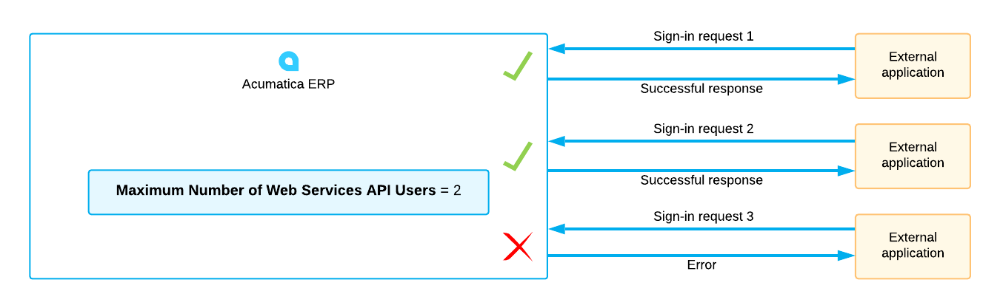
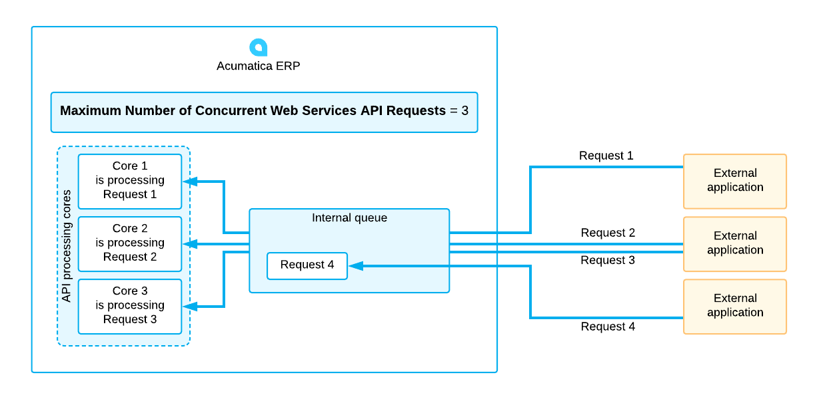
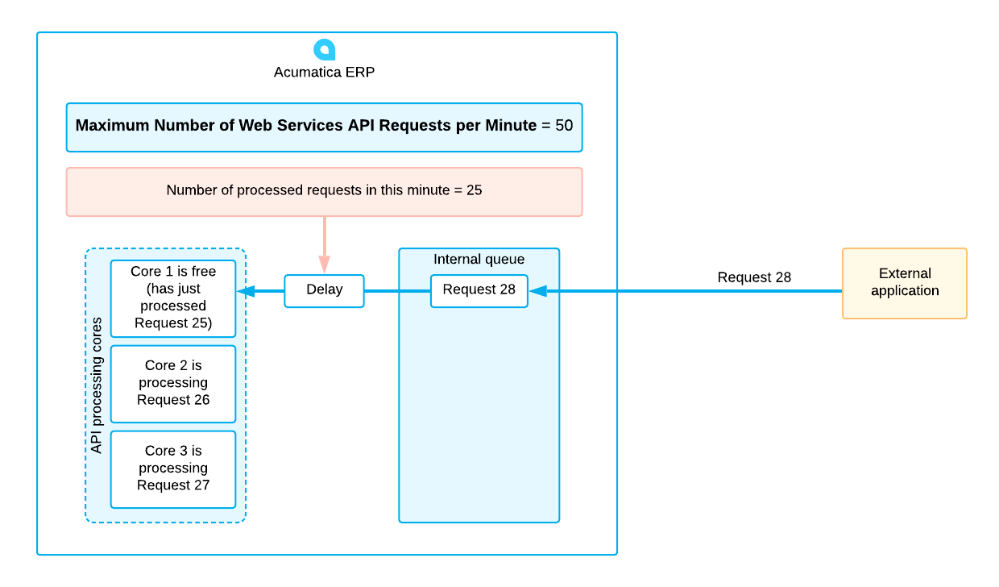
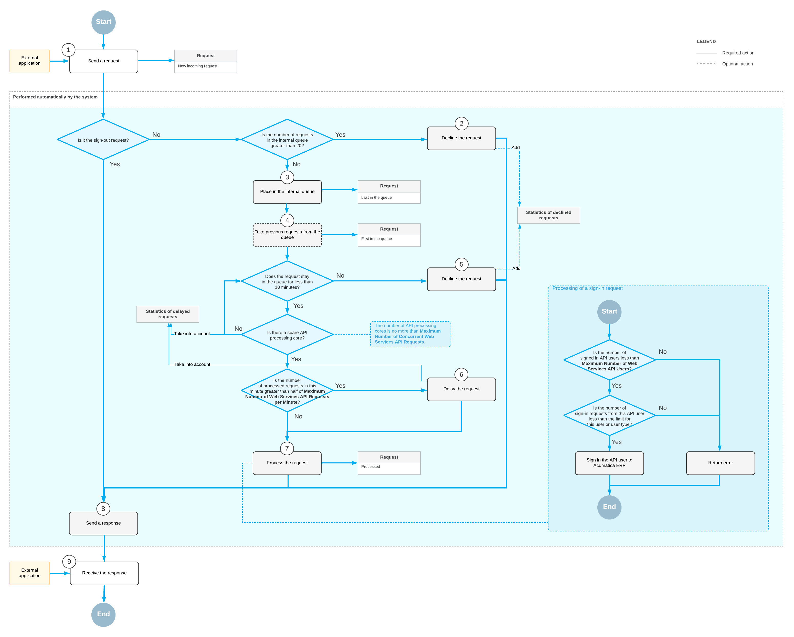

# License Restrictions for API Users {#_7a796856-3dec-4a4f-abf8-171324c9642b .concept}

*API users* are client applications that sign in to Acumatica ERP by using one of the following ways:

-   The sign-in method of the contract-based REST API
-   The sign-in method of the screen-based SOAP API
-   The OAuth 2.0 mechanism of authorization for applications

Each Acumatica ERP license includes the limits on the number of web services API users, the number of concurrent API requests, and the number of web services API requests per minute. You can view these limits of the Acumatica ERP license on the [License Monitoring Console](../UserGuide/SM_60_40_00.md) \(SM604000\) form. The trial license sets the limit on the number of web services API users to two and imposes no other limits.

The following sections describe these limits and the lifecycle of API requests.

## Number of Web Services API Users { .section}

On the **License** tab of the [License Monitoring Console](../UserGuide/SM_60_40_00.md) \(SM604000\) form, the **Maximum Number of Web Services API Users** box displays the license restriction for the number of API users that can work with Acumatica ERP. When an extra API user tries to sign in to the system and the number of API user sessions exceeds your license restriction, an error message is returned and the sign-in process is interrupted. The following diagram shows an example of how this limitation works with three sign-in requests when the **Maximum Number of Web Services API Users** is set to *2*.

To avoid exceeding the maximum number of API users, external applications must properly implement the signing in to and signing out from Acumatica ERP. If an external application does not close its sessions in Acumatica ERP \(that is, does not sign out from Acumatica ERP in each session\), this application can prevent other applications from signing in. For details about the implementation of signing in and signing out, see the following sources:

-   [Sign In to the Service](IntegrationDev_RESTExample_Basic_Login.md) for the REST API
-   [Login\(\) Method](IS__con_SB_Login.md) for the screen-based SOAP API

## Number of Concurrent Web Services API Requests { .section}

All incoming API requests \(except the requests to sign out from Acumatica ERP, which are processed immediately\) are placed in an internal queue. To process these requests, the server uses the API processing cores, which execute the requests in parallel. The number of cores is no more than the maximum number of concurrent web services API requests, which is specified in the **Maximum Number of Concurrent Web Services API Requests** box on the **License** tab of the [License Monitoring Console](../UserGuide/SM_60_40_00.md) \(SM604000\) form.

The API processing cores take the requests from the queue one by one. If the limit for the number of concurrent web services API requests has been reached \(that is, if all API cores are processing the requests\), the next concurrent request waits in the queue and is processed when one of the previous requests has completed. These requests in the queue are taken into account in the statistics of the delayed requests \(see [Lifecycle of the Requests](IS__con_License_Restrictions_API_Users.md#_5e45d3c6-e814-4b08-a995-9592bd6e30fd)\).

**Note:** The system sends a response to the request when the request is fully processed or declined. For details about the lifecycle of the requests, see [Lifecycle of the Requests](../Shared/../IntegrationDevelopmentGuide/IS__con_License_Restrictions_API_Users.md#_5e45d3c6-e814-4b08-a995-9592bd6e30fd).

The following diagram shows an example of how this limitation works with **Maximum Number of Concurrent Web Services API Requests** set to 3.

## Number of Web Services API Requests per Minute { .section}

The maximum number of requests that can be processed per minute is shown in the **Maximum Number of Web Services API Requests per Minute** box on the **License** tab of the [License Monitoring Console](../UserGuide/SM_60_40_00.md) \(SM604000\) form.

If the number of requests in the past minute has reached 50% of the limit specified for the license, the current request is delayed. The system calculates the delay as follows:

1.  When a request enters the queue, the system checks how many requests have been processed for the past minute. The system calculates the past minute from the moment the request has come.

    For the example in this section, suppose that in a particular license, the limit of the number of web services API requests per minute is 50. Further suppose that the system has processed 25 requests in the past minute. These numbers will be used in further computations.

2.  The system finds the time when the first request in the past minute has been received.

    For this example, suppose that the first request in the past minute has been received at 02:40:20. Further suppose that the time of the current request is 02:41:00.

3.  The system finds the time that remains until the end of the minute since the receipt of the first request in the past minute.

    In this example, the end of the minute since the first request is 02:41:20. The remaining time is 20 seconds, calculated as `02:41:20 - 02:41:00`.

4.  The system calculates the remaining number of requests that can be processed in the minute, which is the number in the **Maximum Number of Web Services API Requests per Minute** box minus the number of requests that the system has already processed in the past minute.

    In the example of this section, the remaining number of requests is 25, calculated as `50 - 25`.

5.  The system calculates the delay as the remaining time divided by the remaining number of requests.

    In our example, the delay is 0.8 seconds, calculated as `20 / 25` .

**Note:** The system sends a response to the request when the request is fully processed or declined. For details about the lifecycle of the requests, see [Lifecycle of the Requests](../Shared/../IntegrationDevelopmentGuide/IS__con_License_Restrictions_API_Users.md#_5e45d3c6-e814-4b08-a995-9592bd6e30fd).

The following diagram shows an example of how this limitation works with **Maximum Number of Web Services API Requests per Minute** set to 50 and with 25 requests processed in the minute.

## Decline of the Requests {#_5003371c-88ed-409a-b0f6-fe8864f827cf .section}

The request will be declined only if the number of requests in the internal queue is greater than 20, or the request remains in the queue for more than 10 minutes. Acumatica ERP gives no indication that a request is added to the queue or being processed; the application that makes a request should stay connected and wait for the response. A declined request is not counted in the number of processed requests.

For example, suppose that during one second, each of 50 external applications sends a web services API request to one Acumatica ERP server. Suppose also that each request is processed for 1 second and that the maximum number of concurrent web services API requests in the license is 16. In this case, the first 16 requests will be passed to 16 API processing cores immediately. The next 20 requests will wait in the internal queue, and the last 14 requests will be declined.

## Lifecycle of the Requests {#_5e45d3c6-e814-4b08-a995-9592bd6e30fd .section}

The system sends a response to the request when the request is fully processed or declined. You can view the statistics of the delayed and declined requests on the **Statistics** tab of the [License Monitoring Console](../UserGuide/SM_60_40_00.md) \(SM604000\) form.

The following diagram shows the lifecycle of a web services API request. For details about how the sign-in requests are processed, see [Limitation of API Connections for Integrated Applications](IS__con_Limitation_of_API_Connections.md).

**Parent topic:**[Limiting Connections of Integrated Applications](../IntegrationDevelopmentGuide/IS__mng_Licensing_API.md)

