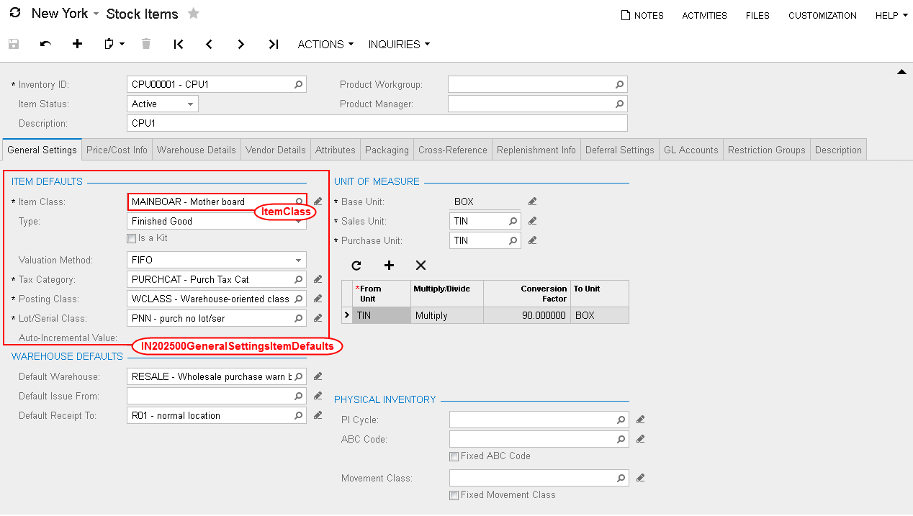

# API Objects Related to Acumatica ERP Forms {#_ac01ace2-7c84-41fd-a4cc-e2202ccbf542 .concept}

The main object, which provides access to all other objects and methods of the Acumatica ERP web services API, is a Screen object. By using the methods of a Screen object, you can log in to Acumatica ERP and retrieve, insert, update, and delete data. You can also use the methods to perform any actions that are exposed by Acumatica ERP forms available through the web service.

## Screen Object { .section}

After you have logged in to Acumatica ERP by using the web services API, you can access data on Acumatica ERP forms available through the web service. The Screen class provides the same set of API methods for working with all Acumatica ERP forms available through the service. You can find out which form a method accesses by noting the prefix in the name of the method, which is the form ID. For example, the Export\(\) method that you use to export data from the [Stock Items](../UserGuide/IN_20_25_00.md) \(IN202500\) form is IN202500Export\(\).

## Content Object { .section}

To get the description of the structure \(schema\) of a form, you should use the GetSchema\(\) method of the Screen object. This method is specific for each Acumatica ERP form, and you should use the method with the ID of the needed form in the prefix of the method name. The method returns the schema of the form as the corresponding Content object, which is specific for each form. For example, to get the schema of the [Stock Items](../UserGuide/IN_20_25_00.md) form, you should call the IN202500GetSchema\(\) method of the Screen object. You will receive the result as a IN202500Content object, as the following code shows.

```
Screen context = new Screen();
...
IN202500Content stockItemsSchema = context.IN202500GetSchema();
```

## Command Object { .section}

By using subobjects of a Content object, you configure the sequence of commands that should be executed during data import, data export, or data processing through the web service. You configure the sequence of commands inside an array of objects of the Command type. When you are reflecting the selection of an element on a form in the sequence of commands, you have to select the object of the Acumatica ERP form whose element you want to access. The objects that are available inside a Content object have names that are similar to the names of the UI elements that you see on the form and have the ID of the form as a prefix.

For example, to be able to select the **Item Class** element, which is located in the **Item Defaults** group on the **General** tab of the [Stock Items](../UserGuide/IN_20_25_00.md) form \(shown in the following screenshot\), you would select the GeneralSettingsItemDefaults property of the IN202500Content object. This property provides access to the IN202500GeneralSettingsItemDefaults object, which includes the ItemClass property.

Each element on an Acumatica ERP form \(such as a text box, combo box, or table column\) is associated with a particular web services API class and is available through corresponding property of this class. The property has a similar name to that of the corresponding box on the form, such as ItemClass, as the following screenshot shows.



The following code shows an example of configuring a list of commands for the [Stock Items](../UserGuide/IN_20_25_00.md) form inside an array of Command objects.

```
//stockItemsSchema is a IN202500Content object
var commands = new Command[]
{
    stockItemsSchema.StockItemSummary.ServiceCommands.EveryInventoryID,
    stockItemsSchema.StockItemSummary.InventoryID,
    stockItemsSchema.StockItemSummary.Description,
    stockItemsSchema.GeneralSettingsItemDefaults.ItemClass,
    stockItemsSchema.GeneralSettingsUnitOfMeasureBaseUnit.BaseUnit
};
```

For more information on the commands, see [Working with Commands of the Screen-Based SOAP API](IS__mng_Screen-Based_API_Commands.md#).

## Actions Object { .section}

To insert an action to a sequence of commands, such as clicking a button, you use the corresponding property of the special API object Actions \(which has a prefix with the ID of the form in the name\). The Actions object is available through the Actions property of the Content object that corresponds to the form. The properties of the Actions object have names that are similar to the names of corresponding buttons on the form, such as Delete.

You can view the classes available through the web services API by using Object Browser in Visual Studio.

**Parent topic:**[Working with the Screen-Based SOAP API](../IntegrationDevelopmentGuide/IS__mng_Screen_Based_Web_Services.md)

