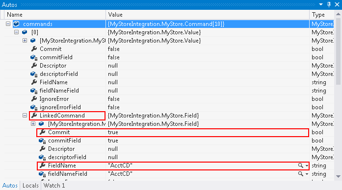

# Commands That Require a Commit {#_d8d2b1f1-8aba-49d8-a780-63bd99881867 .concept}

There are two types of elements on an Acumatica ERP form: elements with a commit, and elements without a commit. A commit is an action initiated by the form that, when triggered, sends the data to the server. On the server, the commit causes all data on the form to be updated, including the insertion of default values and the recalculation of the values of elements on the form.

A commit is a costly operation that causes the browser to make requests to the server and takes server time. As such, a commit is invoked for only a limited number of elements: mainly the key elements and the elements the other elements depend on.

In a Visual Studio project, if you specify the value of an element for which the system performs a commit by using a Value command, the Commit property of the LinkedCommand property \(which specifies this element\) is automatically set to `true`. You can check the value of the `Commit` property when you are debugging an application if you insert a breakpoint in the code after an array of commands has been configured. In the following screenshot, you can see that for the command that sets the value of the **Customer ID** element on the [Customers](../UserGuide/AR_30_30_00.md) \(AR303000\) form, the Commit property of the LinkedCommand is set to `true`. \(The **Customer ID** element has the internal field name `AcctCD`.\)

If the Commit property is `false`, the element is filled in with data but no update of the form is invoked. If the Commit property is `true`, after the element is filled in, the commit is invoked on the server and the form is updated.

For example, when you select a customer class on the [Customers](../UserGuide/AR_30_30_00.md#) form, the system assigns values to the elements related to customer class settings, such as **Statement Cycle ID** and **Country**. When you configure a sequence of commands for setting the values of elements on the [Customers](../UserGuide/AR_30_30_00.md#) form, for elements such as **Customer**, the system automatically sets the Commit property of LinkedCommand to `true`.

In most cases, when you compose the sequence of commands, you can use the values of the Commit property that are set by default. However, you may need to force the system to invoke a commit to the server—for example, when you need to commit the value of the field before entering another field value. In such cases, you should set the Commit property to `true` for the command or action.

**Parent topic:**[Working with Commands of the Screen-Based SOAP API](../IntegrationDevelopmentGuide/IS__mng_Screen-Based_API_Commands.md)

