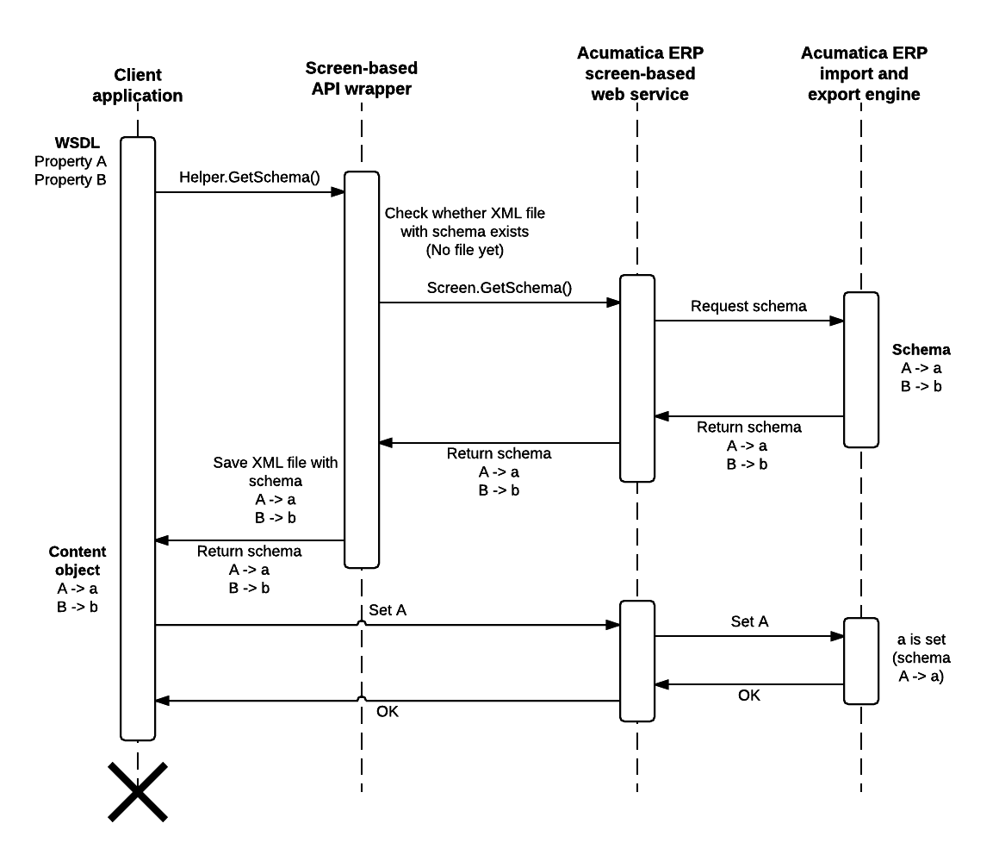
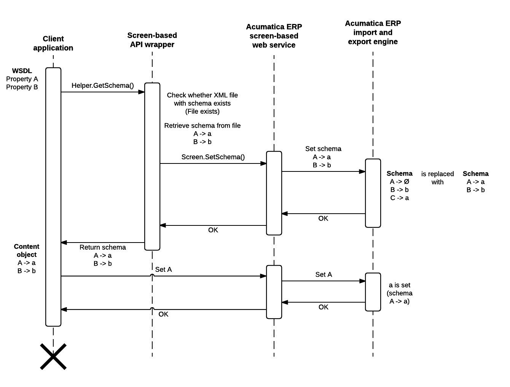

# Screen-Based API Wrapper {#_37c6db0a-8233-4f07-b496-d84a0e00fcfc .concept}

Because of the connection of the screen-based SOAP API with Acumatica ERP forms, the applications that are developed based on this API are sensitive to the UI changes in the system. That is, any changes made to the UI after the application is created require the application to be updated and recompiled. If you want your application to not depend on the UI changes in the system, you should use the screen-based API wrapper, which is described in this topic.

## How a Client Application Based on the Screen-Based API Works { .section}

A client application that uses the screen-based web services API includes the WSDL description of the service, which contains the API elements that the application can use to work with the service. The API elements have names that are similar to the names of the elements on the UI of Acumatica ERP. For example, the **Customer ID** element of the [Customers](../UserGuide/AR_30_30_00.md) \(AR303000\) form corresponds to the Customer.CustomerSummary.CustomerID property.

When the application calls the Screen.GetSchema\(\) method, it retrieves from Acumatica ERP the schema of an Acumatica ERP form. The schema of the form is a Content object, which defines the correspondence between the API elements and the internal data fields that are used for operations with data by Acumatica ERP. If something has been changed in the schema of an Acumatica ERP form, the Content object that is returned by the Screen.GetSchema\(\) method contains a different correspondence between the API elements and internal data fields than the correspondence for which the application is compiled, and the application fails.

For example, suppose that a client application requests the customer ID by the Customer.CustomerSummary.CustomerID property. Suppose also that in an update of Acumatica ERP, the **Customer ID** element of the [Customers](../UserGuide/AR_30_30_00.md#) form was renamed to **Customer**, and therefore it should be requested by using the Customer.CustomerSummary.Customer property from the API. The client application requests the customer ID by using the Customer.CustomerSummary.CustomerID property and fails.

## What the Screen-Based API Wrapper Is { .section}

The screen-based API wrapper is a special wrapper designed to prevent the UI changes in the system from causing application failure. The wrapper works with any changes in the schema of an Acumatica ERP form. That is, the wrapper makes the application work regardless of the changes in the names of UI elements and the changes in the internal names of data fields and objects.

The wrapper is distributed as the `PX.Soap.dll` file, which is installed automatically during Acumatica ERP installation. You can find the `PX.Soap.dll` file in the `ScreenBasedAPIWrapper` folder of your Acumatica ERP installation folder.

The PX.Soap library, which the wrapper provides, includes the Helper.GetSchema\(\) method, which you should use instead of the Screen.GetSchema\(\) method of the screen-based web services API. For information on how to use the screen-based API wrapper, see [To Use the Screen-Based API Wrapper](IS__how_Prevent_Breaking_Changes.md#).

## How the Screen-Based API Wrapper Works { .section}

When the client application is executed for the first time and requests the schema of an Acumatica ERP form by using the Helper.GetSchema\(\) method, the wrapper requests the schema from the Acumatica ERP screen-based web service by using the Screen.GetSchema\(\) method of the screen-based API. The web service interacts with the Acumatica ERP import and export engine and returns the current schema of the form. The wrapper saves the schema in an XML file and returns the schema to the client application as a Content object. The client application uses this schema to work with Acumatica ERP.

**Tip:** Instead of the Helper.GetSchema\(\) method you can use the Helper.ReuseStoredSchema\(\) method to upload a schema that was saved earlier by the wrapper.

The following diagram illustrates the way the screen-based API wrapper works during the first execution of a client application.

When the client application is executed for the second time and all subsequent times and it requests the schema of an Acumatica ERP form by using the Helper.GetSchema\(\) method, the wrapper retrieves the XML schema that is saved locally and submits this schema to the Acumatica ERP screen-based web service by using the Screen.SetSchema\(\) method of the screen-based API. The web service interacts with the Acumatica ERP import and export engine, which replaces the current schema of the form that is stored on the server with the one that was saved locally. The wrapper returns the schema that was saved locally to the client application. The client application uses the local schema to work with Acumatica ERP.

**Tip:** The schema that is submitted to Acumatica ERP by using the screen-based API wrapper is used on the server during the current session and is discarded after the end of the session.

The following diagram illustrates the way the screen-based API wrapper works during the second execution and all subsequent executions of a client application.

**Attention:** You should distribute the XML file with the schema along with your client application. If the wrapper has not found the XML file, it requests the new schema.

The name of the XML file with the schema contains a hash code that depends on the WSDL description. If you update the WSDL description in your application, the wrapper works in the same way as it did during the first execution of the application and creates a new XML file with the schema.

**Parent topic:**[Working with the Screen-Based SOAP API](../IntegrationDevelopmentGuide/IS__mng_Screen_Based_Web_Services.md)

