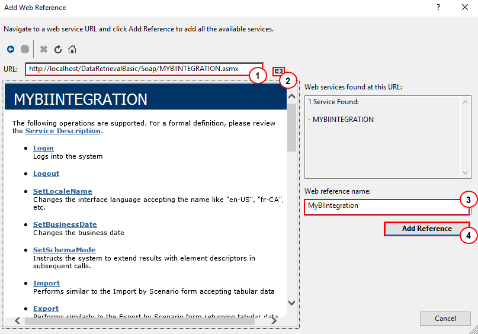
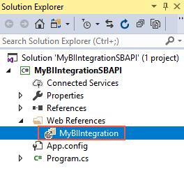
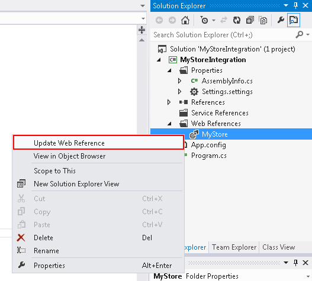

# To Import the WSDL File Into the Development Environment {#_0b2f1956-4612-40c5-a816-4ab4ae06f0bf .task}

When the WSDL file is generated, you must import it into your development environment to generate proxy classes. If necessary, see the documentation of your development environment to find out the correct way of building the proxy classes based on the WSDL definition.

The procedure below is described based on an example of the creation of a console project with the *MyBIIntegrationSBAPI* name that uses the *MYBIINTEGRATION* web service. You can create another type of Visual Studio project with another name and use any other web service define on the [Web Services](../UserGuide/SM_20_70_40.md) \(SM207040\) form in this procedure.

In this topic, you will find instructions on how to implement the proxy classes by using Visual Studio 2019.

## Importing the WSDL File into a Visual Studio Project { .section}

To import the WSDL description into your development environment, proceed as follows:

1.  Open Visual Studio, and create a new Visual C\# console application with the *MyBIIntegrationSBAPI* name and the *.NET Framework 4.8* target framework.

    **Note:** To create a console application, click **File** &gt; **New** &gt; **Project** on the main menu of Visual Studio. In the **Create a new project** dialog box, which appears, select the *Console App \(.Net Framework\)* C\# template and click **Next**. In the **Configure your new project** dialog box, specify the name and location of the solution, select the *.NET Framework 4.8* framework version, and click **Create**.

    The MyBIIntegration application that you have created contains the `Program.cs` file with the `Program` class.

2.  Add to the project a reference to the Acumatica ERP web service as follows:
    1.  On the main menu of Visual Studio, click **Project** &gt; **Add Service Reference**.
    2.  In the **Add Service Reference** dialog box, which appears, click **Advanced**.
    3.  In the **Service Reference Settings** dialog box, which appears, click **Add Web Reference**.
    4.  In the **URL** box of the **Add Web Reference** dialog box, which appears, specify the URL of the *MYBIINTEGRATION* web service \(see item 1 in the following screenshot\).

        **Note:** To copy the URL of the service, on the [Web Services](../Shared/../UserGuide/SM_20_70_40.md) \(SM207040\) form, select *MYBIINTEGRATION* in the **Service ID** box, click **Generate** and then **View Generated** on the form toolbar, and copy the URL from the address line in the browser for the page that opens. In this example, the URL is *http://localhost/MyStoreInstance/Soap/MYBIINTEGRATION.asmx*.

    5.  Click **Go** \(2\) to make Visual Studio connect to the web service.

        **Note:** If your Acumatica ERP website uses a self-signed certificate, Visual Studio displays security alert windows with warnings on the certificate. Click **Yes** in these windows to proceed.

    6.  In the **Web reference name** box, type `MyBIIntegration` \(3\). This name will be used as a namespace for the web service classes generated by Visual Studio based on the WSDL description of the service.
    7.  Click **Add Reference** \(4\) to close the dialog box and add to the project the reference to the specified service.

        

        Visual Studio adds to the project the `Web References` project folder with the *MyBIIntegration* web service reference in it, as shown in the following screenshot.

        

        **Note:** If you need to update a web reference to the Acumatica ERP web service in a Visual Studio project, you can update the WSDL description in Acumatica ERP and update the web reference in the project by right-clicking the web reference in Solution Explorer and selecting **Update Web Reference**, as shown in the following screenshot.

        

3.  Rebuild the project.

**Parent topic:**[Working with the Screen-Based SOAP API](../IntegrationDevelopmentGuide/IS__mng_Screen_Based_Web_Services.md)

