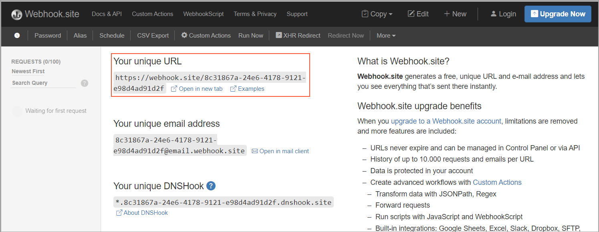
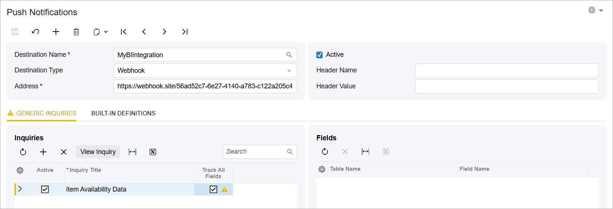

# Push Notifications: To Configure Push Notifications {#_a403e854-a30e-4964-8bfb-886f594fdd14 .task}

This activity will walk you through the process of configuring Acumatica ERP to send push notifications to an HTTP address.

## Story { .section}

The business intelligence \(BI\) application of the MyStore company needs to display up-to-date information about item availability in warehouses. You will configure Acumatica ERP to track the changes in item availability and to send notifications to an HTTP address when the availability of any item changes. \(The processing of these notifications in the BI application is outside of the scope of this activity.\)

## Process Overview { .section}

You will configure Acumatica ERP to monitor changes in the Item Availability Data \(INGI0002\) custom generic inquiry, which has been configured for this activity. You will then test how Acumatica ERP sends push notifications about the changes to an HTTP address in JSON format.

## System Preparation { .section}

Before you begin performing the steps of this activity, deploy an instance of Acumatica ERP with the *MyStoreInstance* name and a tenant that has the *MyStore* name and contains the *T100* data.

## Step 1: Obtaining an HTTP Address for Push Notifications { .section}

To test the push notifications that you will set up Acumatica ERP to send to an HTTP address, you will use the [https://webhook.site/](https://webhook.site/) website, which is an open-source service. To obtain the HTTP address that you will use for testing, do the following:

1.  Open [https://webhook.site/](https://webhook.site/).
2.  In the **Your unique URL** section, copy the HTTP address that the site has generated. An example of the address is shown in the following screenshot.

    


## Step 2: Configuring Push Notifications { .section}

To configure Acumatica ERP to send push notifications to an HTTP address, do the following:

1.  In the Summary area of the [Push Notifications](../UserGuide/SM_30_20_00.md) \(SM302000\) form, specify the following settings:
    -   **Destination Name**: `MyBIIntegration`.

        You can specify any name for the target notification destination.

    -   **Destination Type**: *Webhook*.

        With *Webhook* selected, Acumatica ERP will send HTTP `POST` requests with notification information to an HTTP address.

    -   **Address**: The address that you have created in Step 1.
2.  On the **Generic Inquiries** tab, click **Add Row** on the toolbar of the **Inquiries** table.
3.  In the added row, do the following:
    1.  In the **Inquiry Title** column of the added row, select *Item Availability Data*.
    2.  Select the **Track All Fields** check box.

        **Attention:** If all fields in the results of the data query are tracked, the system produces push notifications for changes of any field in the results of the data query, which can cause the push notification queue to overflow. If you need to track only particular fields in the results of the data query, push notifications for changes in other fields are useless for you but consume system resources. Therefore, in this case, we recommend that you specify particular fields to be tracked in the **Fields** table.

4.  On the form toolbar, click **Save**. The following screenshot shows the final configuration.

    


## Step 3: Testing Push Notifications { .section}

To test the configured notifications, do the following:

1.  On the [Sales Orders](../UserGuide/SO_30_10_00.md) \(SO301000\) form, create a sales order as follows:
    1.  In the **Customer** box, select *C000000001*.
    2.  Click **Remove Hold**.
    3.  On the table toolbar of the **Details** tab, click **Add Items**. In the dialog box that opens, select the unlabeled check box for the *AALEGO500* inventory item, and click **Add &amp; Close**.
    4.  On the form toolbar, click **Save**.
2.  On the [https://webhook.site/](https://webhook.site/) site, review the push notification that Acumatica ERP sent for the change in the available quantity for the *AALEGO500* inventory item. When you created a sales order, the available quantity of the *AALEGO500* inventory item was changed. The notification contains the information about the new value of the QtyAvailable field of the changed record in the `Inserted` element and the information about the previous value of this field in the `Deleted` element. An example of the notification is shown in the following code.

    ```language-json
    {
      "Inserted":
      [
        {
          "Warehouse":"MAIN ",
          "InventoryID":"AALEGO500",
          "Description":"Lego, 500 piece set",
          "QtyOnHand":1999,
          "QtyAvailable":1976
        }
      ],
      "Deleted":
      [
        {
          "Warehouse":"MAIN",
          "InventoryID":"AALEGO500 ",
          "Description":"Lego, 500 piece set",
          "QtyOnHand":1999,
          "QtyAvailable":1977
        }
      ],
      "Query":"Item Availability Data",
      "CompanyId":"MyStore",
      "Id":"06284bdf-2952-4a9a-bf60-2ad0cd33924e",
      "TimeStamp":638465233453014192,
      "AdditionalInfo":
      {
        "PXPerformanceInfoStartTime":"03/20/2025 09:22:24"
      }
    }
    ```


**Parent topic:**[Configuring Push Notifications for Real-Time Monitoring](../IntegrationDevelopmentGuide/IntegrationDev_PushNotifications_Mapref.md)

