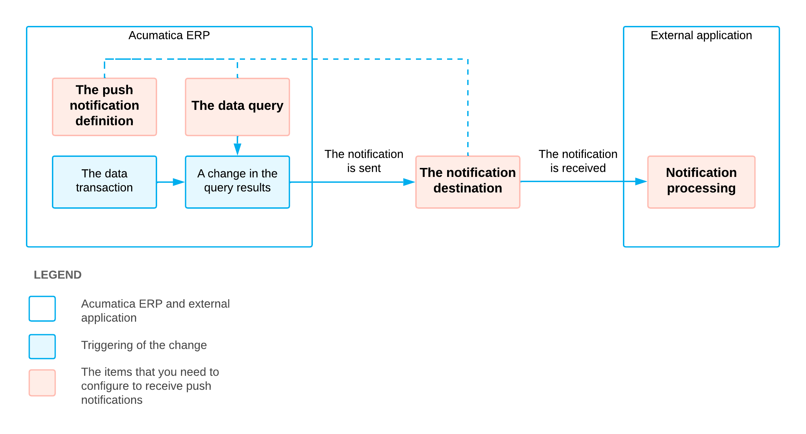

# Push Notifications: General Information {#_562ccb34-3b08-45c4-9cf9-d51a8a54ae01 .concept}

Push notifications are notifications in JSON format that are sent by Acumatica ERP to notification destinations when specific data changes occur in Acumatica ERP. External applications can receive the notifications and process them to retrieve the information about the changes.

## Learning Objectives { .section}

In this chapter, you will learn the following:

-   How to configure push notifications
-   Which requirements exist in Acumatica ERP for the data queries that are used by push notifications
-   Which push notification destinations you can use
-   Which format of push notifications is used by Acumatica ERP
-   How to process failed push notifications
-   How to include push notification configuration in a customization project

## Applicable Scenarios { .section}

You define push notifications in Acumatica ERP in the following scenarios:

-   You need to send notifications about changes in particular data.
-   You need to implement real-time synchronization of changes in the data in Acumatica ERP with the data in an external system.

## Configuration of Push Notifications { .section}

To work with Acumatica ERP push notifications, you need to configure the following items:

-   The data query that defines the data for whose changes Acumatica ERP should send notifications
-   The destination to which Acumatica ERP should send notifications
-   The way the external application processes the notifications
-   The definition of the push notification in Acumatica ERP, which specifies the data query and the notification destination

The following diagram illustrates the sending of a push notification and shows the items that you need to configure to receive push notifications when changes occur.

To configure push notifications, you use the [Push Notifications](../UserGuide/SM_30_20_00.md) \(SM302000\) form. You can configure as many push notifications as you wish.

## Data Query { .section}

The data query can be defined by either a generic inquiry or a built-in query definition \(which is a data query defined in code\). For details on generic inquiries, see [Managing Generic Inquiries](../UserGuide/SM__MNG_Managing_Generic_Inquiry.md#). For information on how to create a built-in query definition, see [Push Notifications: To Create a Built-In Query Definition](IntegrationDev_PushNotifications_Activity_BuiltInDefinition.md). You can define multiple queries for one notification destination.

The data query should adhere to the recommendations described in [Push Notifications: Recommendations for the Data Queries](IntegrationDev_PushNotifications_RequirementsToQuery.md#).

## Notification Destination { .section}

The following predefined notification destinations are provided: webhook \(HTTP address\), message queue, SignalR hub, and commerce push destination. For more information on the predefined notification destinations, see [Push Notifications: Destinations](IntegrationDev_PushNotifications_Destinations.md#). You can also create your own destination type, as described in [Push Notifications: To Create a Custom Destination Type](IntegrationDev_PushNotifications_Activity_CustomDestinationType.md).

## Processing of the Notifications in the External Application { .section}

You should configure your external application so that it can process the notifications and extract the information about the data changes. Acumatica ERP sends notifications to notification destinations in JSON format. For details on the format of the notifications, see [Push Notifications: Format](IntegrationDev_PushNotifications_Format.md). If your application watches notifications in the SignalR hub, you need to connect to the hub, as described in [Push Notifications: To Connect to the SignalR Hub](IntegrationDev_PushNotifications_Activity_SignalRHub.md).

## Definition of the Push Notification { .section}

In the definition of the push notification on the [Push Notifications](../UserGuide/SM_30_20_00.md) \(SM302000\) form, you specify the notification destination and the data queries for which the notifications should be sent. You can also specify particular fields that the system should track in the results of the data queries.

**Tip:** If an attribute is included in the list of fields that the system should track, the returned inserted and deleted rows contain *null* for the value of the attribute that was not changed. For details, see [Push Notifications: Format](../Shared/../IntegrationDevelopmentGuide/IntegrationDev_PushNotifications_Format.md).

**Parent topic:**[Configuring Push Notifications for Real-Time Monitoring](../IntegrationDevelopmentGuide/IntegrationDev_PushNotifications_Mapref.md)

