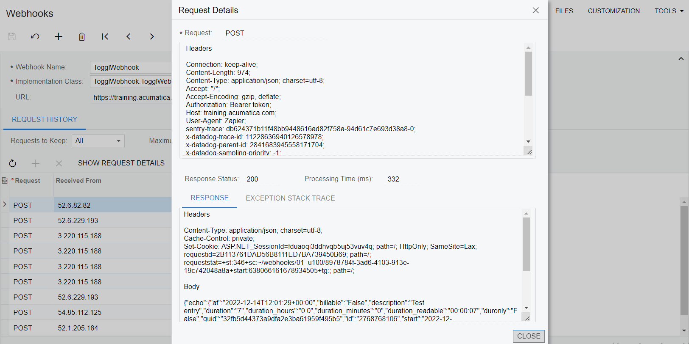

# Webhooks: To Configure Webhooks {#_53fd37eb-6840-4709-a852-68bc6abc0a90 .task}

The following activity shows you how to configure webhooks to save the time tracking information from Toggl in Acumatica ERP.

## Story { .section}

Suppose that you need to register employee time activities. For that purpose, you plan to use the Toggl application, which can track employees’ time. To send data about tracked time periods from Toggl to Acumatica ERP, you need to configure a webhook in Acumatica ERP.

## Process Overview { .section}

You will define a webhook handler that implements the PX.Api.Webhooks.IWebhookHandler interface. You will then register in Acumatica ERP a webhook that will use this webhook handler. You will include the registered webhook and the DLL file with the code of the webhook handler in a customization project.

The webhook will receive data from the Zapier application, which will transfer data from Toggl to Acumatica ERP. You will prepare both the Toggl application and the Zapier application.

## System Preparation { .section}

Before you begin performing the steps of this activity, do the following:

1.  Prepare an Acumatica ERP instance with the *U100* dataset, as described in the [Instance Deployment: To Deploy an Instance with Demo Data](../UserGuide/INST_Deploying_Instances_Deploy_Tenant_With_Demodata_Activity.md) prerequisite activity.

    **Tip:** You need the *U100* dataset because the activity uses the *gibbs* user, which has been defined in this dataset.

2.  Create a new customization project, as specified in the [Customization Projects: To Create a Customization Project](../CustomizationPlatform/CustomizationProjects_GettingStarted_Activity_CreateProject.md) prerequisite activity.
3.  Create an extension library, as described in the [To Create an Extension Library](../CustomizationPlatform/cg_platform_tocreateextensionlib.md) prerequisite activity.

**Tip:** You can find the final code and customization project of this activity in the [Help-and-Training-Examples](https://github.com/Acumatica/Help-and-Training-Examples) repository on GitHub.

## Step 1: Preparing Toggl { .section}

Prepare the Toggl application as follows:

1.  On [https://toggl.com/](https://toggl.com/), sign up for an account, and sign in to that account.
2.  Create a time entry, which you will use later to test the connection. In the entry, specify its description.
3.  On your profile page, copy the API token, which is located at the bottom of the page.

## Step 2: Creating a Webhook Handler { .section}

To create a webhook handler, do the following:

1.  In the Visual Studio project of the extension library, add references to the following libraries from the `Bin` folder of the Acumatica ERP instance:
    -   `PX.Api.Webhooks.Abstractions.dll`
    -   `Microsoft.AspNetCore.Http.Abstractions.dll`
    -   `Microsoft.Extensions.Primitives.dll`
    -   `Microsoft.Net.Http.Headers.dll`
    -   `Newtonsoft.Json.dll`
2.  In the project, define the `TogglWebhookHandler` class, which implements the PX.Api.Webhooks.IWebhookHandler interface, as shown in the following code.

    ```
    using System;
    using System.Collections.Generic;
    using System.Threading;
    using System.Threading.Tasks;
    using Microsoft.AspNetCore.Http;
    using Microsoft.Net.Http.Headers;
    using Newtonsoft.Json;
    using PX.Api.Webhooks;
    using PX.Data;
    using PX.Objects.CR;
    using PX.Objects.PM;
    
    namespace TogglWebhook
    {
        public class TogglWebhookHandler : IWebhookHandler
        {
            private static readonly JsonSerializer Serializer = new JsonSerializer();
            public async Task HandleAsync(WebhookContext context, 
                CancellationToken cancellation)
            {
                if (!context.Request.Headers.TryGetValue(HeaderNames.Authorization, 
                    out var authValue))
                {
                    context.Response.StatusCode = StatusCodes.Status401Unauthorized;
                    return;
                }
    
                if (authValue != "Bearer token")
                {
                    context.Response.StatusCode = StatusCodes.Status403Forbidden;
                    return;
                }
    
                using (var scope = GetAdminScope())
                {
                    using (var jr = new JsonTextReader(
                        context.Request.CreateTextReader()))
                    {
                        var payload = Serializer.Deserialize<
                            Dictionary<String, Object>>(jr);
                        if (payload == null)
                        {
                            context.Response.StatusCode = StatusCodes.Status400BadRequest;
                            return;
                        }
                        var graph = PXGraph.CreateInstance<TimeEntry>();
                        var ta = graph.Items.Insert(new PMTimeActivity()
                        {
                            Date = Convert.ToDateTime(payload["at"]).ToLocalTime(),
                            TimeSpent = Convert.ToInt32(payload["duration"]),
                            OwnerID = PXAccess.GetContactID(),
                            Summary = "Test time entry"
                        });
                        graph.Items.Cache.SetValueExt<PMTimeActivity.projectID>(ta, "X");
                        graph.Items.Cache.SetValueExt(ta, "NoteText", 
                            "Created from Toggl");
                        graph.Actions.PressSave();
                        using (var w = context.Response.CreateTextWriter())
                        {
                            Serializer.Serialize(w, new
                            {
                                echo = payload,
                                ts = DateTimeOffset.Now
                            });
                        }
                    }
                }
            }
            private IDisposable GetAdminScope()
            {
                //Specify the name of your tenant with the U100 dataset after @.
                var userName = "gibbs@01_U100";
                return new PXLoginScope(userName);
            }
        }
    }
    ```

    In the code above, you have implemented the HandleAsync method of the IWebhookHandler interface. In the method, you have validated the `Authorization` header, created an instance of the TimeEntry graph, parsed the contents of the request, inserted the parsed data in the cache, and saved your changes to the database.

    **Tip:** For simplicity, in the code above, the `Authorization` header is expected to be `Bearer token`. You need to implement an actual authorization validation in the production code.

3.  Build the project. The DLL file of the extension library is available in the `Bin` folder of your Acumatica ERP instance.

## Step 3: Registering the Webhook { .section}

To register the webhook, do the following:

1.  In Acumatica ERP, open the [Webhooks](../UserGuide/SM_30_40_00.md) \(SM304000\) form.
2.  In the **Webhook Name** box, enter the name of the webhook: `TogglWebhook`.
3.  In the **Implementation Class** box, select the name of the webhook handler, which is *TogglWebhook.TogglWebhookHandler*.
4.  On the **Request History** tab, select *All* in the **Requests to Keep** box. You make the system save all webhook requests for testing purposes.
5.  On the page toolbar, click **Save**.

    In the **URL** box, the generated URL appears. An example of this URL is shown below.

    ```
    https://example.acumatica.com/2023R1/Webhooks/01_U100/3d5c2d34-26ed-48bf-9879-cd7f52163c0a
    ```


## Step 4: Saving the Webhook to a Customization Project { .section}

To simplify the deployment of a created webhook in another environment, add the created webhook and the DLL file of the extension library to the customization project by doing the following:

1.  Open the customization project of the extension library with the webhook handler in the Customization Project Editor. For details, see [To Open a Project](../CustomizationPlatform/CG_GL_Project_Opening.md).
2.  Add the *TogglWebhook* webhook to the customization project. For details about adding to a customization project, see [Webhooks in a Customization Project](IntegrationDev_Webhooks_GeneralInfo.md#_384c7952-eba3-4109-924f-ba44994867d4).
3.  Add the DLL file of the extension library as a *File* item to the customization project as specified in [To Add a Custom File to a Project](../CustomizationPlatform/CG_GL_Items_Files_Adding.md).

## Step 5: Preparing the External Application { .section}

Because the Toggl application cannot interact using HTTP, you will use the Zapier application to connect the Toggl application and Acumatica ERP. To prepare the Zapier application, do the following:

1.  On [https://zapier.com](https://zapier.com), sign up for an account, and sign in to that account.
2.  Create a new zap based on the following template: [https://zapier.com/app/editor/template/90071](https://zapier.com/app/editor/template/90071).

    **Tip:** If the template is not available, create a new zap that connects the Toggl app with Acumatica ERP.

    In the new zap, specify the Toggl account that you created in Step 1, set up the trigger, and test it. Make sure that the test time entry that you created in Step 1 is displayed.

3.  Specify the request settings and test the request as follows:
    1.  Add the URL that you generated in Step 3 to configure the webhook request to be sent to Acumatica ERP.
    2.  Add the `Authorization` header with the `Bearer token` value. \(You use this value to pass the validation of the `Authorization` header that you defined in the `TogglWebhookHandler` webhook handler.\)
    3.  Make sure that the test request is completed successfully.
4.  Publish the created zap and turn it on.

## Step 6: Testing the Webhook { .section}

To test the webhook that you have created, do the following:

1.  On the Toggl website, create a time entry and specify its description.

    The information about the time entry is sent to Acumatica ERP via Zapier.

2.  Open the [Webhooks](../UserGuide/SM_30_40_00.md) \(SM304000\) form. On the **Request History** tab, find the latest *POST* request.
3.  To view the body of the request, in the table, select the request, and on the table toolbar, click **Show Request Details**.

    The request contains the body in JSON format with the time entry details, as shown in the following screenshot.

    


**Parent topic:**[Configuring Webhooks](../IntegrationDevelopmentGuide/IntegrationDev_Webhooks_Mapref.md)

