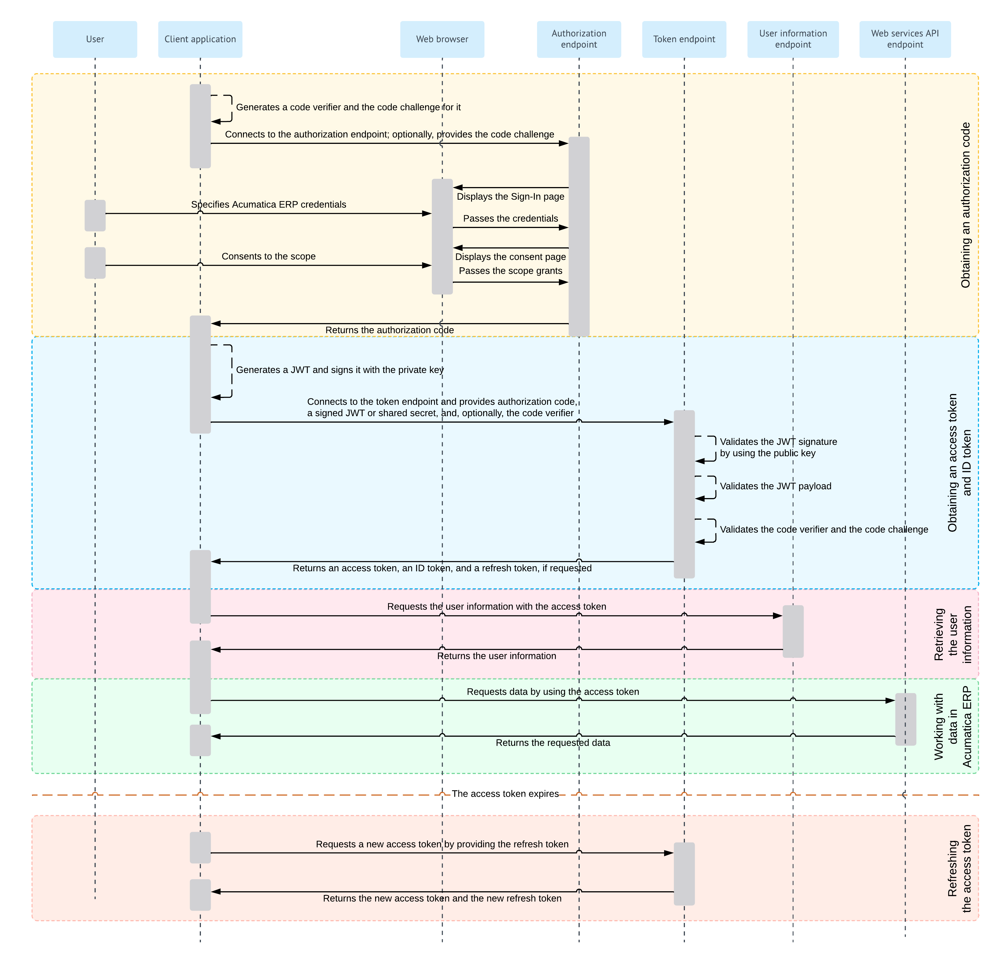

# Authorization Code Flow: General Information {#_ff780860-09c2-46c9-bdd7-c6c3b1fc442c .concept}

When you implement OAuth 2.0 or OpenID Connect \(OIDC\) in a client application to make the application work with Acumatica ERP, you can use the Authorization Code flow. With this authorization flow, the client application never gets the credentials of the applicable Acumatica ERP user. After the user is authenticated in Acumatica ERP, the client application receives an authorization code, exchanges it for an access token, and then uses the access token to work with data in Acumatica ERP.

## Learning Objectives { .section}

In this chapter, you will learn how to implement a client application that uses the Authorization Code flow.

## Applicable Scenarios { .section}

You implement the Authorization Code flow in a client application when you want to securely obtain an access token without exposing the user's credentials to the client application.

## Authorization Code Flow { .section}

For the support of the Authorization Code flow, you implement the following general steps in the application:

1.  **Obtaining an authorization code**

    If the client application uses the proof key for code exchange \(PKCE\), the client application generates the code verifier and the code challenge. For details about this generation, see [https://www.rfc-editor.org/rfc/rfc7636](https://www.rfc-editor.org/rfc/rfc7636). Only the S256 challenge method is supported.

    The client application connects to the authorization endpoint of Acumatica ERP; if PKCE is used, it provides the code challenge.

    The authorization endpoint directs the user of the client application to the sign-in page of Acumatica ERP, where the user should enter the credentials to sign in to a tenant configured in the Acumatica ERP instance.

    **Note:** The user must sign in to the tenant that was specified in the client\_id URL parameter passed to the authorization endpoint. \(This tenant is selected by default on the sign-in page.\)

    If the credentials are accepted by Acumatica ERP, the system displays the consent form, where the user can confirm that the application has access to the requested scopes. Only the scopes that were requested by the application are displayed on the consent form.

    Once the user grants access to the requested scopes, Acumatica ERP redirects the client application to the address that was specified in the request, and adds the authorization code in the URL parameter.

    For details on the request for the authorization code, see [Authorization Code Flow: Obtaining of an Authorization Code](OAuthOIDC_AuthorizationCode_AuthorizationCode.md).

2.  **Obtaining an access token and ID token**

    If the client application uses JSON Web Token \(JWT\) bearer tokens, the application generates a JWT and signs it with the private key.

    The client application connects to the token endpoint of Acumatica ERP and submits the following:

    -   The authorization code.
    -   A signed JWT or a shared secret. If a JWT is provided, Acumatica ERP verifies the JWT signature by using the public key \(which was specified during the registration of the client application in Acumatica ERP\) and validates the JWT payload. If a shared secret is provided, Acumatica ERP verifies the provided application credentials.
    -   If PKCE is used, the code verifier. Acumatica ERP validates the code verifier upon the code challenge that the system has received from the client application with the request for the authorization code.
    If verification is completed successfully, Acumatica ERP issues the access token, the ID token, and the refresh token if these tokens have been requested by the application. The client application should provide the access token with each data request to Acumatica ERP.

    If the ID token is retrieved, the client application validates it by using the key that is available on the [OpenID Connect Preferences](../Shared/../UserGuide/SM_30_30_30.md) \(SM303030\) form. The client application can obtain the key through a `GET` request to the following URL: *\[&lt;Acumatica ERP instance URL&gt;\]/identity/.well-known/openid-configuration/jwks*. The ID token contains the claims to which the user has granted access.

    For more information on this process, see [Authorization Code Flow: Obtaining of an Access Token and ID Token](OAuthOIDC_AuthorizationCode_AccessToken.md).

3.  **Optional: Retrieving the user information**

    The client application requests user information from Acumatica ERP and provides the access token with this request. Acumatica ERP returns the information for which the user has provided the consent. For details about this request, see [OAuth 2.0 and OIDC: Obtaining of the User Data](../Shared/../IntegrationDevelopmentGuide/OAuthOIDC_GettingStarted_UserInfoEndpoint.md).

    **Attention:** The recommended way of obtaining the user data is to parse the validated ID token, which contains the same claims as the ones that are obtained through this request.

4.  **Optional: Working with data in Acumatica ERP**

    The client application requests data from Acumatica ERP and provides the access token with this request. Acumatica ERP returns the requested data. For details on this process, see [OAuth 2.0 and OIDC: Working with Data in Acumatica ERP](../Shared/../IntegrationDevelopmentGuide/OAuthOIDC_GettingStarted_DataRetrieval.md).

When the access token expires, the client application can request a new access token by providing a refresh token, as described in [OAuth 2.0 and OIDC: Refreshing of an Access Token](../Shared/../IntegrationDevelopmentGuide/OAuthOIDC_GettingStarted_RefreshToken.md).

For details on the OAuth 2.0 authorization mechanism, see the specification at [https://tools.ietf.org/html/rfc6749](https://tools.ietf.org/html/rfc6749). For details on the OIDC authorization mechanism, see the specification at [https://openid.net/specs/openid-connect-core-1\_0.html\#Authentication](https://openid.net/specs/openid-connect-core-1_0.html#Authentication).

**Tip:** The configuration of the OpenID Connect protocol that is used by an Acumatica ERP website can be displayed by a request to the following URL: *\[&lt;Acumatica ERP instance URL&gt;\]/identity/.well-known/openid-configuration*. \(In this request, *\[&lt;Acumatica ERP instance URL&gt;\]* stands for the URL of the Acumatica ERP website.\)

## Authorization Code Flow Diagram { .section}

The following diagram illustrates the Authorization Code flow.

**Parent topic:**[Implementing the Authorization Code Flow](../IntegrationDevelopmentGuide/OAuthOIDC_AuthorizationCode_Mapref.md)

