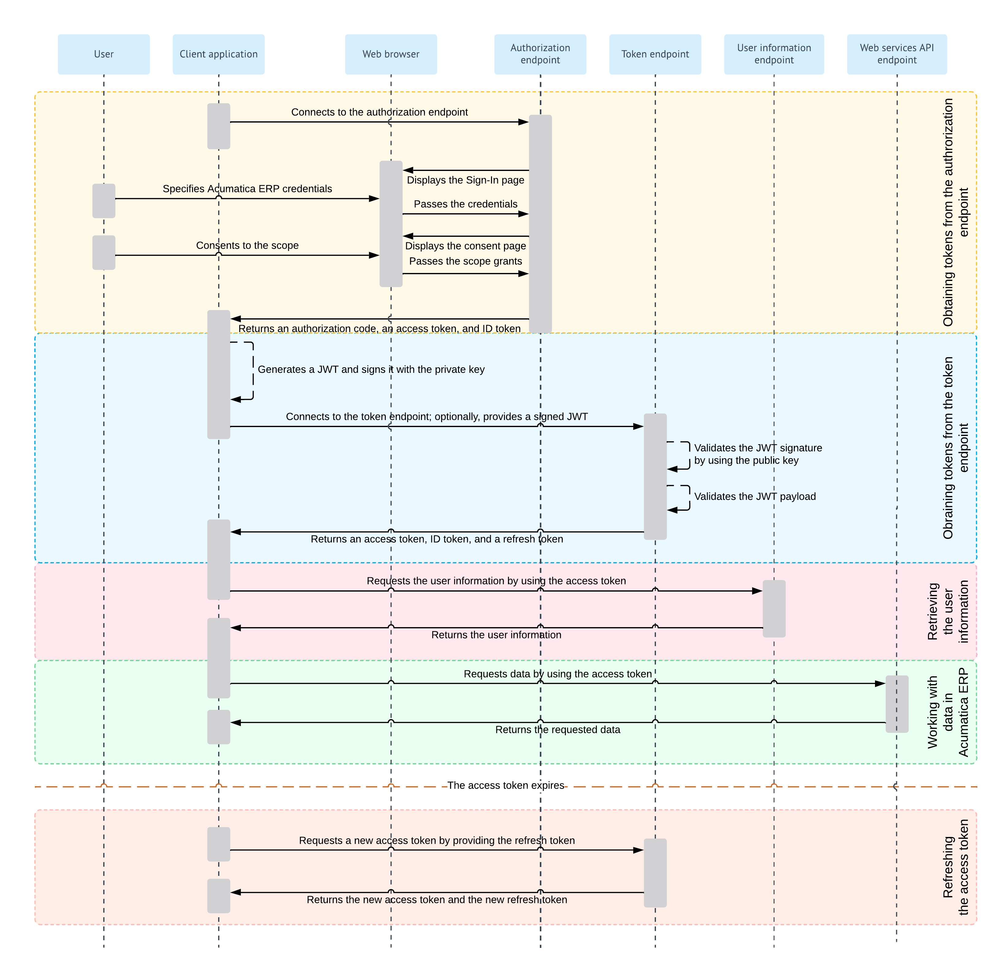

# Hybrid Flow: General Information {#_f1bcf512-d676-4d8d-99d7-1a25fd565cdf .concept}

When you implement OpenID Connect \(OIDC\) in a client application to make the application work with Acumatica ERP, you can use the Hybrid flow. This authorization flow is a combination of the Authorization Code flow and the Implicit flow. As with the Authorization Code flow, with the Hybrid flow, the client application requests the authorization code at the authorization endpoint. As with the Implicit flow, with the Hybrid flow, the client application requests the ID token, access token, or both at the token endpoint. The Hybrid flow allows an application to have immediate access to an ID token while providing secure retrieval of access and refresh tokens.

## Learning Objectives { .section}

In this chapter, you will learn how to implement a client application that uses the Hybrid flow.

## Applicable Scenarios { .section}

You implement the Hybrid flow in a client application that can securely store client secrets when the application needs to immediately access information about the user, but must perform some processing before gaining access to protected resources for a long period.

## Hybrid Flow { .section}

For the support of the Hybrid flow, you implement the following general steps in the application:

1.  **Obtaining tokens from the authorization endpoint**

    The client application connects to the authorization endpoint of Acumatica ERP.

    The authorization endpoint directs the user of the client application to the sign-in page of Acumatica ERP, where the user should enter the credentials to sign in to a tenant configured in the Acumatica ERP instance.

    **Note:** The user must sign in to the tenant that was specified in the client\_id URL parameter passed to the authorization endpoint. \(This tenant is selected by default on the sign-in page.\)

    If the credentials are accepted by Acumatica ERP, the system displays the consent form, where the user can confirm that the application has access to the requested scopes. Only the scopes that were requested by the application are displayed on the consent form.

    If the user has successfully signed in to Acumatica ERP and has granted the access, a response is sent to the redirect URI specified in the authorization request. The response can contain an ID token, access token, and authorization code.

    If the ID token is retrieved, the client application validates it by using the key that is available on the [OpenID Connect Preferences](../Shared/../UserGuide/SM_30_30_30.md) \(SM303030\) form. The client application can obtain the key through a `GET` request to the following URL: *\[&lt;Acumatica ERP instance URL&gt;\]/identity/.well-known/openid-configuration/jwks*. The ID token contains the claims to which the user has granted access.

    For details on the requesting of tokens from the authorization endpoint, see [Hybrid Flow: Obtaining of an Authorization Code, Access Token, and ID Token from the Authorization Endpoint](OAuthOIDC_Hybrid_AuthorizationEndpoint.md).

2.  **Obtaining tokens from the token endpoint**

    If the client application uses JSON Web Token \(JWT\) bearer tokens, the application generates a JWT and signs it with the private key.

    The client application connects to the token endpoint of Acumatica ERP, submits the authorization code, and provides a signed JWT or a shared secret. If a JWT is provided, Acumatica ERP verifies the JWT signature by using the public key \(which was specified during the registration of the client application in Acumatica ERP\) and validates the JWT payload. If a shared secret is provided, Acumatica ERP verifies the provided application credentials.

    If verification is completed successfully, Acumatica ERP issues the access token, the ID token, and the refresh token if these tokens have been requested by the application. The client application should provide the access token with each data request to Acumatica ERP.

    If the ID token is retrieved, the client application validates it by using the key that is available on the [OpenID Connect Preferences](../Shared/../UserGuide/SM_30_30_30.md) \(SM303030\) form. The client application can obtain the key through a `GET` request to the following URL: *\[&lt;Acumatica ERP instance URL&gt;\]/identity/.well-known/openid-configuration/jwks*. The ID token contains the claims to which the user has granted access.

    For more information on this process, see [Hybrid Flow: Obtaining of an Access Token and ID Token from the Token Endpoint](OAuthOIDC_Hybrid_TokenEndpoint.md).

3.  **Optional: Retrieving the user information**

    The client application requests user information from Acumatica ERP and provides the access token with this request. Acumatica ERP returns the information for which the user has provided the consent. For details about this request, see [OAuth 2.0 and OIDC: Obtaining of the User Data](../Shared/../IntegrationDevelopmentGuide/OAuthOIDC_GettingStarted_UserInfoEndpoint.md).

    **Attention:** The recommended way of obtaining the user data is to parse the validated ID token, which contains the same claims as the ones that are obtained through this request.

4.  **Optional: Working with data in Acumatica ERP**

    The client application requests data from Acumatica ERP and provides the access token with this request. Acumatica ERP returns the requested data. For details on this process, see [OAuth 2.0 and OIDC: Working with Data in Acumatica ERP](../Shared/../IntegrationDevelopmentGuide/OAuthOIDC_GettingStarted_DataRetrieval.md).

When the access token expires, the client application can request a new access token by providing a refresh token, as described in [OAuth 2.0 and OIDC: Refreshing of an Access Token](../Shared/../IntegrationDevelopmentGuide/OAuthOIDC_GettingStarted_RefreshToken.md).

For details on the OAuth 2.0 authorization mechanism, see the specification at [https://tools.ietf.org/html/rfc6749](https://tools.ietf.org/html/rfc6749). For details on the OIDC authorization mechanism, see the specification at [https://openid.net/specs/openid-connect-core-1\_0.html\#Authentication](https://openid.net/specs/openid-connect-core-1_0.html#Authentication).

**Tip:** The configuration of the OpenID Connect protocol that is used by an Acumatica ERP website can be displayed by a request to the following URL: *\[&lt;Acumatica ERP instance URL&gt;\]/identity/.well-known/openid-configuration*. \(In this request, *\[&lt;Acumatica ERP instance URL&gt;\]* stands for the URL of the Acumatica ERP website.\)

## Hybrid Flow Diagram { .section}

The following diagram illustrates the Hybrid flow.

**Parent topic:**[Implementing the Hybrid Flow](../IntegrationDevelopmentGuide/OAuthOIDC_Hybrid_Mapref.md)

