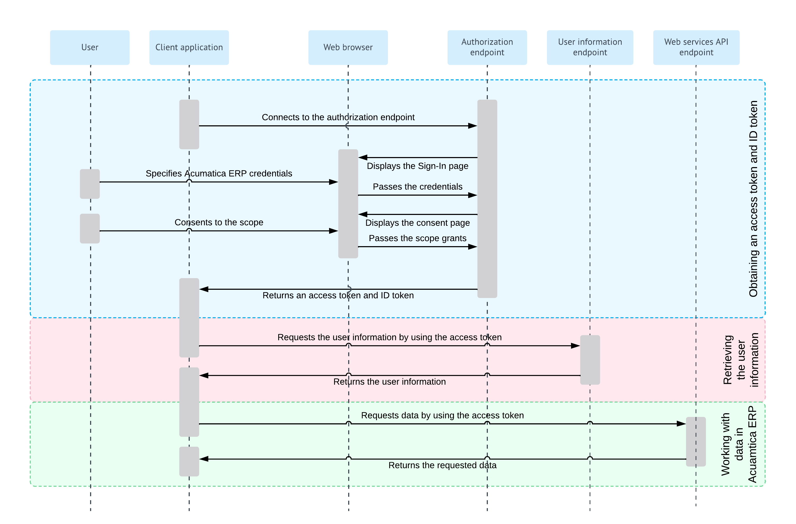

# Implicit Flow: General Information {#_76861c67-265c-46f4-949d-c8d4509c99ec .concept}

When you implement OAuth 2.0 or OpenID Connect \(OIDC\) in a client application to make the application work with Acumatica ERP, you can use the Implicit flow, which is a simplified variant of the Authorization Code flow.

With the Implicit flow, the client application never gets the credentials of the applicable Acumatica ERP user. When the user is authenticated in Acumatica ERP, the client application does not receive an authorization code \(as with the Authorization Code flow\); instead, the client application directly receives an access token, and then uses the access token to work with data in Acumatica ERP. The access token is valid for a limited period of time and cannot be renewed.

## Learning Objectives { .section}

In this chapter, you will learn how to implement a client application that uses the Implicit flow.

## Applicable Scenarios { .section}

You implement the Implicit flow in a client application when you want to securely obtain an access token without exposing the user's credentials to the client application. This flow can be used for clients using a scripting language \(such as JavaScript\) or for mobile clients.

## Implicit Flow { .section}

For the support of the Implicit flow, you implement the following general steps in the application:

1.  **Obtaining an access token**

    The client application connects to the authorization endpoint of Acumatica ERP.

    The authorization endpoint directs the user of the client application to the sign-in page of Acumatica ERP, where the user should enter the credentials to sign in to a tenant configured in the Acumatica ERP instance.

    **Note:** The user must sign in to the tenant that was specified in the client\_id URL parameter passed to the authorization endpoint. \(This tenant is selected by default on the sign-in page.\)

    If the credentials are accepted by Acumatica ERP, the system displays the consent form, where the user can confirm that the application has access to the requested scopes. Only the scopes that were requested by the application are displayed on the consent form.

    Once the user grants access to the requested scopes, Acumatica ERP issues the access token and the ID token \(if requested\). The client application should provide the access token with each data request to Acumatica ERP.

    If the ID token is retrieved, the client application validates it by using the key that is available on the [OpenID Connect Preferences](../Shared/../UserGuide/SM_30_30_30.md) \(SM303030\) form. The client application can obtain the key through a `GET` request to the following URL: *\[&lt;Acumatica ERP instance URL&gt;\]/identity/.well-known/openid-configuration/jwks*. The ID token contains the claims to which the user has granted access.

    For more information on the request that obtains the tokens, see [Implicit Flow: Obtaining of an Access Token and ID Token](OAuthOIDC_Implicit_AccessToken.md).

2.  **Optional: Retrieving the user information**

    The client application requests user information from Acumatica ERP and provides the access token with this request. Acumatica ERP returns the information for which the user has provided the consent. For details about this request, see [OAuth 2.0 and OIDC: Obtaining of the User Data](../Shared/../IntegrationDevelopmentGuide/OAuthOIDC_GettingStarted_UserInfoEndpoint.md).

    **Attention:** The recommended way of obtaining the user data is to parse the validated ID token, which contains the same claims as the ones that are obtained through this request.

3.  **Optional: Working with data in Acumatica ERP**

    The client application requests data from Acumatica ERP and provides the access token with this request. Acumatica ERP returns the requested data. For details on this process, see [OAuth 2.0 and OIDC: Working with Data in Acumatica ERP](../Shared/../IntegrationDevelopmentGuide/OAuthOIDC_GettingStarted_DataRetrieval.md).

**Note:** Refresh tokens are not supported by the Implicit flow.

For details on the OAuth 2.0 authorization mechanism, see the specification at [https://tools.ietf.org/html/rfc6749](https://tools.ietf.org/html/rfc6749). For details on the OIDC authorization mechanism, see the specification at [https://openid.net/specs/openid-connect-core-1\_0.html\#Authentication](https://openid.net/specs/openid-connect-core-1_0.html#Authentication).

**Tip:** The configuration of the OpenID Connect protocol that is used by an Acumatica ERP website can be displayed by a request to the following URL: *\[&lt;Acumatica ERP instance URL&gt;\]/identity/.well-known/openid-configuration*. \(In this request, *\[&lt;Acumatica ERP instance URL&gt;\]* stands for the URL of the Acumatica ERP website.\)

## Implicit Flow Diagram { .section}

The following diagram illustrates the Implicit flow.

**Parent topic:**[Implementing the Implicit Flow](../IntegrationDevelopmentGuide/OAuthOIDC_Implicit_Mapref.md)

