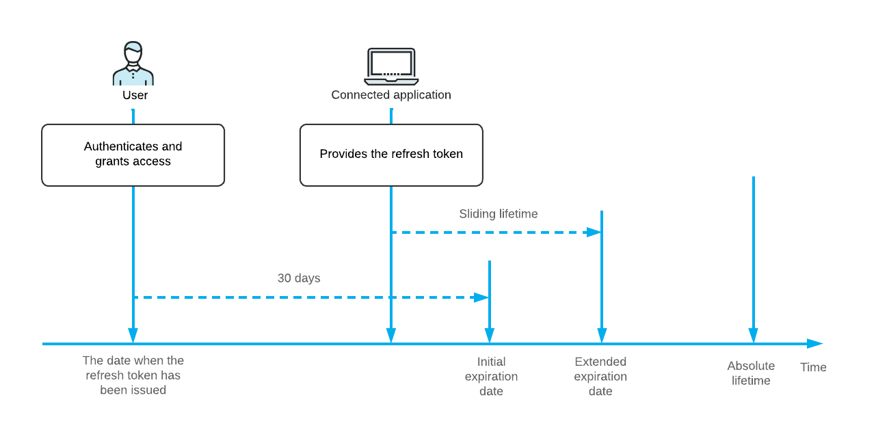

# Registration of an OAuth 2.0 or OIDC Application: Sliding Expiration of Refresh Tokens {#_92bf610c-f18c-446c-8e62-5fb928ef2def .concept}

If you do not want a user to reauthorize the client application to work with Acumatica ERP every 30 days, you can configure the sliding expiration of refresh tokens for client applications. On the [Connected Applications](../UserGuide/SM_30_30_10.md) \(SM303010\) form, for any client application that has the *Authorization Code*, *Resource Owner Password Credentials*, or *Hybrid* flow, you can select the *Sliding Expiration* mode in the **Refresh Tokens** section in the Summary area. You can also specify the length of the sliding lifetime and indicate whether the refresh tokens for the application have an absolute lifetime.

## How the Sliding Expiration Works { .section}

When a user grants the offline\_access scope \(along with the api or openid scope\) to a connected application, the application receives a refresh token and an access token. The application can then access data in Acumatica ERP during a specific period of time, which is specified in the response that returns the access token. When the access token expires, the client application can request a new access token by providing the refresh token to the token endpoint. The refresh token can be provided anytime within 30 days of the first issuing of the token.

If during these 30 days, the connected application provides the refresh token to the token endpoint, the system extends the period of time for which the new refresh token is valid. The lifetime is extended by the time that is specified in the **Sliding Lifetime \(Days\)** box in the Summary area \(**Refresh Tokens** section\) of the [Connected Applications](../UserGuide/SM_30_30_10.md) \(SM303010\) form. The lifetime of the refresh token can be extended multiple times by the period of the sliding lifetime until the refresh token's total lifetime \(from its initial issuing\) exceeds the number of days that is specified in the **Absolute Lifetime \(Days\)** box. If the **Infinite** check box is selected for the absolute lifetime, the lifetime of the refresh token can be extended endlessly. The following diagram illustrates the sliding expiration of refresh tokens.

**Parent topic:**[Registering Client Applications That Support OAuth 2.0 or OIDC](../IntegrationDevelopmentGuide/OAuthOIDC_Registration_Mapref.md)

