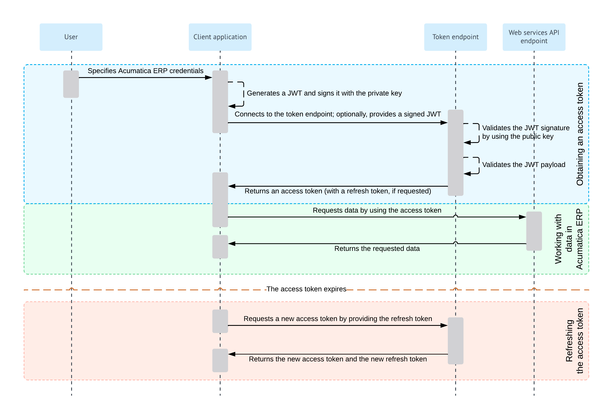

# Resource Owner Password Credentials Flow: General Information {#_2930d2f7-e081-4d0e-8879-93907ce82607 .concept}

When you implement OAuth 2.0 in a client application to make the application work with Acumatica ERP, you can use the Resource Owner Password Credentials flow.

With the Resource Owner Password Credentials flow, the credentials \(username and password\) of the Acumatica ERP user are provided directly to the client application, which uses the credentials to obtain the access token. When the access token expires, the client application can request a new access token by providing a refresh token.

## Learning Objectives { .section}

In this chapter, you will learn how to implement a client application that uses the Resource Owner Password Credentials flow.

## Applicable Scenarios { .section}

You can use the Resource Owner Password Credentials flow in environments where the client application can securely store user credentials and there is a high level of trust between the user and the client application, as with native mobile applications.

**Attention:** The Resource Owner Password Credentials flow has significant drawbacks and security concerns, such as the following:

-   Handling and transmitting user credentials directly from the client application to the authorization server can introduce security risks.
-   Because the Resource Owner Password Credentials flow bypasses the authorization step, a user does not have the opportunity to review and grant consent to the client application's access to the resources.

Therefore, you should carefully consider the use of the Resource Owner Password Credentials flow, and prefer other authorization flows, such as Authorization Code flow, whenever possible.

## Resource Owner Password Credentials Flow { .section}

For the support of the Resource Owner Password Credentials flow, you implement the following general steps in the application:

1.  **Obtaining an access token**

    The client application obtains the username and password of the applicable Acumatica ERP user, which can then be exchanged for an access token.

    If the client application uses JSON Web Token \(JWT\) bearer tokens, the application generates a JWT and signs it with the private key.

    The client application connects to the token endpoint of Acumatica ERP, submits the user credentials, and provides a signed JWT or a shared secret. If a JWT is provided, Acumatica ERP verifies the JWT signature by using the public key \(which was specified during the registration of the client application in Acumatica ERP\) and validates the JWT payload. If a shared secret is provided, Acumatica ERP verifies the provided application credentials.

    If verification is completed successfully, Acumatica ERP issues an access token, which the client application should provide with each data request to Acumatica ERP, and a refresh token \(if requested\).

    For more information on this process, see [Resource Owner Password Credentials Flow: Obtaining of an Access Token](OAuthOIDC_ResourceOwner_AccessToken.md).

2.  **Optional: Working with data in Acumatica ERP**

    The client application requests data from Acumatica ERP and provides the access token with this request. Acumatica ERP returns the requested data. For details on this process, see [OAuth 2.0 and OIDC: Working with Data in Acumatica ERP](../Shared/../IntegrationDevelopmentGuide/OAuthOIDC_GettingStarted_DataRetrieval.md).

When the access token expires, the client application can request a new access token by providing a refresh token, as described in [OAuth 2.0 and OIDC: Refreshing of an Access Token](../Shared/../IntegrationDevelopmentGuide/OAuthOIDC_GettingStarted_RefreshToken.md).

For details on the OAuth 2.0 authorization mechanism, see the specification at [https://tools.ietf.org/html/rfc6749](https://tools.ietf.org/html/rfc6749).

## Diagram of the Resource Owner Password Credentials Flow { .section}

The following diagram illustrates the Resource Owner Password Credentials flow.

**Parent topic:**[Implementing the Resource Owner Password Credentials Flow](../IntegrationDevelopmentGuide/OAuthOIDC_ResourceOwner_Mapref.md)

