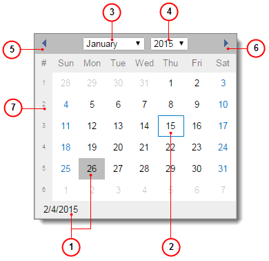

# Calendar Dialog Box {#_07015047-bb27-45d2-871d-97f8b7dc9667 .concept}

The Calendar dialog box, which appears when you click the arrow in a date box, displays the calendar page for the selected date, as shown in the screenshot below. You can use the Calendar dialog box to select a new date, which will appear in the date box. For details, see [To Select a Date by Using the Calendar](UIG__how_Use_calendar.md).

1.  Current date
2.  Selected date
3.  Selected month
4.  Selected year
5.  Previous month
6.  Next month
7.  Week number column

When you're defining a new object, entity, or record, the selected date by default is the business date specified in Acumatica ERP. For details on changing the business date, see [Your Working Environment: To Change the Business Date](../UserGuide/Setting_Business_Date.md) in the Acumatica ERP Getting Started Guide.

-   **[To Select a Date by Using the Calendar](../InterfaceGuide/UIG__how_Use_calendar.md)**  

**Parent topic:**[Form Elements](../InterfaceGuide/Form_Fields.md)

