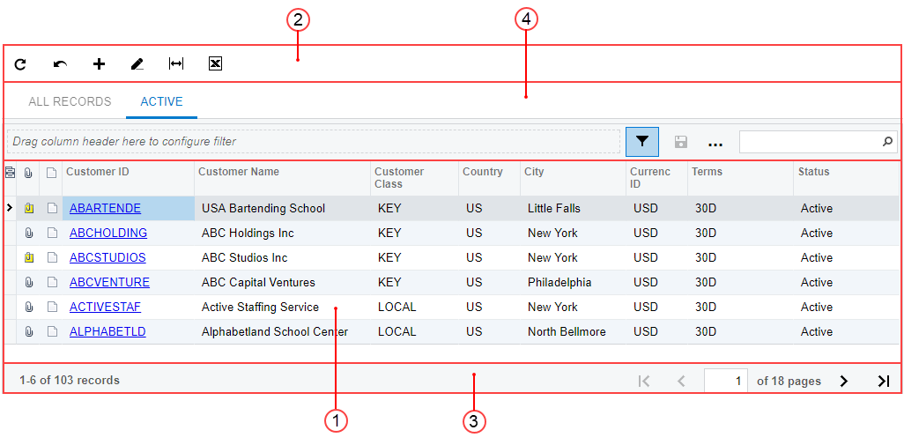

# Tables {#_87a128a5-1230-4584-8c7a-ad05bcd08b75 .concept}

On many Acumatica ERP forms, tabs, and dialog boxes, some or all of the data is arranged in *tables*, where each row represents an object or detail \(such as an account, an inventory item, a document row, or a journal entry\) and each column shows a parameter of the object or detail in the row.

A table can have the following elements:

-   Table rows and columns \(see Item 1 in the following screenshot\)
-   A table toolbar \(2\) with buttons you can click to invoke actions as you work with the objects or details in the table
-   A table footer \(3\) with buttons you can click to navigate between the pages of the table
-   A filtering area \(4\), which you can use to filter the objects in the table

## In This Chapter { .section}

-   [Table Rows and Columns](TB__con_Table_Rows_and_Columns.md)
-   [Table Toolbar](Details_Toolbar.md)
-   [Table Footer](TB__con_Table_Footer.md)
-   [Filtering Area](TB__con_Filter_Area.md)
-   [Adjusting the Table Layout](Details_Table_Using.md)
-   [Using Tables](Details_Table__con_Working_with.md)

-   **[Table Rows and Columns](../InterfaceGuide/TB__con_Table_Rows_and_Columns.md)**  

-   **[Table Toolbar](../InterfaceGuide/Details_Toolbar.md)**  

-   **[Table Footer](../InterfaceGuide/TB__con_Table_Footer.md)**  

-   **[Filtering Area](../InterfaceGuide/TB__con_Filter_Area.md)**  

-   **[Adjusting the Table Layout](../InterfaceGuide/Details_Table_Using.md)**  

-   **[Using Tables](../InterfaceGuide/Details_Table__con_Working_with.md)**  

