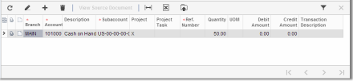
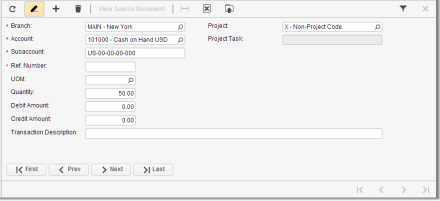

# Adjusting the Table Layout {#_f78e2c44-fa52-4593-ba37-65cf2acd58de .concept}

As you work, you may need to adjust layouts of tables to suit your needs; typical operations are discussed below.

## Switching Between Form View and Grid View { .section}

On data entry forms, tables can be presented in the following views:

-   **Grid View**: This is a standard tabular view, with all details arranged in a table and each row representing one detail or document row, as shown in the following screenshot.

    

-   **Form View**: With the form view \(shown in the following screenshot\), you see a set of elements intended for only one detail or document row, and you use the navigation buttons \(in the lower left corner of the form\) to move from one row of the table to another.

    

To switch between these two views, do the following:

-   Click **Switch Between Grid and Form** \(\) on the table toolbar.

## Changing the Table Layout { .section}

You can adjust any table to meet your information needs. Adjustments that you make to a table affect only your user account and are not visible to other users.

You can fine-tune the table in the following ways:

-   Hide or display columns, as described in [To Hide or Display Table Columns](Tables__how_Hide_columns.md)
-   Adjust the column width, as described in [To Adjust Column Widths](Tables__how_Adjust_width.md)
-   Change the order of columns, as described in [To Change the Order of Columns](Tables__how_Change_column_order.md)

When you make any of these changes, the table will display them immediately, and the system will save them automatically.

The **Column Configuration** dialog box, which is used to adjust the table, is described in [Column Configuration Dialog Box](TB__con_Table_Rows_and_Columns.md#_2f357643-1a28-4e29-a8da-17a4f668121e).

If your user account is assigned the *Administrator* role you can set default column configuration for all users of the system and configure table layouts for particular users, as described in [Default Table Layout and Accessibility](UIG__con_Default_Table_Layout.md).

-   **[Default Table Layout and Accessibility](../InterfaceGuide/UIG__con_Default_Table_Layout.md)**  

-   **[To Change the Default Configuration of a Table](../InterfaceGuide/UIG_how_Change_Default_Config_Table.md)**  

-   **[To Share a Column Configuration](../InterfaceGuide/UIG_how_Share_Column_Configuration.md)**  

-   **[To Hide or Display Table Columns](../InterfaceGuide/Tables__how_Hide_columns.md)**  

-   **[To Adjust Column Widths](../InterfaceGuide/Tables__how_Adjust_width.md)**  

-   **[To Change the Order of Columns](../InterfaceGuide/Tables__how_Change_column_order.md)**  

**Parent topic:**[Tables](../InterfaceGuide/Details_Table.md)

