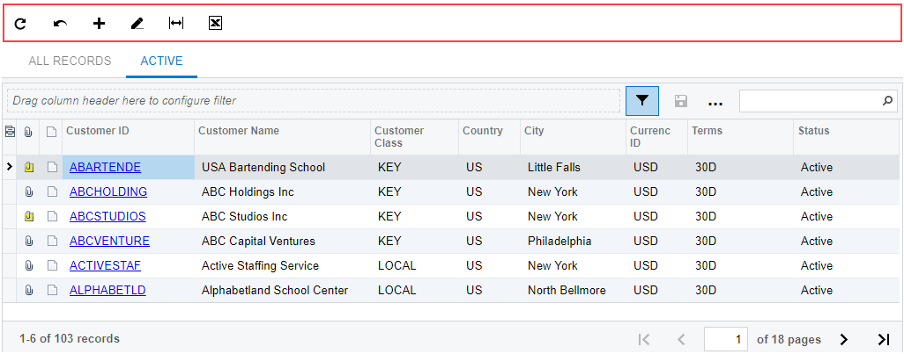
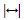

# Table Toolbar {#_53fbbe04-a46c-4975-93c4-1d342170e472 .concept}

Each table on an Acumatica ERP form, tab, dialog box, or page has a table toolbar, which contains the buttons you can use to work with the details or objects of the table. A toolbar, shown in the following screenshot, includes buttons that are specific to the table, standard buttons that most table toolbars have, and the Search box \(for some tables; for others, the Search box is displayed in the filtering area\).

## Standard Table Toolbar Buttons { .section}

The following table describes the standard table toolbar buttons. A table toolbar may include some or all of those buttons. If a table toolbar includes table-specific buttons, they are described in the reference help topic.

|Button|Icon|Description|
|------|:---:|-----------|
|**Refresh**||Refreshes the data in the table.|
|**Switch Between Grid and Form**||Controls how the elements are displayed: in a table \(grid\) with rows and columns; or as separately arranged elements for one table row, with navigation tools you use to move between row data.|
|**Add Row**||Appends a new row to the table so you can define a new detail or object. The new row may contain some default values.|
|**Delete Row**||Deletes the selected row or rows.|
|**Move Row Up**||Moves the selected row one position up.|
|**Move Row Down**||Moves the selected row one position down.|
|**Fit to Screen**||Adjusts the table to the screen width and makes the column width proportional.|
|**Export to Excel**||Exports the data in the table to an Excel file. For more information, see [Integration with Excel](../UserGuide/Exporting_to_Excel.md) in the Acumatica ERP Getting Started Guide.|
|**Filter Settings**||Opens the **Filter Settings** dialog box, which you can use to define a new advanced filter. After you create and save the filter, the corresponding tab appears on the table.

 For more information about filtering, see [Filters](IB_Filters.md). For details on the **Filter Settings** dialog box, see [Filter Settings Dialog Box](../UserGuide/GS__ref_Reusable_Filter_Settings_dialog.md).

|
|**Load Records from File**||Opens the **File Upload** dialog box, described in detail below, so you can locate and upload a local file for import. You can use this option to import data from an Excel spreadsheet \(`.xlsx`\) or `.csv` file. For the detailed procedure, see [To Import Data from a Local File to a Table](UIG__how_Import_data.md).|
|**Search**||A box in which you can type a word, part of a word, or multiple words. As you type, the system filters the contents of the table to display only rows that contain the string you have typed in any column.|
|**Download**||Downloads the selected file.|

## File Upload Dialog Box { .section}

With the **File Upload** dialog box, you select a file of one of the supported formats \(`.csv` or `.xlsx`\) to import data from the file.

|Element|Description|
|-------|-----------|
|**File Path**|The path to the file you want to upload. To select the file, click **Browse**, and then find and select the file you want to upload.

|
|The dialog box has the following button.|
|**Upload**|Closes the dialog box and opens the **Common Settings** dialog box, where you specify the import settings.|

## Common Settings Dialog Box { .section}

In the **Common Settings** dialog box, which opens if you click **Upload** in the **File Upload** dialog box, you specify the import settings for a file that you has selected in the **File Upload** dialog box.

|Element|Description|
|-------|-----------|
|**Separator Chars**|The character that is used as the separator in the imported file.

 By default, the comma is used as the separator. You specify the separator character if the imported file uses any other separator.

 This box appears only if you import data from a .`csv` file.

|
|**Null Value**|Optional. The value that is used to mark an empty column in the imported file. You specify the null value if the value in the imported file differs from the empty string.|
|**Encoding**|The encoding that is used in the imported file.

 This box appears only if you import data from a `.csv` file.

|
|**Culture**|The regional format that has been used to display the time, currency, and other measurements in the imported file.|
|**Mode**|The mode that determines which rows of the uploaded file will be imported into the table. The following options are available:-   *Update Existing*: The rows already present in the table will be updated, and the rows not present in the table will be added.
-   *Bypass Existing*: Only the new rows that are not present in the table will be imported. The rows that are already present in the table will not be updated.
-   *Insert All Records*: All the rows from the file will be imported into the table.

**Attention:** If you select this option, you may get duplicated rows because the system does not check for duplicates when importing rows from the file.

|
|The dialog box has the following buttons.|
|**OK**|Closes the dialog box and opens the **Columns** dialog box.|
|**Cancel**|Closes the dialog box without importing the data from the file.|

## Columns Dialog Box { .section}

In the **Columns** dialog box, which opens if you click **OK** in the **Common Settings** dialog box, you match the columns in the imported file that you have selected in the **File Upload** dialog box to the columns in the Acumatica ERP table to which you are importing data.

|Element|Description|
|-------|-----------|
|**Column Name**|The name of the column in the uploaded file.|
|**Property Name**|The name of the corresponding column in the table in Acumatica ERP.|
|The dialog box has the following buttons.|
|**OK**|Closes the dialog box and imports the selected file.|
|**Cancel**|Closes the dialog box without importing the data from the file.|

**Parent topic:**[Tables](../InterfaceGuide/Details_Table.md)

