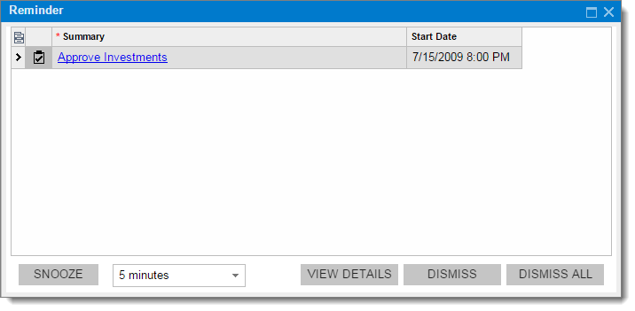

# Reminder Dialog Box {#_cb450352-a204-4eb4-967a-2abc44cd5a7c .reference}

Starting at the time specified as the reminder time for a particular task or event, the **Reminder** dialog box will appear automatically.

By using the **Reminder** dialog box, you can do any of the following:

-   Drill down to the selected task or event details
-   Dismiss the selected task or event from the list
-   Clear the list of tasks and events
-   Postpone the reminder

## Table { .section}

In this table, you can see tasks and events for which you set the reminder.

|Column|Description|
|------|-----------|
|**Summary**|The short description of the task or event for which you set the reminder. To view the details, click the summary to open the [Task](../UserGuide/CR_30_60_20.md) \(CR306020\) or [Event](../UserGuide/CR_30_60_30.md) \(CR306030\) form.|
|**Start Date**|The start date and time of the task or event.|

## Dialog Box Toolbar { .section}

The form toolbar includes only form-specific buttons, which are listed below.

|Button|Description|
|------|-----------|
|**Snooze**|Postpones the reminder for the selected task or event for the time interval you select.|
|**View Details**|Displays the details of the selected task or event.|
|**Dismiss**|Removes the selected task or event from the list.|
|**Dismiss All**|Removes all tasks and events from the list.|

**Parent topic:**[Form Elements](../InterfaceGuide/Form_Fields.md)

