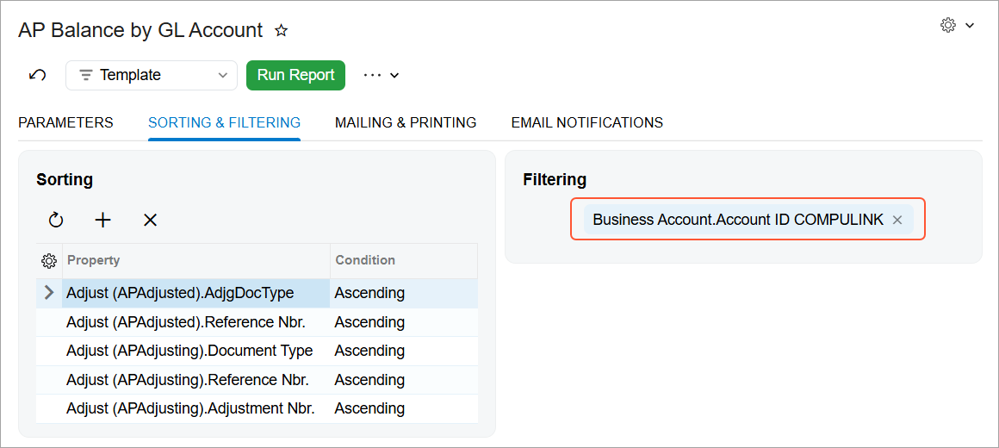
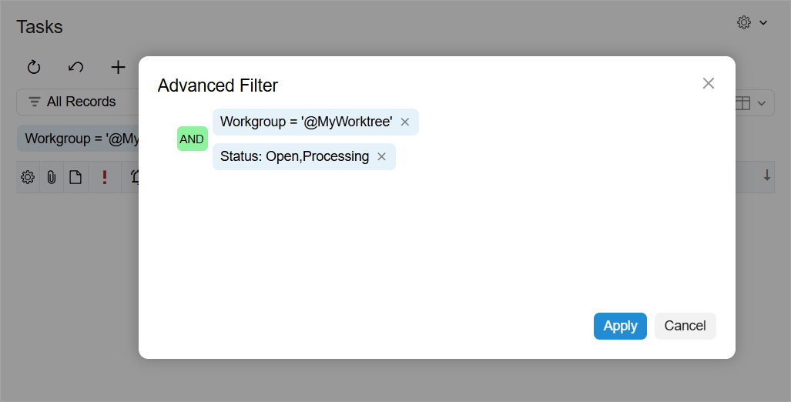
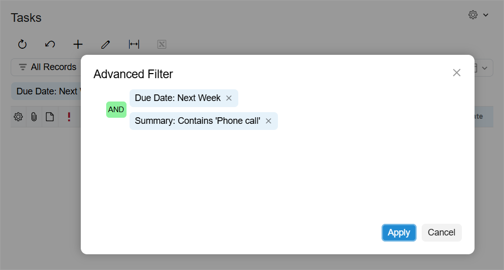

# Examples of Advanced and Ad Hoc Filters {#_35072b22-5e78-47a3-b93b-c442f08b4264 .concept}

The examples in this topic show you how you can filter records by using ad hoc and advanced filters.

## Ad Hoc Filter { .section}

The [AP Balance by GL Account](../UserGuide/AP_63_20_00.md) \(AP632000\) report displays the balances of the Accounts Payable accounts and activities on the accounts for the selected period. To fine-tune the report to show only payments collected on the *COMPULINK* account, you can add the following filter in the **Filtering** table of the **Sorting and Filtering** tab of the report form.

## Advanced Filter with Multiple Clauses { .section}

To view the tasks your workgroup is working on, on the Tasks \(EP4040PL\) form, you can add the following filter.

The filter works as follows:

-   By grouping the two status clauses, you include the tasks with a status of *Open* or *Processing*.
-   By adding the *Workgroup* clause, you include only the tasks assigned to your workgroups.

## Advanced Filter with a Date-Relative Clause { .section}

To view the phone calls due next week, you can use the following filter on the Tasks \(EP4040PL\) form.

The filter works as follows:

-   By adding the first clause, you include the tasks with a due date of next week.
-   By adding the second clause, you include the tasks whose summary includes the phrase *Phone call* with any capitalization because filtering is not case-sensitive.

**Parent topic:**[Filters](../InterfaceGuide/IB_Filters.md)

