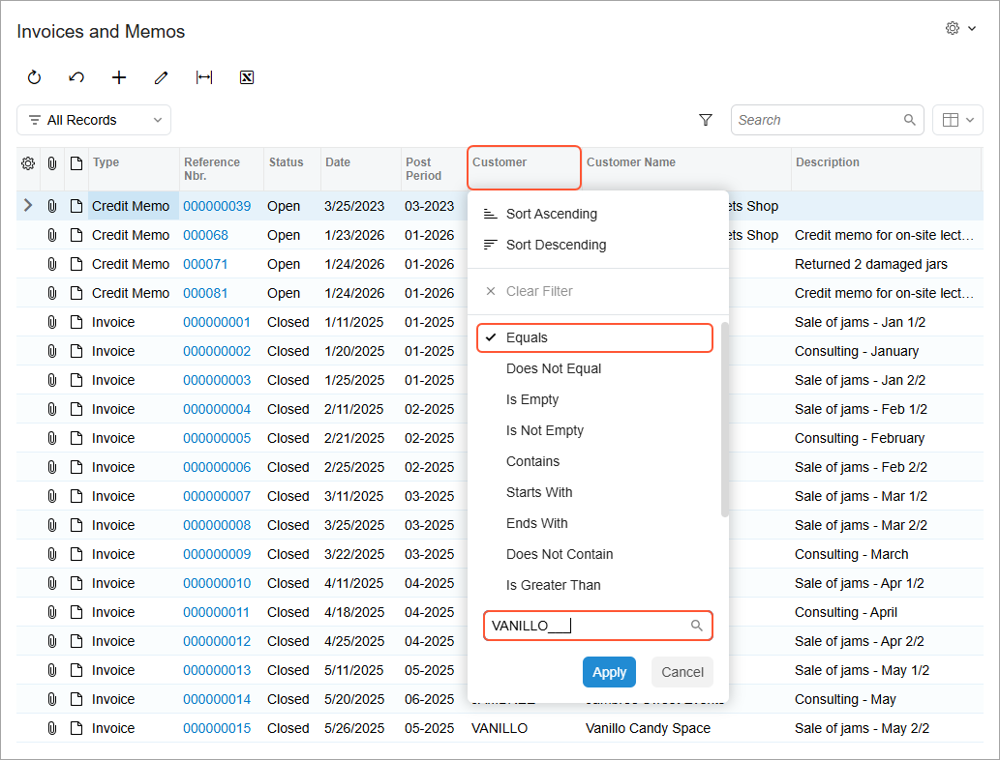
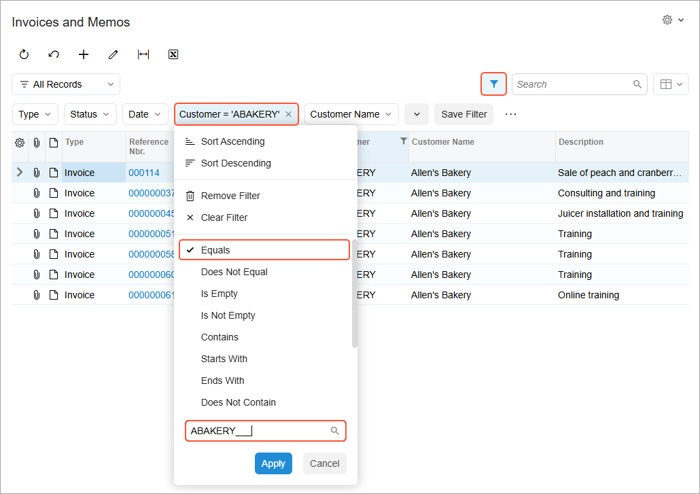
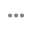

# Types of Filters {#_9371f240-f73a-4b7a-8f16-72add7be7b62 .concept}

Filters in Acumatica ERP help you find the information you want to view in a table and include only the data you need in a generated report. To help you meet your changing information needs, Acumatica ERP has the following types of filters, each with different functionality: simple, quick, advanced, and ad hoc.

**Note:** All Acumatica ERP filters are form-specific—that is, if a filter is designed for one form, you cannot apply it to another form.

## Simple Filters { .section}

You use *simple filters* to quickly filter data in a table. To use a simple filter, you click the header of the column to which you want to apply the filter and specify a condition for the column. This causes the system to display only the table rows for which this column meets the selected condition, as shown below. You can then sort the data to best meet your information needs.

For generic inquiry forms \(such as substitutes for entry forms\), once you have configured a simple filter, the simple filter is added to the filtering area of the table, where you can work with the simple filter as you can work with a quick filter. For details, see [Quick Filters](#_3ccf0fe3-5fb2-47f9-a1df-883fe5c09576) below.

For details on using simple filters, see [To Filter the Data in a Table](Filter_how_Using_Column_Filters.md).

## Quick Filters {#_3ccf0fe3-5fb2-47f9-a1df-883fe5c09576 .section}

You use *quick filters* to filter data in a table on a generic inquiry form \(such as a substitute form for a data entry form\). To use a quick filter, click the **Filter Settings** button to display the filtering area above the table. Then drag to this area the header of the column to which you want to apply the filter. In the filtering area, you select one of these:

-   The value you’re filtering by if the column has a fixed set of values \(options\)
-   The filter condition \(as shown below\) if the column has an unlimited number of values

Quick filters are session-based—that is, not automatically retained after you sign out. To save a quick filter for future use, you click **Save Filter** in the filtering area and enter its name in the **Save Filter As** dialog box. Once you save a filter, the system adds it to the Filter List menu, and the quick filter button displays its name. You can save quick filters for personal use or share them with other users if your user role has access to the [Filters](../Shared/../UserGuide/CS_20_90_10.md) \(CS209010\) form. Additionally, to have the system apply this filter automatically each time you open the form, you select the **Default** check box in the **Save Filter As** dialog box.

For details on using quick filters, see [Filtering and Sorting in Acumatica ERP](../UserGuide/GS_Filtering_and_Sorting_Mapref.md) and [Managing Advanced Filters](../UserGuide/GI_Reusable_Filters_Mapref.md).

## Advanced Filters {#_fa906328-67d8-454c-9b69-80b553b6fe43 .section}

You add *advanced filters* on processing and inquiry forms to have the data filtered when you open the form; you can create and apply these filters any time you want to, and save them for future use. These filters are considered advanced because you can specify complex and flexible filtering conditions when you set up these filters. For more information on designing advanced filters, see [Managing Advanced Filters](../UserGuide/GI_Reusable_Filters_Mapref.md).

To open the **Advanced Filter** dialog box \(shown below\), do either of the following in the filtering area:

-   Click the More \(\) button and then click the **Open Advanced Filter** command.
-   Click the **Add Quick Filter** button and select **Advanced** in the dialog box that opens.

Once the advanced filter has been applied to a table, it’s displayed as a row in the filtering area, as shown below.

For more information on using advanced filters, see [Saving of Filters for Future Use](Using_Reusable_Filters.md).

## Ad Hoc Filters { .section}

You configure *ad hoc filters* on the **Sorting &amp; Filtering** tab \(**Filtering** section\) of report forms, shown below, to fine-tune the basic report parameters. You can’t save these filters directly and reuse them later. However, you can set up and save report templates that contain the filtering and sorting settings you use for an ad hoc filter.

**Parent topic:**[Filters](../InterfaceGuide/IB_Filters.md)

