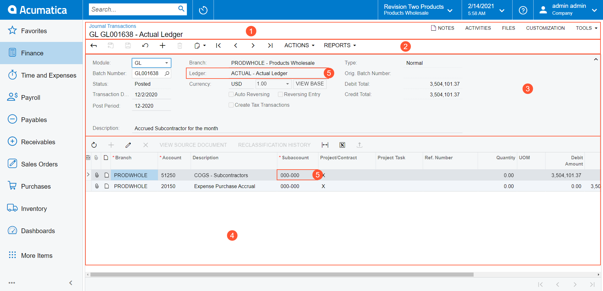

# Parts of a Form {#_a056d5a4-c50c-423b-8233-e471654b2a22 .concept}

An Acumatica ERP form consists of several basic parts. The form can include only one part or a combination of parts, depending on the functionality and use of the form. The following screenshot shows a typical Acumatica ERP screen with the parts of a form that appear on it.

1.  Form title bar
2.  Form toolbar
3.  Summary or selection area
4.  Details area
5.  Form elements

## Form Title Bar { .section}

The form title bar, which is present on each Acumatica ERP page, includes buttons for managing the form-related information. You can use this bar to view the notes and files attached to form records, to navigate to the list of records \(if you are viewing a record on a data entry form or a class form\), and to add the form to your favorites \(except for data entry forms\), among other capabilities. For more information, see [Form Title Bar](Form_Title_Bar.md).

## Form Toolbar { .section}

The form toolbar provides data navigation and processing buttons that apply to the entire form. You can use these buttons to cancel or save changes you've made, insert or delete an object, or navigate through the objects created while you use the form. For more information, see [Form Toolbar and More Menu](Form_Toolbar.md).

## Summary or Selection Area { .section}

The Summary or Selection area includes a collection of elements of different types, generally arranged in a column or in multiple columns. This area may contain a summary of a document if a form contains a document or a variety of selections you can make to determine the information in the details area.

## Details Area { .section}

The details area contains the data of the object or entity.

On some forms, the details area contains a *table*. A table is an arrangement of similar objects or details displayed with the same number of parameters. For more information, see [Tables](Details_Table.md).

On other forms, the details area may contain a rich text editor, which includes a text area and a formatting toolbar. You can enter a description or comments in the text area. You use the buttons on the formatting toolbar to format your text and to insert images, links, and macros. For more information, see [Formatting Toolbar](Formatting_toolbar.md).

## Form Elements { .section}

Form elements are used to enter information or settings to be stored in the database, specify selection criteria for presenting information on the form, or display relevant information on the form. For more information, see [Form Elements](Form_Fields.md).

**Parent topic:**[Forms](../InterfaceGuide/Forms.md)

