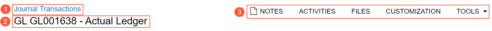
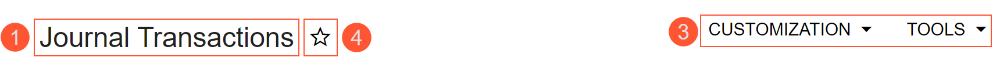

# Form Title Bar {#_150ca0bd-1a99-468f-b9c4-a728bb541bcf .concept}

The form title bar, located at the top of every Acumatica ERP form, includes general buttons you can use to manage the related data of the form—such as attaching a file to the form and adding the form to your favorites. The form title bar is slightly different depending on the type of form you are viewing:

-   A data entry form or class creation form showing a single record \(see the first screenshot below\). This form title bar is shown in the following screenshot below; the numbered elements are noted below.

    

-   Any other type of form, such as a processing form, configuration form, list of records, or other inquiry form. The following screenshot shows the form title bar for a list of records.

    

You can find the following numbered elements on the screenshots above:

1.  Form name button \(Item 1\). You can click it to return to the list of records, which in the example above is Journal Transactions \(GL3010PL\).
2.  Record title \(Item 2\). This element is shown for only data entry or class forms to provide more information about the specific record that is being viewed on the form.
3.  Menu buttons \(Item 3\). As the screenshots above show, various menu buttons appear on the right side of the form title bar, depending on the particular form.
4.  **Add to Favorites** button \(Item 4\). Notice that this button is shown on the form title bar in only the second screenshot above; it is not shown on data entry forms or forms used to create classes.

A form title bar on a particular form may include some or all of the standard buttons, which are described in more detail in the next section.

## Standard Form Title Bar Elements {#_6a655c3e-36b7-4d46-9f9e-59714e0784da .section}

The following table lists the standard elements that a form title bar might include.

|Element|Description|
|-------|-----------|
|Form Name|Shows the name of the current form.

 If you are on a data entry form or a form used to create a class, you can click the form name to navigate to the list of records of this type. For example, if you are viewing a particular customer, you click this button to view the list of customers defined in the system, and if you are viewing a particular customer class, you click this button to view the list of customer classes defined in the system.

 For all other forms, clicking the form name causes the system to refresh the form.

|
|Record Title|For a data entry form or class form, shows the record title, which represents the ID and name, description, or additional information about the specific record.

 For a new record, the system may display **New Record** as the record title. If the form boxes used for creating a caption are populated when the form is opened, the system will display the limited record details. For example, if you initiate the creation of a AP bill on the [Bills and Adjustments](../UserGuide/AP_30_10_00.md) \(AP301000\) form, the system will display **Bill** as the record title because the required **Type** box is filled by default with the *Bill* option. If you change the value of the **Type** box to *Credit Adj.*, the system will change the record title to **Credit Adj.**. However, if you initiate the creation of a task on the [Task](../UserGuide/CR_30_60_20.md) \(CR306020\) form, the system will display **New Record** in the record title because all elements the system uses for creating a caption are empty by default.

|
|**Add to Favorites**|Adds the form to your favorites. If you frequently work with the current form, you can add it to your favorites for quicker access.

 This button does not appear on the form title bar for data entry or class creation forms; it appears for other types of forms, including lists of records, configuration forms, and inquiry forms.

|
|**Notes**|Gives you the ability to attach notes to records. For more information, see [To Attach a Note to a Record](Attaching_Notes_to_Records.md).|
|**Activities**|Opens the [Tasks and Activities](#_e6cf65bd-7be8-42e2-bc3f-6c6958151635) dialog box, which gives you the ability to create and manage form-related activities, such as tasks, events, emails, phone calls, and appointments.|
|**Files**|Opens the [Files](#_8a62f1ec-6260-4cf7-bc47-cc722212ec33) dialog box, which gives you the ability to attach files to the form and manage the attached files.|
|**Customization**|Provides access to the functionality that you can use to customize the Acumatica ERP instance. For more information, see [Customization Menu](../UserGuide/AU_CustomizationMenu.md).|
|**Tools**|Provides the following commands, which give you form-related information:

 -   **Screen ID**: Shows the ID of the current form. If the form's workflow has been customized, the system displays the Flow icon \(\) to the left of the screen ID.
-   **Get Link**: Displays the link to the current form, which you can send to another user.
-   **Web Service**: Navigates to the page with the Web Service Definition Language \(WSDL\) for the Screen-Based API access methods for the currently open Acumatica ERP form.
-   **DAC Schema Browser**: Opens the [DAC Schema Browser](../UserGuide/DAC_Schema_Browser_Reference.md), which displays detailed information about DACs and the relationships between DACs. If you are on a form that has a primary view DAC, the DAC Schema Browser displays the primary view DAC of this form. If you are on a form that does not have a primary view DAC, the DAC Schema Browser opens with an empty page.
-   **Notifications**: Opens the **Notifications** dialog box, which lists the notifications configured for the form and provides options that you can use to configure notification templates that can be used as subscribers of business events. For details, see [Using Business Events](../UserGuide/SA_Using_Business_Events_Mapref.md) in the Acumatica ERP System Administration Guide.
-   **Business Events**: Opens the **Business Events** dialog box, which lists the business events configured for the form and provides options that you can use to create and send notifications about data changes on a data entry form. For details, see [Using Business Events](../UserGuide/SA_Using_Business_Events_Mapref.md) in the Acumatica ERP System Administration Guide.
-   **Access Rights**: Navigates to the [Access Rights by Screen](../UserGuide/SM_20_10_20.md) form where the form from which you initiated the **Access Rights** command is open by default in the company tree.
-   **Audit History**: If the field level auditing of the form is turned on, then in a separate tab, the system opens the **Audit History** page with the full history of changes of the form or the record opened on the form. If the field level auditing is turned off, then the system opens the **Update History** dialog box with the limited information about the form or record creation and its last update.
-   **Share Column Configuration**: Opens the **Share Column Configuration** dialog box, which is described below. This item is visible for only users with the *Administrator* role.

**Attention:** This item is not displayed on dashboard pages, wiki pages, pivot tables, or report forms.

-   **Trace**: Opens the Trace page, where you can view recent operations performed by the current user, all messages, SQL statements, exceptions logged in the system, information about system performance, and logs that will be sent to Acumatica.
-   **Profiler**: Opens the **Profiler** dialog box, in which you can turn on or turn off the Request Profiler and export the information about the latest requests in the current user's session. For details about the Request Profiler, see [System Health: Request Profiler](../UserGuide/SA_Monitoring_System_Health_Request_Profiler_Concept.md).
-   **About**: Opens the **About Acumatica** dialog box, which displays information about the current version and build of the application and some copyright information.

|

## Share Column Configuration Dialog Box {#_a54385c8-f301-4412-8594-405f3ea1cc44 .section}

You can use the **Share Column Configuration** dialog box to set the current layout of a table on a particular form as the default layout and to share the settings with multiple users. To open the dialog box in the **Tools** menu on the form title bar you select **Share Column Configuration**.

**Attention:** This item is not displayed on dashboard pages, wiki pages, pivot tables, or report forms.

The **Share Column Configuration** dialog box contains two pages, which are described in detail below.

|Element|Description|
|-------|-----------|
|Included|A check box that you select to make the system apply the current configuration of columns to this table.|
|**Table ID**|The identifier of the table on this form to which the current configuration of columns can be applied.|
|The dialog box has the following buttons.|
|**Cancel**|Cancels your changes and closes the dialog box.|
|**Next**|Goes to the next page of the **Share Column Configuration** dialog box.|

|Element|Description|
|-------|-----------|
|**Set as the Default**|A check box that you select to set the current column configurations of the table or tables you have selected on Page 1 as the default column configurations. With this check box selected, the system applies the current column configuration for users of the system who have the default table layout. =

 If you clear the check box, in the Users table, you can select the particular users for which the system will apply the current layout of the table or tables.

|
|**Override Users' Personal Configurations**|A check box that you select to replace the column configuration of the selected table or tables for users who have changed the default layout of the table or tables \(that is, they have a personalized configuration of the table or tables\).

 This box is selected and unavailable when you clear the **Set as the Default** check box; with these settings, you apply the column configuration to only users selected in the Users table, and the system always overrides any personalized column layouts the users might have configured for the selected tables.

|
|**User Role**|The user role, which you can select to filter the list of users displayed in the Users table.

 This box is available only when you clear the **Set as the Default** check box.

|
|The dialog box has the following buttons.|
|**Cancel**|Cancels your changes and closes the dialog box.|
|**Prev**|Returns to the previous page of the dialog box without saving your changes.|
|**Finish**|Saves your changes and closes the dialog box.|

|Column|Description|
|------|-----------|
|Included|A check box that you select to indicate that the system should apply the current column settings to the user.|
|**Login**|Read-only. The login name of the user in the system.|
|**Display Name**|Read-only. For the user specified in the **Login** column, the combination of the **First Name** and **Last Name** on the [Users](../UserGuide/SM_20_10_10.md) \(SM201010\) form.|
|**Email**|Read-only. The email address of the user.|
|**Guest Account**|Read-only. A check box that indicates \(if selected\) that the user account is a guest account.|
|**Status**|Read-only. The current status of the user \(*Active*, *Online*, *Disabled*, or *Temporarily Locked*\).|

## Profiler Dialog Box { .section}

You use this dialog box to turn on the Request Profiler, which starts the logging of URL requests, SQL queries, exceptions, and warnings and errors; you can also turn off the Request Profiler and export a ZIP archive with the log files.

|Element|Description|
|-------|-----------|
|**Start Logging**|Causes the Request Profiler to start logging URL requests, SQL queries, exceptions, and warnings and errors.|
|**Stop and Export**|Causes the Request Profiler to return to the default monitoring and to export a ZIP archive with the log files that contain information in JSON format about the performed URL requests, SQL requests, and stack trace.|
|**Profiler**|Opens the [Request Profiler](../UserGuide/SM_20_50_70.md) \(SM205070\) form.|

## Tasks and Activities Dialog Box {#_e6cf65bd-7be8-42e2-bc3f-6c6958151635 .section}

You use this dialog box to create tasks, emails, and activities, such as events, phone calls, and appointments, associated with the particular record or to view and manage existing tasks, emails, and activities listed in a table. Tasks, emails, and activities with the *Canceled* status are not shown in the table.

The table toolbar includes the buttons described below.

|Button|Description|
|------|-----------|
|**Add Task**|Opens the [Task](../UserGuide/CR_30_60_20.md) \(CR306020\) form so you can create a new task.|
|**Add Event**|Opens the [Event](../UserGuide/CR_30_60_30.md) \(CR306030\) form so you can create a new event.|
|**Add Email**|Opens the [Email Activity](../UserGuide/CR_30_60_15.md) \(CR306015\) form so you can create a new email.|
|**Add Activity**|Provides menu commands that correspond to the list of activity types configured on the [Activity Types](../UserGuide/CR_10_20_00.md) \(CR102000\) form. By clicking on a menu command, you open the [Activity](../UserGuide/CR_30_60_10.md) \(CR306010\) form, which you use to create an activity of the corresponding type.|

The table includes the following unlabeled columns.

|Column|Description|
|------|-----------|
|Activity Type|An icon that indicates the type of the activity.|
|Start Date|The start date of the activity.

 The start date is shown in red font in the following cases:

 -   For an event that begins in less than an hour or whose start date has already passed, regardless of the status of the event
-   For a task whose due date matches the current date

|
|Summary|The description provided for the activity.|
|Duration|The planned duration of the activity.

 The duration is shown in red font in the following cases:

 -   For an event that begins in less than an hour or whose start date has already passed, regardless of the status of the event
-   For a task whose due date matches the current date

|

## Files Dialog Box {#_8a62f1ec-6260-4cf7-bc47-cc722212ec33 .section}

You use this dialog box for uploading files and attaching them to records and record details.

|Element|Description|
|-------|-----------|
|**File Name**|The name of the selected file to be uploaded.|
|The dialog box has the following buttons.|
|**Browse**|Opens the system dialog box you can use to look for the file to be uploaded.|
|**Upload**|Uploads the selected file.|
|The dialog box has a table that displays all files that have been attached to the record or record detail for which you have opened the dialog box. The table toolbar includes the buttons described below.

|
|**Add Link**|Adds a link to a file that is stored in Acumatica ERP but attached to another record in the system to the table. For more information on managing files in Acumatica ERP, see [Attachments: File Upload and Attachment](../UserGuide/GS_Working_With_Attachments_File_Upload_Concept.md).|
|**Remove Link**|Removes a link to a file from the table.|
|**Scan**|Runs the scanning of a document.

 This button is available only if the *DeviceHub* feature is enabled on the [Enable/Disable Features](../UserGuide/CS_10_00_00.md) \(CS100000\) form and at least one scanner is configured in the DeviceHub application.

|
|**Upload from Teams**|Opens the [Upload from Teams](../UserGuide/SM_40_40_00.md) \(SM404000\) form, where you can select files that have been shared with you in Microsoft Teams and add them to the record.

 This button is available only if the *Teams Integration* feature is enabled on the [Enable/Disable Features](../UserGuide/CS_10_00_00.md) \(CS100000\) form.

|
|**Upload Using Mobile App**|If you have a mobile device with the installed Acumatica mobile app, when clicking this button, the system sends a push notification to the linked device.

 Opening this push notification on the mobile device, navigates you to the Attachments screen. On this screen, you can either upload the existing files or take a photo of the needed entity. After you complete the upload on the mobile app, the selected files will appear in the Acumatica ERP site.

|
|The table contains the following columns.|
|**File Name**|The name of the uploaded file.|
|**Comment**|Any comment that has been provided related to the uploaded file.|
|**Last Date**|The date when the uploaded file was last modified.|

**Parent topic:**[Forms](../InterfaceGuide/Forms.md)

