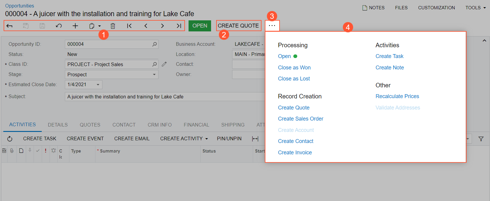
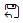
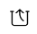
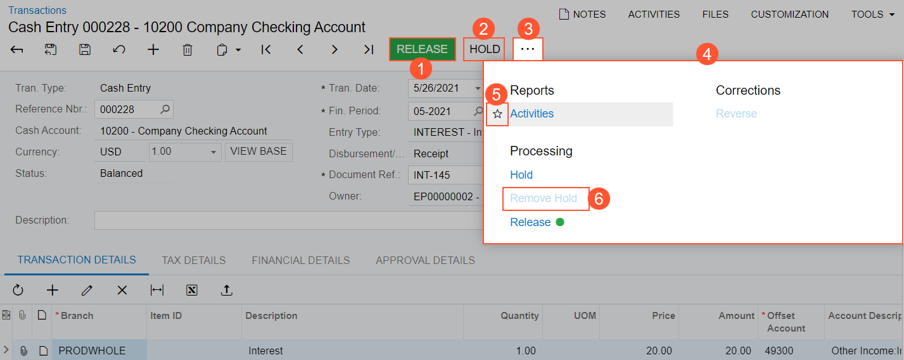
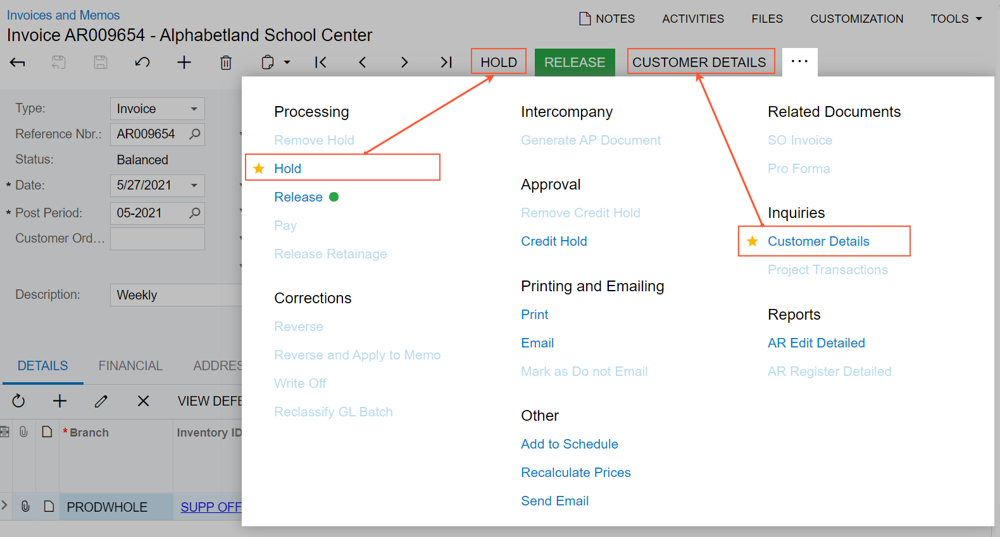
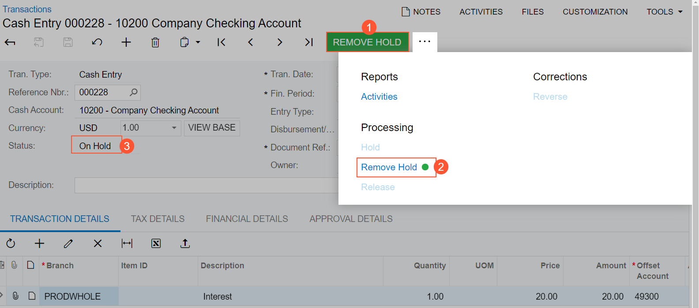
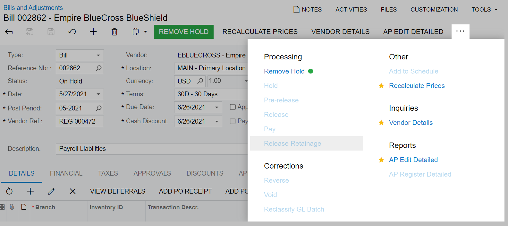
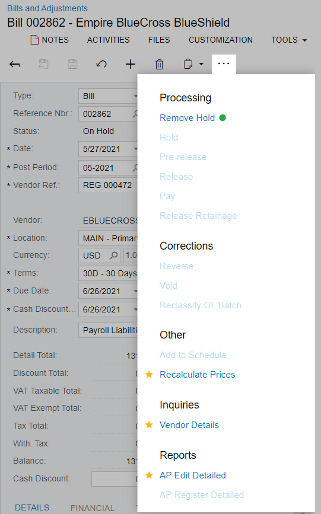

# Form Toolbar and More Menu {#_dfac4724-edbc-468e-9569-877c174ac871 .concept}

The form toolbar, which is available on most forms, is located near the top of the form, under the form name \(and record title, if the form has one\), as shown in the following screenshot.

The form toolbar includes the following:

-   Standard buttons \(see Item 1 in the following screenshot\), with the particular set of buttons depending on the specific form
-   On some forms, form-specific buttons \(Item 2\)
-   On some form, the More button \(Item 3\); clicking this button opens the More menu \(Item 4\), which contains additional form-specific commands

You use the standard buttons on the form toolbar to navigate through entities that were created by using the current form, insert or delete an entity, use the clipboard, save the data you have entered, or cancel your work on the form.

A form toolbar on a particular form may include form-specific buttons in addition to standard buttons; it may also \(or instead\) include commands on the More menu. By using these form-specific buttons and commands, users can navigate to related records and forms, initiate specific actions, and perform modifications or processing related to the functionality of the form.

## Standard Form Toolbar Buttons { .section}

The following table lists the standard buttons of the form toolbar. A form toolbar may include some or all of these buttons.

|Button|Icon|Description|
|------|:---:|-----------|
|**Discard Changes and Close**||Discards any unsaved changes made to the entity, and navigates to the list of records that is related to the current form.

 **Note:** If the system opened the current form in a pop-up window \(from a different form\), this button is not displayed. To return to the original form, click **Close**.

|
|**Save &amp; Close**||Saves the changes made to the entity, and navigates to the list of records that is related to the current form.|
|**Save**||Saves the changes made to the entity.|
|**Cancel**||Depending on the context, does one of the following:-   Discards any unsaved changes you have made to entities and retrieves the last saved version.
-   Clears all changes and restores the default settings.

|
|**Add New Record**||Clears any values you've specified on the form, restores any default values, and initiates the creation of a new entity.|
|**Delete**||Deletes the currently selected entity, clears any values you have specified on the form, and populates elements with the default values that the system inserts when a new entity is created.**Note:** You can delete an entity only if it is not linked with another entity.

|
|**Archive**||Archives the document that is opened on the form. This button is available if archival is set up on the [Archival Policy](../UserGuide/SM_20_04_00.md) \(SM200400\) form for the type of the document open on the form and if the document meets the archival criteria—that is, if the document is older than the retention period specified on the [Archival Policy](../UserGuide/SM_20_04_00.md) form and has been processed to completion or canceled.

 For more information on archiving the documents, see [Archiving Old Documents](../UserGuide/SA_Archiving_Old_Documents_Mapref.md) in the Acumatica ERP System Administration guide.

|
|**Extract**||Extracts the archived document from the archive and makes the system use this document in day-to-day operations. This button is available if archival is set up on the [Archival Policy](../UserGuide/SM_20_04_00.md) \(SM200400\) form for the type of the document opened on the form is archived.

 For more information on archiving the documents, see [Archiving Old Documents](../UserGuide/SA_Archiving_Old_Documents_Mapref.md) in the Acumatica ERP System Administration guide.

|
|**Clipboard**||Provides menu commands you can use to do the following: -   **Copy**: Copy the selected entity to the clipboard.
-   **Paste**: Paste an entity or template from the clipboard.
-   **Save as Template**: Create a template based on the selected entity.
-   **Import from XML**: Import an entity or a template from an `.xml` file.
-   **Export to XML**: Export the selected entity to an `.xml` file.

For more information on templates and copy-and-paste operations in Acumatica ERP, see [Using Forms](Forms__con_Working_with_forms.md). For more information on importing and exporting `.xml` files, see [Importing and Exporting Data to Excel and XML](../UserGuide/GS_Importing_Exporting_to_Excel_XML.md) in the Acumatica ERP User Guide.

|
|**Go to First Record**||Displays the first entity \(in the list of entities of the specific type\) and its details.|
|**Go to Previous Record**||Displays the previous entity and its details.|
|**Go to Next Record**||Displays the next entity and its details.|
|**Go to Last Record**||Displays the last entity \(in the list of entities of the specific type\) and its details.|
|**View Schedule**| |Gives you the ability to schedule the processing. For more information, see [Automated Processing: General Information](../UserGuide/SA_Scheduling_Automated_Processing_GeneralInfo.md).|

## Inquiry Form Toolbar Buttons { .section}

Acumatica ERP inquiry forms present data in a tabular format; they may also have selection criteria you can use to filter the data in the table. Predefined inquiry forms are provided as part of Acumatica ERP out of the box, and inquiry forms can be designed by a user with the appropriate access rights by using the Generic Inquiry tool \(for details, see [Managing Generic Inquiries](../UserGuide/SM__MNG_Managing_Generic_Inquiry.md) in the Acumatica ERP Reporting Tools Guide\). A form toolbar of an inquiry form contains both the standard form toolbar buttons \(described in the table above\) and the additional buttons described below.

|Button|Icon|Description|
|------|:---:|-----------|
|**Refresh**||Refreshes the inquiry data in the table.|
|**Cancel**||Clears all changes \(including selection criteria that has been specified, if the generic inquiry form has this criteria\) and restores the default settings.|
|**Add New Record**||Initiates the creation of a new entity.|
|**Edit**||Opens the applicable data entry form with the selected record.|
|**Fit to Screen**||Expands the form to fit on the screen and adjusts the column widths proportionally.|
|**Export to Excel**||Exports the data to an Excel file. For more information, see [Integration with Excel](../UserGuide/Exporting_to_Excel.md) in the Acumatica ERP Getting Started Guide.|

## The More Menu and Form-Specific Buttons {#section_ntz_2h3_sqb .section}

If there are multiple form-specific commands on the form toolbar, they are displayed on a single menu—the More menu—and listed under descriptive categories, which makes it easier to find the needed menu command. On the More menu, you can easily define your favorite menu commands, which eases access to them.

On some forms, the system places a button \(which is highlighted in green\) on the form toolbar for the expected next command, which represents the likely next step to be performed on the selected record. The following screenshot, which shows the [Cash Transactions](../UserGuide/CA_30_40_00.md) \(CA304000\) form, illustrates an example of the form toolbar and the More menu, which contains categories and menu commands.

The numbered items in the screenshot indicate the following:

1.  A highlighted button for the expected next command, which represents the next logical step to be performed on the record selected on the form
2.  Another button for a command that is commonly performed on the form
3.  The More button, which you click to open the More menu
4.  The More menu with most form-specific menu commands and descriptive categories on it
5.  The star icon, which is used to mark the individual user's favorite commands on the form
6.  An unavailable command

## Favorite Commands {#section_b5c_fs2_tpb .section}

Based on your role in the company and your job duties, you may use some commands more often than others. On the form toolbar, you can specify these commands as favorites. This will cause the system to duplicate the commands as form toolbar buttons, easing access to them.

To add a command to the form toolbar as a button, you open the More menu, hover over the needed command, and click the star icon when it appears. The yellow color of the star indicates that the command has been added to your favorites, and a button for the command appears on the form toolbar immediately. The following example shows two commands that have been added to the user's favorites on the [Invoices and Memos](../UserGuide/AR_30_10_00.md) \(AR301000\) form and thus added as buttons on the form toolbar.

Favorites are individual to each user account, specific to a particular form, and preserved across user sessions.

## Highlighted Buttons and Commands {#section_ih1_w1z_spb .section}

On some forms, the system applies predefined logic to commands for specific records. Based on this logic, the system may place a button on the form toolbar, highlight it using some color, or do both of these things.

If a command is the expected next command \(that is, the command that is most likely to be clicked for a record with the current status\), it is shown both on the form toolbar and on the More menu. The primary command on the form toolbar is highlighted in green \(see Item 1 in the following screenshot\), and on the More menu, it is marked with a green dot \(Item 2\). Below is an example of a cash transaction on the [Cash Transactions](../UserGuide/CA_30_40_00.md) \(CA304000\) form that has the *On Hold* status \(Item 3\). Before you can process it, you need to remove it from hold. Because **Remove Hold** is the next logical command, it is displayed as a button on the form toolbar and highlighted in green.

## Unavailable Commands on the More Menu {#section_egw_zv2_tpb .section}

By default, on the More menu, the system displays all commands that could be available for the form, based on the system configuration. Some of these commands may be unavailable \(that is, they are listed but cannot be clicked\). These are the commands that are not applicable to the record based on its current status or other factors.

## The Responsive Form Toolbar and More Menu {#section_w13_mt2_tpb .section}

The form toolbar and the More menu have a responsive layout, meaning that they dynamically adjust to different screen sizes. When there is enough space, buttons for highlighted and favorite commands are displayed on the form toolbar. When the screen size decreases, the system moves the commands off the form toolbar one by one but keeps them on the More menu.

If there are multiple categories on the More menu, the categories and menu commands can be displayed in multiple columns on the More menu, depending on the screen size and the number of categories. When the screen size decreases, the system moves some categories and menu commands to the left to decrease the number of columns, and in the screens of the smallest size, all categories are displayed in one column. Below are two examples of the same menu in different screen sizes for a record on the [Bills and Adjustments](../UserGuide/AP_30_10_00.md) \(AP301000\) form.

**Parent topic:**[Forms](../InterfaceGuide/Forms.md)

