# Formatting Toolbar {#_21f37778-be31-42b2-93c6-610fa55bef28 .concept}

Formatting is available on Acumatica ERP forms in which the details area or tab has a text area with a rich text editor. In the text area, you can add detailed information about some record or text to be used in some other way \(for example, in a message or an email\). The formatting toolbar has buttons you can use to edit text, change the typographical treatment of the text, and format it. You can also click buttons to add files and insert images.

The formatting toolbar is located above the text area \(see the screenshot below\) and may include standard and form-specific buttons.

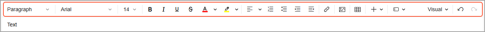

You use the standard buttons on the formatting toolbar to write and edit text, use the clipboard, and format the text in the text area.

## Standard Formatting Toolbar Buttons { .section}

The following table lists the standard buttons that a formatting toolbar might include.

|Button|Icon|Description|
|------|:---:|-----------|
|**Style**|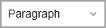|Applies the selected style to the text. The following styles are available: *Paragraph*, *Header1*, *Header2*, *Header3*, *Header4*, *Header5*, *Header6*, *Preformatted*, and *Quote*.|
|**Font**|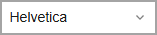|Applies the selected font to the text.|
|**Font Size**|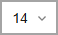|Applies the selected font size to the text.|
|**Bold**|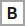|Marks the selected text in bold style.|
|**Italic**|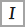|Marks the selected text in italic style.|
|**Underline**||Marks the selected text as underlined.|
|**Strike Through**|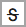|Marks the selected text as strike through.|
|**Font Color**|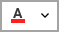|Changes the color of the selected text to the color you click.|
|**Text Highlight Color**|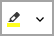|Highlights the selected text in the color you click.|
|**Align Text**|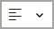|Aligns the selected text as follows:

 -   **Align Text Left**: Aligns the text to the left with a ragged right margin.
-   **Center**: Centers the text.
-   **Align Text Right**: Aligns the text to the right with a ragged left margin.
-   **Justify**: Aligns the text evenly between the left and right margins.

|
|**Ordered List**|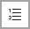|Starts an ordered list or converts the selected text to an ordered list.|
|**Unordered List**||Starts an unordered list or converts the selected text to an unordered list.|
|**Increase Indent**|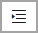|Moves the paragraph farther away from the margin.|
|**Decrease Indent**||Moves the paragraph closer to the margin.|
|**Insert Link**||Opens the **Insert Link** dialog box, which you can use to insert any links into the text area. The dialog box is described in the [Insert Link Dialog Box](#insert_link) section of this topic.|
|**Insert Image**||Opens the **Insert Image** dialog box, which you can use to insert an image into the text area. The dialog box is described in the [Insert Image Dialog Box](#insert_image) section of this topic.|
|**Insert Table**||Opens a dialog box in which you specify the number of rows and columns for the table.|
|**Tables**| |Displays a toolbar that contains the following buttons:-   **Insert Row Before**: Inserts the row before the selected one.
-   **Insert Row After**: Inserts the row after the selected one.
-   **Insert Column Before**: Inserts the column before the selected one.
-   **Insert Column After**: Inserts the column after the selected one.
-   **Move Row Up**: Moves the selected row up.
-   **Move Row Down**: Moves the selected row down.
-   **Delete Row**: Deletes the selected row.
-   **Move Column Left**: Moves the selected column to the left.
-   **Move Column Right**: Moves the selected column to the right.
-   **Delete Column**: Deletes the selected column.
-   **Delete Table**: Deletes the selected table.

This toolbar appears if you select a table in the working area.

|
|**Select Macro to Insert**||Provides the following options:

 -   *Table of Contents*: Inserts a table of contents, which contains all headers of the current document.
-   *File list*: Inserts a control that lists all the files attached to the article.
-   *Warning*: Inserts a warning box.
-   *Info*: Inserts an info box.
-   *Code*: Opens the dialog box for inserting code.
-   *Subarticles*: Inserts a table of contents, which contains all the subarticles linked to the current article.

|
|**Insert Data Field**|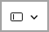|Provides the following options:

 -   **Data Field**: Displays a list of available data fields for selection.

This button can be used to insert a field value in a notification related to a business event..

-   **Previous Data Field**: Displays a list of data fields whose previous values can be inserted in the text area.

This button can be used to insert a previous field value in a notification related to a business event. The system will insert the placeholder with the `PREV` function, for example `PREV((CRCase_status))`.

 For details on the business events, see [Using Business Events](../UserGuide/SA_Using_Business_Events_Mapref.md).

|
|**Language**|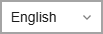|Gives you the ability to select a language, and then enter the text for this language. The box displays a list of available languages. In Acumatica ERP instances with multiple active locales, the system automatically determines the default language by a translation that a user specified in the text area—for example, a description of a stock item on the [Stock Items](../UserGuide/IN_20_25_00.md) \(IN202500\) form—by using the algorithm described in [The Order of the Languages in the Box](UIG__CON_TranslationBoxes.md#_a8f85339-7996-465f-b4be-43ee1b833cb7).

 You can select another language in this box. If there’s a translation of the text for the selected language in the Acumatica ERP database, it will be displayed in the text area. If there’s no translation of the text for a required language in the Acumatica ERP database, you can enter it in the text area.

 This box appears only if both of the following are true:

 -   Multiple locales are specified on the [System Locales](../UserGuide/SM_20_05_50.md) \(SM200550\) form.
-   One language is selected as the default one in the **Select Languages for Multilingual Text Boxes** dialog box on this form.

|
|**Delete**||Deletes the text specified in the text area for the language selected in the language box.

 This box appears only if both of the following are true:

 -   Multiple locales are specified on the [System Locales](../UserGuide/SM_20_05_50.md) \(SM200550\) form.
-   One language is selected as the default one in the **Select Languages for Multilingual Text Boxes** dialog box on this form.

|
|**View**|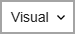|Displays a list of view modes. The following options are available:

 -   **Visual**: Opens the editor view, where you can input and format the text.
-   **HTML**: Opens the editor in HTML view, where you can input multiple HTML elements.

**Tip:** We recommend that you use the **Visual** view to avoid misprints in HTML tags.

-   **Plain text**: Opens the plain text view, in which all the formatting is removed. You can edit the text without formatting.
-   **Preview**: Opens the preview mode, where you can view the content as it will look.

|
|**Undo**|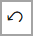|Cancels the most recent changes you have made.|
|**Redo**|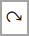|Restores the changes you canceled by clicking **Undo**.|

## Insert Link Dialog Box {#insert_link .section}

You use this dialog box to insert links to forms, wiki articles, and external websites into the text area. You click one of the tabs in the dialog box and then use the elements on the tab to add a link to the selected object into your text.

**Tip:** When you edit an existing link, the name of the dialog box changes to **Edit Link**.

The tabs of this dialog box are documented below. Some common elements are shown at the bottom of all the tabs; you can find the descriptions of these elements after the descriptions of the tabs and their tab-specific elements.

|Element|Description|
|-------|-----------|
|**URL Address**|The URL of the website.|
|**Text**|The text of the link that will be displayed in the working area.|

|Element|Description|
|-------|-----------|
|The top part of the tab has the following elements.|
|Search|A box where you enter the search string.|
|The working area of the tab has a table that initially displays all wiki articles available in the system. If you enter a search string, the table shows all articles whose titles contain the search string.

 The table toolbar has only standard buttons.

 The table contains the following columns.

|
|**Name**|The title of a topic in the online Help or an article in a custom wiki.|
|**Module**|The title of the chapter \(in the online Help or an article in a custom wiki\) in which the topic or article is located.|
|**Created At**|The date when the topic or article was created.|

|Element|Description|
|-------|-----------|
|The top part of the tab has the following elements.|
|Search|A box in which you enter the search string.|
|The working area of the tab has a table that initially displays all screens \(forms\) available in the system. If you enter a search string, the table shows all screens whose names contain the search string.

 The table toolbar has only standard buttons.

 The table contains the following columns.

|
|**Title**|The name of the form.|
|**Screen ID**|The ID of the form.|
|**Module**|The name of the functional area of the system to which the form belongs.|

|Buttons|Description|
|-------|-----------|
|**Unlink**|Removes the link.

 This button appears if you edit the added link.

|
|**Wrap Around**|Wraps the selected text.

 This button appears only if you’ve selected some text in the working area.

|
|**Insert**|Inserts the link into the text area and closes the dialog box.

 **Tip:** This button changes to **Apply** when you edit an existing link.

|
|**Cancel**|Cancels the adding of the link and closes the dialog box.|

## Insert Image Dialog Box {#insert_image .section}

You use this dialog box for inserting images into the text area. The dialog box contains tabs that you can use to insert an image from any of the following sources: your device, the system, or the web. After going to the tab that represents the source of the image, you use the elements on the tab to select and insert the needed images.

The tabs of this dialog box are documented below. Some common elements are shown at the bottom of all the tabs; you can find the descriptions of these elements after the descriptions of the tabs and their tab-specific elements.

|Element|Description|
|-------|-----------|
|The top part of the tab has the following elements.|
|Upload Files|A box in which you select the image file for uploading.|
|The working area of the tab shows all files that have been uploaded.|

|Element|Description|
|-------|-----------|
|The top part of the tab has the following elements.|
|Search|An untitled box in which you enter a search string.|
|The working area of the tab shows all images that are stored in the system and that match the search string you specified.|

|Element|Description|
|-------|-----------|
|The top part of the tab has the following elements.|
|**URL Address**|The URL to the image.|
|The tab has a working area that shows the image after you have entered its URL.|

|Element|Description|
|-------|-----------|
|**Insert**|Inserts the image into the text area and closes the dialog box.|
|**Cancel**|Cancels the adding of the image and closes the dialog box.|

**Tip:** In the Acumatica ERP instance, all emails that have embedded images encoded by the `base64` algorithm are processed in the following way \(without affecting the display of the email\):

1.  The `base64` attachment is extracted from the email.
2.  The extracted attachment is saved as a file.
3.  The file is attached to the email.
4.  The link to the attached file is inserted into the email body.

**Parent topic:**[Forms](../InterfaceGuide/Forms.md)

