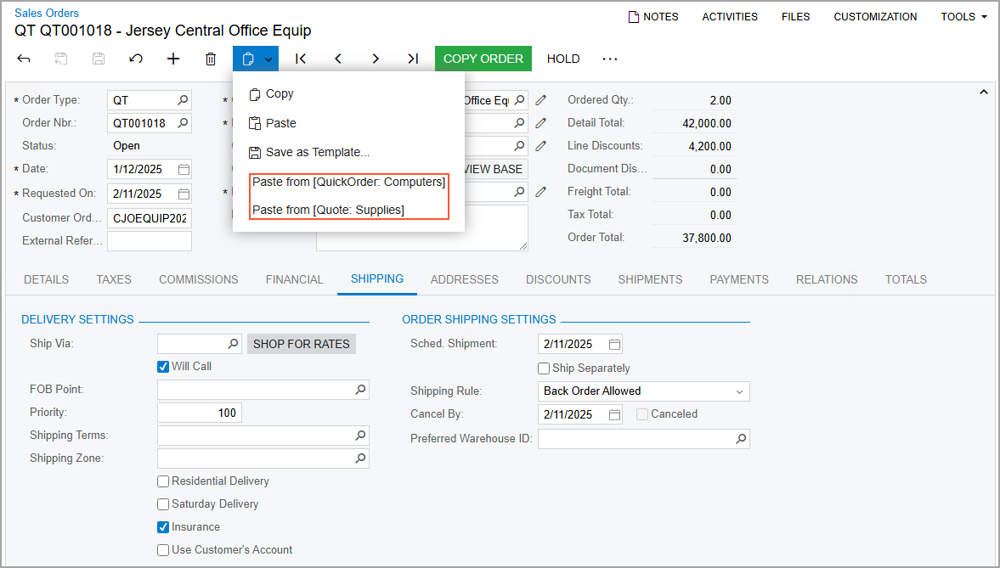

# Using Forms {#_ee9cef6c-4d1a-46ce-8c34-1b66593f934f .concept}

During the normal course of business, you use forms to add, delete, edit, and manage records, such as documents or business accounts. You use form functionality to facilitate this process.

## Navigating to a Form { .section}

To open a form, you either navigate to the form or search for it. You navigate to the form by clicking the appropriate workspace item on the main menu of Acumatica ERP, and then clicking the form you want to view. For details on searching for a form, see [Search Capabilities: General Information](../UserGuide/GS_Searching_in_Acumatica_ERP_GeneralInfo.md).

## Attaching Files to Records { .section}

In Acumatica ERP, files can be attached to any record that Acumatica ERP keeps for the objects—such as invoices, leads, customers, bills, sales orders, and batches of transactions—that users add by using data entry forms. You can attach different files, such as images in various formats, scanned documents, and internal instructions for employees.

You can attach files to the records on data entry forms. The value in parentheses to the right of the **File** menu on the form title bar shows the number of files attached to the selected record.

**Tip:** Files can also be attached to record details. For more information, see [To Attach a File to a Record Detail](Attaching_Files_to_Record_Details.md).

You can easily manage and track files and images attached to Acumatica ERP records and record details for various purposes. For more information on managing attached files, see [Managing External Storage for File Attachments](../UserGuide/SA_External_Storage_Management_Mapref.md) in the Acumatica ERP System Administration Guide and [Entering Records into the System](../UserGuide/GS_Working_With_Data_Entry_Forms_Mapref.md) and [Importing and Exporting Data to Excel and XML](../UserGuide/GS_Importing_Exporting_to_Excel_XML.md) in the Acumatica ERP Getting Started Guide.

## Attaching Notes to Records { .section}

In Acumatica ERP, you can attach text notes to any record that Acumatica ERP keeps for the objects—such as invoices, opportunities, vendors, bills, purchase orders, and batches of transactions—that users add by using data entry forms. You can use these notes to communicate key information about the record or record detail to other users.

**Tip:** Notes can also be attached to record details. For more information, see [To Attach a Note to a Record Detail](Attaching_Notes_to_Record_Details.md).

## Copying and Pasting { .section}

In Acumatica ERP, you can easily create a new document by copying and pasting an existing document of the same type. This functionality can also be used to create new objects, such as vendor or customer classes, by copying existing objects. For applicable forms, the copying and pasting options are offered on the **Clipboard** menu on the form toolbar \(shown in the screenshot below\). For the detailed procedure, see [To Copy a Document Contents to a New Document](UIG__how_Copy_Documents.md).

For more information, see [Record Entry: Copy-and-Paste Options and Record Templates](../UserGuide/SM__con_Copy-and-Paste_Options_and_Document_Templates.md) in the Acumatica ERP Getting Started Guide.

## Applying a Template { .section}

If templates have been added for a document you want to create, you can use a template to fill the elements for a new document. You can see the available templates on the **Clipboard** menu on the form toolbar, as shown in the screenshot below.

For the detailed procedure, see [To Create a Document with a Template](UIG__how_Use_template.md).

For more information, see [Record Entry: Copy-and-Paste Options and Record Templates](../UserGuide/SM__con_Copy-and-Paste_Options_and_Document_Templates.md) in the Acumatica ERP Getting Started Guide.

## Importing from and Exporting to XML { .section}

In Acumatica ERP, some record types, such as generic inquiries and Analytical Report Manager \(ARM\) reports, have a complex structure. You may need to export data from these forms—for example, to transfer a generic inquiry to another instance. Then in the other instance, you need to import this generic inquiry. You can import and export these records in XML format.

A form has XML export and import functionality when the **Export as XML** and **Import from XML** menu commands are available if you click **Clipboard** on the form toolbar after you select an entity. For example, navigate to the [Generic Inquiry](../Shared/../UserGuide/SM_20_80_00.md) \(SM208000\) form, select an inquiry, and notice that this menu command is available. For details, see [To Export Data to XML](../Shared/../UserGuide/IS__how_XML_export.md) and [To Import Data from XML](../Shared/../UserGuide/IS__how_XML_import.md).

-   **[To Open a Form by Using Acumatica ERP Navigation Options](../InterfaceGuide/Forms__how_Open_a_Form.md)**  

-   **[To Attach a File to a Record](../InterfaceGuide/Attaching_Files_to_Forms_and_Records.md)**  

-   **[To Attach a Note to a Record](../InterfaceGuide/Attaching_Notes_to_Records.md)**  

-   **[To Attach a Pop-Up Note to a Record](../InterfaceGuide/Attaching_PopUp_Notes_to_Records.md)**  

-   **[To Copy a Document Contents to a New Document](../InterfaceGuide/UIG__how_Copy_Documents.md)**  

-   **[To Create a Document with a Template](../InterfaceGuide/UIG__how_Use_template.md)**  

-   **[To Scan a File and Attach It to a Record](../InterfaceGuide/UIG__how_Attach_File_Record.md)**  

**Parent topic:**[Forms](../InterfaceGuide/Forms.md)

