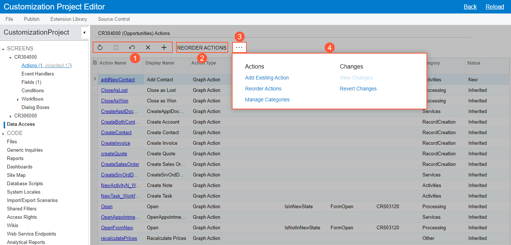
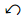
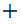
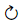
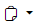
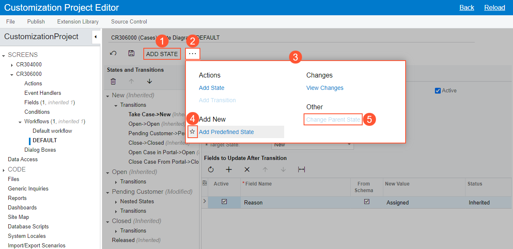
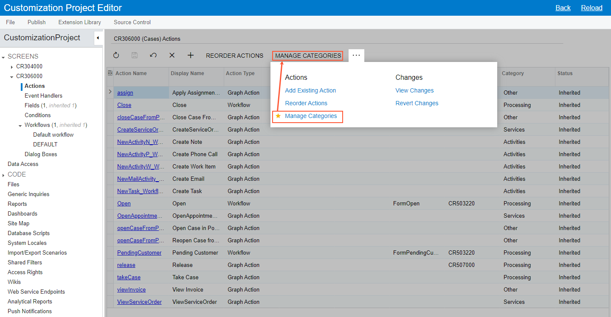

# Page Toolbar {#_f3b7304b-d152-4f66-979a-737568faf2ee .concept}

The page toolbar, which is available on the pages of the Customization Project Editor, is located near the top of the page, under the page title, as shown in the following screenshot.

The page toolbar includes the following:

-   Standard buttons \(see Item 1 in the following screenshot\), with the particular set of buttons depending on the specific page
-   On some pages, page-specific buttons \(Item 2\)
-   On some pages, the More button \(Item 3\); clicking this button opens the More menu \(Item 4\), which contains additional page-specific commands

You use the standard buttons on the page toolbar to, insert or delete an entity, use the clipboard, save the data you have entered, and cancel your work on the page.

A page toolbar on a particular page may include page-specific buttons in addition to standard buttons; it may also \(or instead\) include commands on the More menu. These page-specific buttons and commands give you the ability to navigate to related pages, invoke specific actions, open dialog boxes, and perform modifications or processing related to the functionality of the page.

## Standard Page Toolbar Buttons { .section}

The following table lists the standard buttons of the page toolbar. A page toolbar may include some or all of these buttons.

|Button|Icon|Description|
|------|:---:|-----------|
|**Save**||Saves the changes made to the entity.|
|**Cancel**||Depending on the context, does one of the following:

 -   Discards any unsaved changes you have made to entities and retrieves the last saved version
-   Clears all changes and restores the default settings

|
|**Add Row**||Initiates the creation of a new entity|
|**Delete Row**||Deletes the currently selected entity|
|**Refresh**||Refreshes the data in the table|
|**Clipboard**||Provides menu commands you can use to do the following:

 -   **Copy**: Copy the selected entity to the clipboard
-   **Paste**: Paste an entity or template from the clipboard

|
|**Edit**||Opens the currently selected entity on the applicable page so that you can view its settings and modify it, if needed.|
|**Fit to Screen**||Expands the page to fit on the screen and adjusts the column widths proportionally.|
|**Export to Excel**||Exports the data to an Excel file. For more information, see [Integration with Excel](../UserGuide/Exporting_to_Excel.md) in the Acumatica ERP Getting Started Guide.|

## The More Menu and Page-Specific Buttons { .section}

If there are multiple page-specific commands on the page toolbar, they are displayed on a single menu—the More menu—and listed under descriptive categories, which makes it easier to find the needed menu command. On the More menu, you can easily define your favorite menu commands, which eases access to them.

On some pages, the system places a button \(which is highlighted in green\) on the page toolbar for the expected next command, which represents the likely next step to be performed on the selected record. The following screenshot, which shows the [Workflow \(Tree View\)](../UserGuide/AU_20_10_30.md) page for the [Cases](../UserGuide/CR_30_60_00.md) \(CR306000\) form, illustrates an example of the page toolbar and the More menu, which contains categories and menu commands.

The numbered items in the screenshot indicate the following:

1.  A button for a command that is commonly performed on the page
2.  The More button, which you click to open the More menu
3.  The More menu with the page-specific menu commands and descriptive categories on it
4.  The star icon, which is used to mark the individual user's favorite commands on the page
5.  An unavailable command

## Favorite Commands { .section}

Based on your role in the company and your job duties, you may use some commands more often than others. On the page toolbar, you can specify these commands as favorites. This will cause the system to duplicate the commands as page toolbar buttons, easing access to them.

To add a command to the page toolbar as a button, you open the More menu, hover over the needed command, and click the star icon when it appears. The yellow color of the star indicates that the command has been added to your favorites, and a button for the command appears on the page toolbar immediately. The following example shows a command that has been added to the user's favorites on the [Actions](../UserGuide/AU_20_10_50.md) page and thus added as a button on the page toolbar.

Favorites are individual to each user account, specific to a particular page, and preserved across user sessions.

## Unavailable Commands on the More Menu { .section}

By default, on the More menu, the system displays all commands that could be available for the page, based on the system configuration. Some of these commands may be unavailable. These are the commands that are not applicable to the entity based on its current status or other factors.

## The Responsive Page Toolbar and More Menu { .section}

The page toolbar and the More menu have a responsive layout, meaning that they dynamically adjust to different screen sizes. When there is enough space, buttons for favorite commands are displayed on the page toolbar. When the screen size decreases, the system moves the commands off the page toolbar one by one but keeps them on the More menu.

If there are multiple categories on the More menu, the categories and menu commands can be displayed in multiple columns on the More menu, depending on the screen size and the number of categories. When the screen size decreases, the system moves some categories and menu commands to the left to decrease the number of columns, and in the screens of the smallest size, all categories are displayed in one column.

**Parent topic:**[Forms](../InterfaceGuide/Forms.md)

