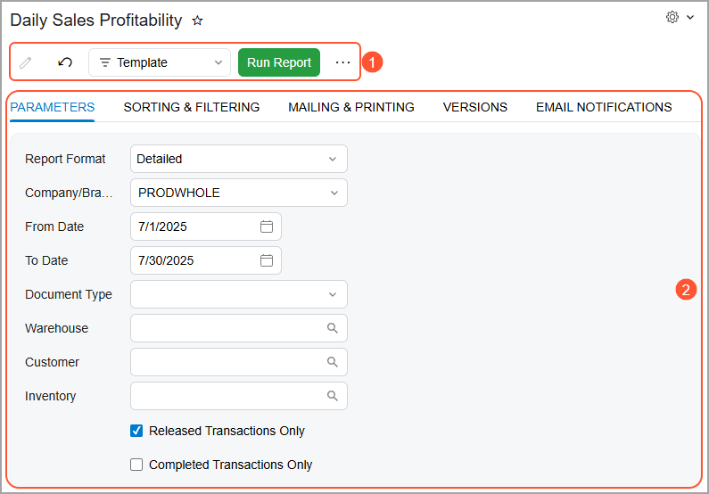
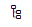
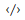

# Report Form {#_d4223134-77e4-4390-86e6-e0bfc7dd21b7 .reference}

Before you run a report, you specify the needed parameters on the report form. You can select a template and manually make selections that affect the information to be collected. Also, you can specify the appropriate settings to print or email the finished report.

The following screenshot shows a typical report form, which has the following elements:

1.  Report form toolbar and More menu \(see Item 1\)
2.  The Tab area \(Item 2\)

## Report Form Toolbar and More Menu { .section}

The following table lists the elements of the report form toolbar and the commands of the More menu.

|Element|Description|
|-------|-----------|
|**Cancel**|Clears any changes you’ve made on the report form and restores the default settings.|
|**Delete Template**|Removes the selected template.

 This command is available only if a template is selected in the **Template** box.

|
|**Edit Report**|For a report created in the Acumatica Report Designer, downloads the RPS file with the report.

 For an ARM report, this command opens the [Report Definitions](../UserGuide/CS_20_60_00.md) \(CS206000\) form, where you can modify the report.

|
|**Edit Template**|Opens the **Edit Template** dialog box, in which you can change the template name and settings.

 This command is available if a template is selected in the **Template** box.

|
|**Run Report**|Initiates data collection for the report and displays the generated report.|
|**Save Template**|Saves changes to the currently selected template. If you don’t select any template, the system saves the currently selected report as a template with the settings you specify in the **Save Template** dialog box.|
|**Save Template As**|Saves a copy of the selected template with the settings you specify in the **Save Template** dialog box. If you don’t select any template, the system creates a template with the specified settings.|
|**Template**|The template to be used for the report. If any templates have been created and saved, you can select one to use its settings for the report.

 To quickly find a template, start typing its name in the Search box. If no template is selected, the lookup box remains empty. After you select a template, its name appears in this box, which becomes highlighted in blue. To run a report without using a template, you select *None* in this box.

 You can mark frequently used templates as favorites. The system lists these templates at the top of the list.

|

|Element|Description|
|-------|-----------|
|**Template**|The name of the template.|
|**Default**|A check box that you select to mark the template as the default one for you.|
|**Shared**|A check box that you select to indicate that the template is shared with other users.

 Shared templates are marked with the Group icon to help you identify them quickly.

 Shared templates are also available for selection in the **Report Parameters** box on the **Attached Reports** tab of the [Email Templates](../UserGuide/SM_20_40_03.md) \(SM204003\) form.

|
|The dialog box has the following buttons.|
|**Save**|Saves the changes and closes the dialog box.|
|**Cancel**|Closes the dialog box without saving the changes.|

|Element|Description|
|-------|-----------|
|**Template**|The name of the template.|
|**Default**|A check box that you select to mark the template as the default one for you.|
|**Shared**|A check box that you select to indicate that the template is shared with other users.

 Shared templates are marked with the Group icon to help you identify them quickly.

|
|The dialog box has the following buttons.|
|**Save**|Saves the changes and closes the dialog box.|
|**Cancel**|Closes the dialog box without saving the changes.|

## Report Toolbar { .section}

The following table lists the buttons of the report toolbar, which is shown on the generated report that you have run.

|Buttons|Icon|Description|
|-------|----|-----------|
|**Parameters**||Navigates back to the report form to let you change the report parameters.|
|**Refresh**||Refreshes the information displayed in the report \(if any data changes were made\).|
|**Groups**||Adds to the report a left pane where the report structure is shown. Click a report node to highlight the pertinent data in the right pane.|
|**View PDF** / **View HTML**| / |Displays the report as a PDF, or displays the report in HTML format. The available button depends on the current report view; if you're viewing a PDF, for instance, you will see the **View HTML** button.|
|**First**||Displays the first page of the report.|
|**Previous**||Displays the previous page.|
|**Next**||Displays the next page.|
|**Last**||Displays the last page of the report.|
|**Print**| |Opens the browser dialog box so you can print the report.|
|**Send**| |Opens the **Email Activity** dialog box, which you use to send the report file \(in the selected format\) to the specified email address.|
|**Export**| |Enables you to export the data in the selected format \(Excel or PDF\).|

## Parameters Tab { .section}

This tab has sections where you can specify the contents of the report depending on the current report and vary in the following regards:

-   Which elements are available on a particular report
-   Whether elements contain default values
-   Whether specific elements require values to be selected
-   Whether elements may be left blank to let you display a broader range of data

## Sorting &amp; Filtering Tab { .section}

This tab contains the following sections with additional sorting and filtering conditions:

-   **Sorting**: Defines the sorting order. You can add a line, select one of the report-specific properties, and select the *Descending* or *Ascending* sort order for the column.
-   **Filtering**: Defines the report filter. You click **Add**, select one of the report-specific fields, and define a condition and its value. The list of conditions include one-operand and two-operand conditions. For more information on creating filters, see [Managing Advanced Filters](../UserGuide/GI_Reusable_Filters_Mapref.md). For detailed procedures on using ad hoc filters, see [Modern UI: Filters](UIG__con_Modern_UI_Filters.md) and [Reports: Process Activity](../UserGuide/GS_Working_With_Reports_Process_Activity.md).

## Mailing &amp; Printing Tab { .section}

If you plan to print the report or save it as a PDF, select the appropriate settings in the **Printing** section.

|Element|Description|
|-------|-----------|
|**Archived Records**|The way the system should treat archived records when printing the report. The following options are available: *Hide*, *Print*, and *Only*.|
|**Deleted Records**|The visibility of the data deleted from the database. The following options are available: *Hide*, *Print*, and *Only*.|
|**Print All Pages**|A check box that you select to cause the system to print all pages of the report.|
|**Print in PDF Format**|A check box that you select to display the report in PDF format.|
|**Compress PDF File**|A check box that you select to indicate that the system should generate a compressed PDF.|
|**Embed Fonts in PDF File**|A check box that you select to indicate that the system should generate the PDF with embedded fonts.|

If you plan to send the report as an email, in the **Mailing** section, specify the format in which the report will be sent, as well as the email subject, the recipients of copies of the report, and the email account of the recipient.

When you add recipients, the system checks the format of the email addresses entered in the **To**, **Cc**, and **Bcc** boxes. If an address’s format is incorrect, its box is highlighted in red so that you can quickly identify and correct the issue.

|Element|Description|
|-------|-----------|
|**Format**|The format \(*HTML*, *PDF*, or *Excel*\) in which the report will be emailed.

 **Attention:** The merge function for reports in Excel format is not supported. If you want to merge a report with other reports and send an aggregated report by email, you should select either the HTML or PDF format for the report.

|
|**To**|The email address of the recipient.|
|**CC**|An additional addressee to receive a carbon copy \(CC\) of the email.|
|**BCC**|The email address of a person to receive a blind carbon copy \(BCC\) of the email; an address entered in this box will be hidden from other recipients.|
|**Subject**|The subject of the email.|

|Element|Description|
|-------|-----------|
|**Locale**|A locale that you select to indicate to the system that the report should be prepared with the data translated to the language associated with this locale. This box is displayed if there are multiple active locales in the system. For details, see [Locales and Languages](../UserGuide/SM__CON_Locales_and_Languages.md).|
|**Localization**|The localization that is used for the report.

 This box appears on the form if the following conditions are met:

 -   The *Canadian Localization* or *UK Localization* feature is enabled on the [Enable/Disable Features](../UserGuide/CS_10_00_00.md) \(CS100000\) form.
-   A localized version of the report exists in the system.

 One of the following options can be selected in the box:

 -   *None* \(default\): Even though the report has a localized version, the report will be printed without any localization applied.
-   *Canada*: The Canadian version of the report will be printed. If the company in which you are signed in has *Canada* selected in the **Localization** box on the **Company Details** tab \(**Configuration Settings** section\) on the [Companies](../UserGuide/CS_10_15_00.md) \(CS101500\) form, this setting is selected by default in the current box.

 **Tip:** To determine if a localized version of a report exists, the system checks the `Site\ReportsDefault` directory, the database, the `ReportsCustomized` folder, and the `ReportsDefault` folder.

|

## Versions Tab { .section}

If the report has multiple versions, you can select one of them.

This tab appears only if you have the *Report Designer* user role.

Report versions are designed in the Acumatica Report Designer. To make it possible for a user to edit report versions, give this user the *Report Designer* role.

The table toolbar includes the buttons described below.

|Button|Description|
|------|-----------|
|**Edit Version**|Downloads the RPS file with the selected report version.|
|**Deactivate**|Deactivates the selected report version. This button appears if this report version is active.

 If the version is inactive, the **Activate** button is displayed instead.

|

|Column|Description|
|------|-----------|
|**Version**|The version number.|
|**Description**|The description of the version.|
|**Created**|The date when the version was created.|
|**Active**|Read-only, A check box that indicates \(if selected\) that the version is active.|

## Email Notifications Tab { .section}

This tab lists the email templates that can be used to send email notifications that include the report.

|Button|Description|
|------|-----------|
|**Schedule Report**|Opens the [Email Templates](../UserGuide/SM_20_40_03.md) \(SM204003\) form, where you can select or create a new email template that can be used to send the report and specify a schedule for notifications.

 The button appears only if the user account to which you are signed in has at least the *Insert* level of access rights to the [Email Templates](../UserGuide/SM_20_40_03.md) \(SM204003\) form.

|

|Column|Description|
|------|-----------|
|**Email Template**|The email template to be used to generate the body of the email notification.|
|**Screen ID**|The identifier of the form whose elements are used as the source of specific placeholders for this template.|
|**Recipients**|The email addresses of the people to receive the email. Use semicolons as separators between addresses.|
|**Report Template**|The template configured for the report.|
|**Report Template Owner**|The name of the user who created the template.|

**Parent topic:**[Reports](../InterfaceGuide/Report_Processing_Options.md)

