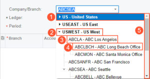

# The Company/Branch Box on Report Forms {#_5bb05b8e-a4d1-4d6a-b29d-100d96690e3b .concept}

When you are running a report, you use report parameters on the report form to narrow the data to your current information needs. You can use a report parameter to select the organizational unit whose data will be shown. In the **Company/Branch** box, you can see a hierarchy of company groups, companies, and branches that shows the relationships between them. By default, the system inserts the company or branch to which you are signed in, but you can select another company group, company, or branch. See the following screenshot for an example of the hierarchical list of company groups, companies, and branches in the **Company/Branch** box; the labeled items are described below.

1.  Collapsed company group \(including branches within any company\)
2.  Expanded company group \(including branches within any company\)
3.  Company; you can collapse the company if there are nested branches
4.  Branch
5.  Scroll bar

In Acumatica ERP, you can define company groups if multiple companies have access to the same set of customer and vendor records. If a company in the company group has branches, they are automatically added to the group within the company. By using this group functionality, you can build reports for the whole group rather than generating separate reports for each company or branch. For more information about company groups, see [Company Groups](../ImplementationGuide/config_Finance_Company_Group_Mapref.md).

If a company is not in any company group, in the **Company/Branch** box, it will be displayed as a standalone entity after all the company groups.

You can collapse or expand company groups and companies to easily navigate to the needed entity. If there are multiple companies and branches in the list, the system displays only part of this list, and you can use the scroll bar to move up and down.

## Searching for a Company or a Branch {#section_qwh_h5y_q4b .section}

The **Company/Branch** box can display a limited number of the companies and branches because of size and design limitations. If you have access to multiple companies and branches, in addition to scrolling within the hierarchical list in this box and collapsing entities, you can search for a specific company or branch by its name.

You search for a company or a branch by typing its name in the **Company/Branch** box. The system initiates the matching process and displays the search results as soon as you begin typing in this box.

**Parent topic:**[Reports](../InterfaceGuide/Report_Processing_Options.md)

