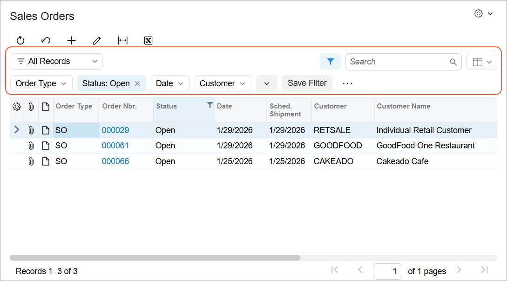
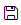
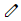
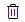

# Filtering Area {#_103a4dd8-cbfe-4da1-9dfa-1c24618e3205 .concept}

A table on an Acumatica ERP form, tab, or dialog box can have a filtering area, which you can use to filter the objects in the table. The filtering area, shown below, can include table-specific filters, quick filters configured on the fly, the Search box, and buttons that you use to edit, save, and remove table filters.

## Elements of the Filtering area { .section}

The following table describes the standard elements of the filtering area. A filtering area can include some or all of those elements. If a filtering area includes table-specific filters, they are described in the form reference help topic.

|Element|Icon|Description|
|-------|----|-----------|
|**Filter List**||A drop-down menu that lists your personal and shared filters.|
|**Filter Settings**||A button you can click to display or hide the additional area where you can configure the current filter or create a new one. After you create and save a filter, it will be displayed in the Filter List drop-down menu.

 The button is highlighted if the records in the table are already filtered.

 For more information about filtering, see [Filters](IB_Filters.md).

|
|**Search**||A box in which you can type a word, a part of a word, or multiple words. As you type, the system filters the contents of the table to display only rows that contain the string you have typed in any column.|
|**View List**||A drop-down menu that allows you to switch between data representations—for example, between table and pivot views.|
|Quick Filter buttons| |Buttons that you can click to define quick filter criteria, specify the sorting order, or remove the Quick Filter button for the respective data fields. You can filter the data in the table on the fly by specifying the value of the quick filter, as described in [Filtering and Sorting Capabilities: To Create a Simple Filter](../UserGuide/GS_Filtering_and_Sorting_Process_Activity.md) in the Getting Started Guide.

 You can add multiple quick filter buttons by dragging table headers to the filtering area or by using the **Add Quick Filter** button.

|
|**Add Quick Filter**||Opens the **Add Quick Filter** dialog box, where you can add more Quick Filter buttons for data fields or open the Advanced Filter editor.|
|**Save Filter**| |Opens the **Save Filter As** dialog box, where you specify the name of the new filter and save the filter.

 This button is visible only when the filter you're creating has not been saved.

|
|**...** &gt; **Save As**||Opens the **Save Filter As** dialog box, where you specify a new name for the currently displayed filter and save this filter with the new name.|
|**...** &gt; **Open Advanced Filter**||Opens the **Advanced Filter** dialog box, where you can visually and intuitively specify complex filtering criteria.

 For more information on designing advanced filters, see [Managing Advanced Filters](../UserGuide/GI_Reusable_Filters_Mapref.md).

|
|**...** &gt; **Edit Filter**||Opens the **Save Filter As** dialog box, where you can modify the properties of the existing filter.

 This button is available if the currently displayed filter was previously saved and you have the rights to edit it.

 **Tip:** You have the rights to edit a filter if it is not shared, or if it is shared and the user account you’re signed in to has access to editing shared filters—that is, to the [Filters](../UserGuide/CS_20_90_10.md) \(CS209010\) form.

|
|**...** &gt; **Delete Filter**||Removes the current saved filter.

 This button is available if the currently displayed filter was previously saved and you have the rights to delete this filter.

 **Tip:** You have the rights to edit a filter if it is not shared, or if it is shared and the user account you’re signed in to has access to editing shared filters—that is, to the [Filters](../UserGuide/CS_20_90_10.md) \(CS209010\) form.

|

## Save Filter As Dialog Box { .section}

In the **Save Filter As** dialog box, you specify the name of the filter configured in the filtering area and save the filter. The dialog box opens when you click **Save Filter**, **Save As**, or **Edit Filter** in the filtering area

|Element|Description|
|-------|-----------|
|**Name**|The name of the saved filter. This name is displayed as the name of the tab with the filtered records on the form.|
|**Shared**|A check box that you select to share the saved filter. If the check box is cleared, the filter will be visible only to you.

 This check box is available only if you have access to editing shared filters—that is, to the [Filters](../UserGuide/CS_20_90_10.md) \(CS209010\) form.

 The system displays all shared quick filters on the [Filters](../UserGuide/CS_20_90_10.md) \(CS209010\) form.

|
|**Default**|A check box that you select to apply this filter each time you open the form. When editing an existing filter, you can clear this check box to apply some another filter each time you open the form.|
|The dialog box has the following buttons.|
|**Save**|Closes the dialog box and creates a new saved filter. This button is displayed when you’re creating a new filter.|
|**Apply**|Closes the dialog box and applies the changes to an existing filter. This button is displayed when you’re editing an existing filter.|
|**Cancel**|Closes the dialog box without saving any changes.|

**Parent topic:**[Tables](../InterfaceGuide/Details_Table.md)

