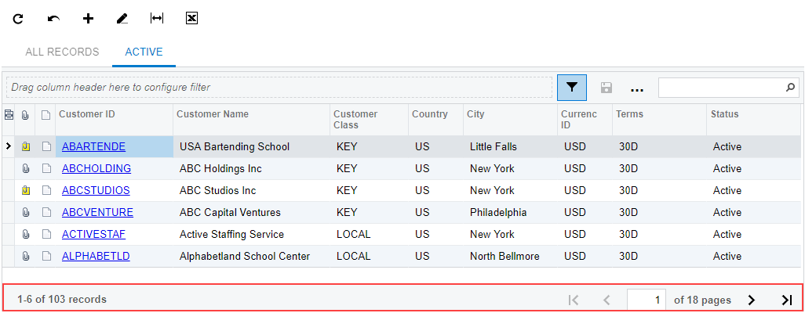
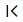
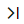

# Table Footer {#_23ae0931-e9c3-461e-9106-0ca2d4906e1b .concept}

A table on an Acumatica ERP form, tab, or dialog box can have a table footer, which contains buttons you can click to navigate between the pages of the table. The toolbar footer displays navigation buttons if the table has too many details or objects \(that is, table rows\) to fit on one page. For a generic inquiry form \(such as a substitute form for a data entry form\), the table footer also displays the number of pages and the total number of records, as shown in the following screenshot.

**Note:** If a request to the database takes too much time and the system cannot calculate the number of records for the generic inquiry before timeout \(which is calculated based on settings of Microsoft SQL Server; the default timeout setting is 6 seconds\), the system displays a warning message, and the table footer does not display the total number of records.

## Standard Navigation Elements of the Table Footer { .section}

If a particular table has too many details \(table rows\) to fit on one page, you use the elements on the footer to browse the table pages.

|Element|Icon|Description|
|-------|:---:|-----------|
|**Go to First Page**||Displays the first page of the table.|
|**Go to Previous Page**||Displays the previous page of the table.|
|*__x__* **of** *__y__* **pages**| |The number of the currently selected page \(in a box that can be edited\) and the total number of pages of the table. You can type the number of the page in this box to open the page with the entered number.

 This box appears only on generic inquiry forms \(such as substitutes for data entry forms\).

|
|**Go to Next Page**||Displays the next page of the table.|
|**Go to Last Page**||Displays the last page of the table.|

**Parent topic:**[Tables](../InterfaceGuide/Details_Table.md)

