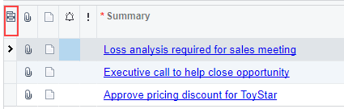

# Table Rows and Columns {#_5ee45030-2b40-4a86-9622-54e93623c441 .concept}

In tables on Acumatica ERP forms, tabs, or dialog boxes, each row represents an object or detail \(such as an account, an inventory item, a document row, or a journal entry\) and each column shows a parameter of the object or detail in the particular row.

## Shortcut Menu { .section}

Right-clicking within the rows of a table opens a shortcut menu. The commands you see in the menu, which depend on the table you are working with, are mostly duplicates of actions on the table toolbar, but they offer you easier access to them. The unique menu commands are described in the following table. For description of other commands, see [Table Toolbar](Details_Toolbar.md).

|Option|Description|
|------|-----------|
|**Clear Column Filter**|Clears the simple filter that you have applied to the selected column.|
|**Filter by This Cell Value**|Filters the data in the table by the value of the selected cell, causing only rows with this value in this column to be displayed. For details, see [To Filter the Data in a Table](Filter_how_Using_Column_Filters.md).|

## Column Configuration Dialog Box {#_2f357643-1a28-4e29-a8da-17a4f668121e .section}

You can use the **Column Configuration** dialog box to work with tables in ways that better suit your needs. By using this dialog box, you can do the following:

-   Change the visibility of the columns in the table
-   Adjust the order of columns
-   Restore the default table layout
-   Save your changes to the table layout, including the quick filters and sorting you have applied to the table

To open the **Column Configuration** dialog box, you click the Column Configuration \(\) button \(the leftmost icon among the column headers\), shown in the screenshot below.

|Element|Description|
|-------|-----------|
|Search for Available Columns|A box in which you can start typing, and the system displays the list of columns whose names contain the string you have typed in the **Available Columns** list.|
|**Available Columns**|The columns that are hidden from the table.|
|**Selected Columns**|The columns that are shown in the table.|
|Search for Selected Columns|A box in which you can start typing, and the system displays the list of columns whose names contain the string you have typed in the **Selected Columns** list.|
|The dialog box has the following buttons.|
|Add Column|Moves the selected column to the **Selected Columns** list, causing it to be displayed on the table.|
|Remove Column|Moves the selected column to the **Available Columns** list, causing it to be hidden from the table.|
|Move Up|Moves the selected column up in the list \(that is, to the left side of the table\).|
|Move Down|Moves the selected column down in the list \(that is, to the right side of the table\).|
|**Reset to Default**|Loads the default table settings.|
|**Delete Default Configuration**|Deletes the default configuration of the table columns created in the **Share Column Configuration** dialog box. This button is visible to users with the *Administrator* role and is available if a shared default configuration has been set previously.

 For details on sharing column configuration, see [Default Table Layout and Accessibility](UIG__con_Default_Table_Layout.md#).

|
|**OK**|Applies your changes and closes the dialog box.|
|**Cancel**|Discards all unsaved changes and closes the dialog box.|

**Parent topic:**[Tables](../InterfaceGuide/Details_Table.md)

