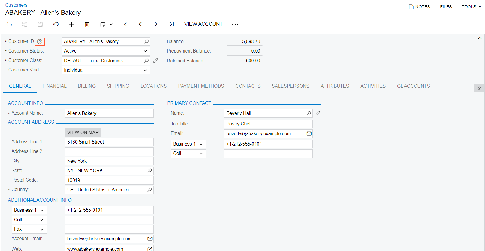
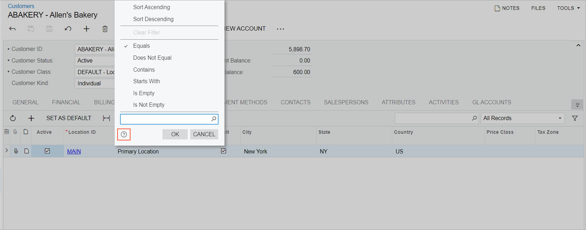
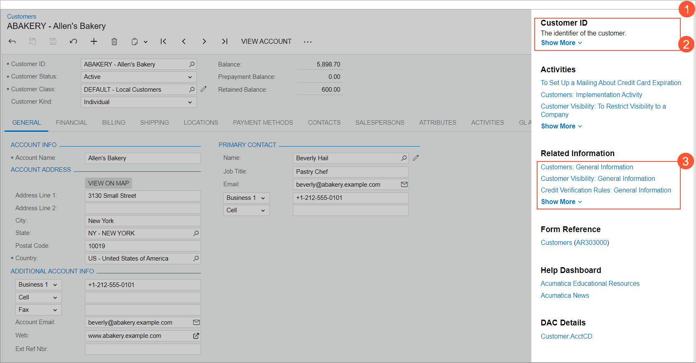

# Built-In Infotips {#_d3770cf7-fac2-4690-86af-e916c6a20fb2 .concept}

Acumatica ERP offers context-sensitive Help infotips to give you an on-the-spot description of a UI element, along with additional sources of information related to the element, while you are viewing a form. This reduces the need to leave the current form to search for information separately.

You can view infotips for boxes, check boxes, and option buttons of most forms, as well as for the columns of tables on these forms. \(See the *Infotip Limitations* section of this topic for details.\)

## Infotip Access {#section_ndr_sm3_tyb .section}

You access a particular infotip by hovering over the box, check box, or option button label and clicking the question mark that appears. The system opens an infotip, which is a pane with the description of the UI element and links to related Help topics.

The following screenshot shows the question mark icon that appears when you hover over the **Customer ID** box.

You access the infotip for a table column slightly differently. You first click the column name, which opens the Sorting and Filtering Settings dialog box. You then click the question mark icon in the bottom left corner of the dialog box \(as the following screenshot shows\).

## Infotip Usage {#section_wcc_32g_45b .section}

When you click the question mark icon for an element, the system opens the infotip: a pane that partially overlaps the working area of the screen \(see Item 1 in the following screenshot\). The infotip pane displays the description of the UI element and the following sections:

-   **Activities**: A list of how-to Help topics with configuration or process activities that may be performed on the current form
-   **Related Information**: A list of Help topics that contain conceptual information related to the functionality of the current form
-   **Form Reference**: A link to the Help topic that has descriptions of the current form's UI elements
-   **Help Dashboard**: Links to the Acumatica*Educational Resources* dashboard \(Help portal\) and to the Acumatica ERP news and announcements page
-   **DAC Details**: A link to the corresponding DAC in the DAC Schema Browser

    **Note:** This section is available only for users with at least one of the following user roles: *Administrator*, *Report Designer*, and *Customizer*.

If an element's description is long, the *Show More* link \(Item 2\) is displayed. When you click *Show More*, the full text of the description is shown. If any of the sections below the description has more than three links, the section shows the first three links, followed by the *Show More* link \(Item 3\).

To close the pane, you click anywhere on the form.

## Infotip Limitations {#section_ytr_155_h5b .section}

Currently, infotips are not shown for the following elements:

-   The names of tabs on a form
-   Elements on the form title bar, form toolbar, and table toolbar
-   Form-specific commands displayed on the More menu
-   Dialog boxes or elements within them

Also, infotips are not supported for Acumatica ERP forms that are inquiry forms, generic inquiry forms, report forms, or ARM reports.

**Parent topic:**[Acumatica ERP User Interface](../InterfaceGuide/UIG__con_New_UI.md)

