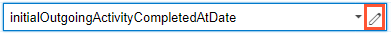

# Formula Boxes {#_2f620c8d-dc0a-4ad7-9390-68fb4db848da .concept}

Formula boxes are used to enter formula, as shown on the screenshot below.

To enter a formula, you can click the Edit button to open the Formula Editor dialog box and construct a formula. For more information, see [Formulas](../UserGuide/CS__ARM_Formulas.md).

**Parent topic:**[Form Elements](../InterfaceGuide/Form_Fields.md)

