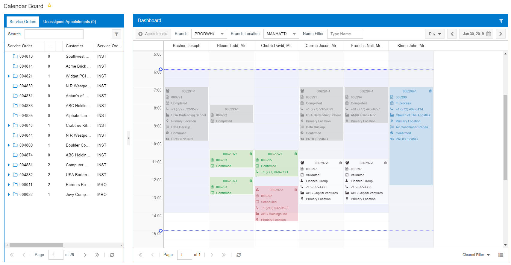
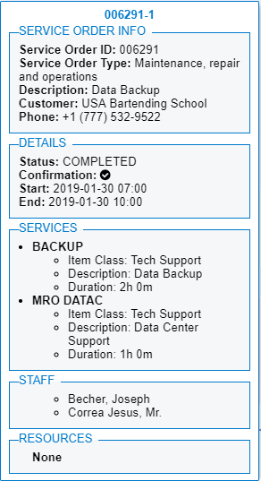

# Appointments on the Calendar Boards {#_fe470aa1-09af-4ab8-b922-be587a89908c .concept}

On a dashboard, you can view the existing appointments for a particular day in the selected time range \(see the screenshot below\), as well as perform actions on appointments.

## Appointments { .section}

The color of an appointment box depends on the status of the appointment and the configuration of the calendar. On the [Calendar Preferences](../UserGuide/FS_10_05_00.md) \(FS100500\) form, you can specify the background color and the color of the text to be used for appointment boxes with specific statuses on calendar boards.

In the box that displays the appointment, key data fields are shown along with icons indicating the data. You can modify the number of fields that will be displayed in the appointment boxes. You also can change the default order of these fields in the box. Additionally, you can select any icon to be displayed next to each field in the box.

The key fields and default icons as summarized in the following table.

|Element|Icon|Description|
|-------|----|-----------|
|**SO Ref. Nbr.**||The reference number of the service order associated with the appointment.|
|**Customer Name**||The name of the customer.|
|**Contact Name**||The name of the customer contact.|
|**Customer Location**||The location where the appointment takes place.|
|**Room**||The identifier of the room where the internal appointment takes place.|
|**Contact**||The customer's contact phone number.|
|**First Service**||The first service to be performed in the appointment.|
|**Confirmed**||The indicator that the appointment has been confirmed with the associated customer.|
|**Not Confirmed**||The indicator that the appointment has not been confirmed with the associated customer.|
|**Staff Members**||The indicator that multiple staff members have been assigned to the appointment.|
|**Status**||The status of the appointment.|
|**Workflow Stage**||The workflow stage of the appointment.|
|**Trash**||A button that you click to delete the appointment.|
|**Warning**||The indicator that the appointment has a warning. You can point at the icon to view information.|

## Appointment Actions { .section}

You can do the following on the dashboard:

-   Create a new appointment
-   Move an appointment
-   Change the duration of an appointment
-   Delete an appointment

You can also use the Appointment Actions menu to edit, clone, validate, or confirm a particular appointment. To open the Appointment Actions menu for the appointment, you right-click the appointment. The menu appears with the menu commands described in the following table.

|Element|Description|
|-------|-----------|
|**OK/Unconfirm**|Confirms or removes the confirmation of the selected appointment with the customer. The color of the appointment box changes based on the confirmation status.|
|**Validate by Dispatcher/Clear Validation**|Validates the selected appointment or removes the validation from the selected appointment.|
|**Unassign**|Removes a staff member from the appointment and moves the appointment to the **Unassigned** row on the calendar board.|
|**Clone**|Opens the [Clone Appointments](../Shared/../UserGuide/FS_50_02_01.md) \(FS500201\) form, where you can create a cloned copy of the selected appointment.|
|**Delete**|Deletes the appointment from the system.|

## Appointment Details { .section}

You can also view the details of a particular appointment by double-clicking the appointment. The appointment details, shown in the following screenshot, appear right of the appointment.

**Parent topic:**[Calendar Dashboards](../InterfaceGuide/UIG__CON_Calendar_Dashboards.md)

