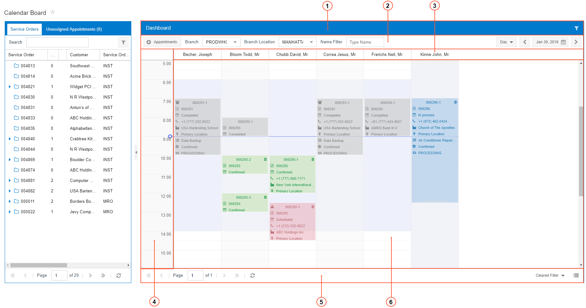
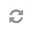
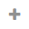
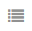
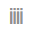
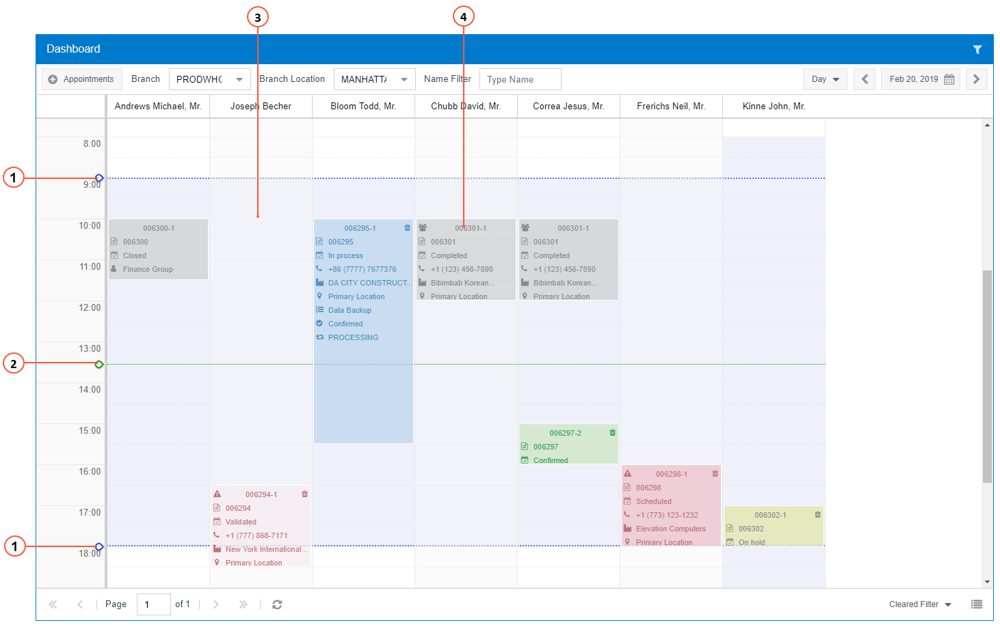

# Calendar Dashboards {#_47b393cd-3fff-4af5-a66e-ab7c0e9ebdff .concept}

On the calendar boards, the dashboards provide information in a calendar format where users can manage appointments and staff members' schedules in time. The following screenshot of the [Calendar Board](../UserGuide/FS_30_03_00.md) \(FS300300\) shows the main parts of a dashboard.

The dashboard on a calendar board includes the following parts:

1.  Dashboard Title Bar: A bar that contains form-specific elements that you can use to filter the dashboard information
2.  Dashboard Toolbar: A bar above the dashboard content that contains standard and form-specific elements that you can use to tailor the dashboard information
3.  Horizontal Axis: A part of the dashboard that defines the horizontal attribute for the dashboard content
4.  Vertical Axis: A part of the dashboard that defines the vertical attribute for the dashboard content
5.  Dashboard Footer: A bar below the dashboard content that displays navigation buttons, the View Mode button, and time resolution slider
6.  Dashboard: The content of the dashboard, which consists of an interactive calendar you can work with to schedule appointments, staff members, and rooms

## Dashboard Title Bar { .section}

The dashboard title bar is located on the top of the dashboard. This bar can contain the **Filter** and **Clear Filter** buttons, which are described in following the table.

|Button|Icon|Description|
|------|----|-----------|
|**Filter**||Opens the **Staff Filters** dialog box, which can be used to define a new filter. When you apply the filter and exit the dialog box, the information on the dashboard is updated.|
|**Clear Filter**||Clears the filter settings.

 This button appears on the dashboard only if a filter has been applied to the dashboard.

|

## Dashboard Toolbar {#_9cb2042e-7912-4c9a-b033-726e7d9f422d .section}

The dashboard toolbar is located in the upper part of the dashboard. The toolbar can contain standard and form-specific elements. If a dashboard toolbar includes specific elements, they are described in the relevant form reference topic.

The following table describes the standard dashboard buttons. A dashboard toolbar may include some or all of these buttons.

|Button|Icon|Description|
|------|----|-----------|
|**Previous Day or Date Range**||Shows the dashboard the day before the date indicated on the Day button \(if you are viewing a day\), a week before the date range indicated on the Date Range button \(if you are viewing a week\), or a month before the date range indicated on the Date Range button \(if you are viewing a month\).|
|**Date or Date Range**| |Displays a particular date of the dashboard if you are viewing a day, or a particular date range if you are viewing a week or month on the calendar. To manually change the date, click this button and change the date in the Calendar dialog box. For details, see [Calendar Dialog Box](UIG__CON_Calendar_Dialog_Box.md).|
|**Next Day or Date Range**||Shows the dashboard the day after the date indicated on the Day button \(if you are viewing a day\), a week after the date range indicated on the Date Range button \(if you are viewing a week\), or a month after the date range indicated on the Date Range button \(if you are viewing a month\).|

## Horizontal Axis {#_0a8d444f-d672-4b66-b742-ba63ec9c255e .section}

On the [Calendar Board](../UserGuide/FS_30_03_00.md) \(FS300300\) and [Room Calendar Board](../UserGuide/FS_30_07_00.md) \(FS300700\) forms, which have multiple view modes, in the *Vertical* view mode, on the horizontal axis of the dashboard, staff members and rooms are shown, respectively. In the *Horizontal* view mode, times are shown on the horizontal axis.

**Tip:** For the [Calendar Board](../UserGuide/FS_30_03_00.md) and [Room Calendar Board](../UserGuide/FS_30_07_00.md) forms, you can set the default view mode that a user sees upon opening a calendar in the **View Mode** box on the **Calendars and Maps** tab of the [Service Management Preferences](../UserGuide/FS_10_01_00.md) \(FS100100\) form.

On the [Staff Calendar Board](../UserGuide/FS_30_04_00.md) \(FS300400\) and [Staff Working Schedule Board](../UserGuide/FS_30_05_00.md) \(FS300500\) forms, dates are shown on the horizontal axis of the dashboard.

## Vertical Axis {#_dd78711c-9d01-476a-b72d-0770a79640b8 .section}

On the [Calendar Board](../UserGuide/FS_30_03_00.md) \(FS300300\) and [Room Calendar Board](../UserGuide/FS_30_07_00.md) \(FS300700\) forms, which have multiple view modes, in the *Horizontal* view mode, on the vertical axis of the dashboard, staff members and rooms are shown, respectively. In the *Vertical* view mode, times are shown on the vertical axis.

**Tip:** For the [Calendar Board](../UserGuide/FS_30_03_00.md) and [Room Calendar Board](../UserGuide/FS_30_07_00.md) forms, you can set the default view mode that a user sees upon opening a calendar in the **View Mode** box on the **Calendars and Maps** tab of the [Service Management Preferences](../UserGuide/FS_10_01_00.md) \(FS100100\) form.

On the [Staff Calendar Board](../UserGuide/FS_30_04_00.md) \(FS300400\) and [Staff Working Schedule Board](../UserGuide/FS_30_05_00.md) \(FS300500\) forms, times are shown on the vertical axis of the dashboard.

## Dashboard Footer {#_44397b66-941d-4853-a9b4-48ed4921fd58 .section}

The [Calendar Board](../UserGuide/FS_30_03_00.md) \(FS300300\) and [Room Calendar Board](../UserGuide/FS_30_07_00.md) \(FS300700\) forms have a dashboard footer. You use the elements of the footer to browse the dashboard pages \(if there are too many details to fit on one page\), to change the view mode of the dashboard, and to change the time intervals of the dashboard.

|Element|Icon|Description|
|-------|----|-----------|
|**First Page**||A button you click to display the first page of the dashboard details.|
|**Previous Page**||A button you click to display the previous page of the dashboard details.|
|**Page _N_ of _M_**| |A box that contains the current page \(*N*\) of the total pages of the dashboard details \(*M*\). You can manually indicate the page to which you want to navigate by typing in the*N* box.|
|**Next Page**||A button you click to display the next page of the dashboard details.|
|**Last Page**||A button you click to display the last page of the dashboard details.|
|**Refresh**||A button you click to refresh the dashboard content.|
|**Time Filter**| |An option that indicates which time filter \(if any\) is applied to the dashboard to limit the days and times shown. You can change the option manually; the following options are available:

 -   *Cleared Filter*: No time filter is applied to the dashboard. That is, the dashboard shows information for 24 hours of each day of the date range selected on the dashboard toolbar.
-   *Working Time*: The dashboard shows information from the start time to the end time of working hours for each day of the date range selected on the dashboard toolbar.

The start time and end time of working hours related to field services are specified in the **Day Start Time** and **Day End Time** boxes on the **Calendars and Maps** tab of the [Service Management Preferences](../UserGuide/FS_10_01_00.md) \(FS100100\) form.

-   *Weekdays*: The dashboard shows information for 24 hours from Mondays to Fridays for the date range selected on the dashboard toolbar.
-   *Working Time and Weekdays*: The dashboard shows information for working hours from Mondays to Fridays for the date range selected on the dashboard toolbar.

The start time and end time of working hours related to field services are specified in the **Day Start Time** and **Day End Time** boxes on the **Calendars and Maps** tab of the [Service Management Preferences](../UserGuide/FS_10_01_00.md) form.

-   *Booked Days*: The dashboard shows the days to which at least one appointment is assigned for the displayed staff members during the the date range selected on the dashboard toolbar; for each day, it shows only the time interval to which at least one appointment is assigned.

 By default, the filter selected in the **Time Filter** box on the **Calendars and Maps** tab of the [Service Management Preferences](../UserGuide/FS_10_01_00.md) form is selected.

|
|**Minus**||A button that you click to reduce the time resolution on the calendar board. When you click this button, the system increases the time interval of each time slot. For instance, if each time slot represents a one-hour interval \(such as 9:00 to 10:00\) and you click this button once, each time slot will represent a two-hour interval \(such as 8:00 to 10:00\).

 This button appears on the dashboard only in the *Horizontal* view mode.

|
|**Time Resolution**| |A slider that you move to change the time resolution of the calendar board. When you move the slider to the left, the system increases the time interval of each time slot. When you move the slider to the right, the system reduces the time interval of each time slot.

 This slider appears on the dashboard only in the *Horizontal* view mode.

|
|**Plus**||A button that you click to increase the time resolution on the calendar board. When you click this button, the system reduces the time interval of each time slot. For instance, if each time slot represents a one-hour interval \(such as 9:00 to 10:00\) and you click this button once, each time slot will represent a 15-minute interval \(such as 10:00 to 10:15\).

 This button appears on the dashboard only in the *Horizontal* view mode.

|
|**Horizontal View Mode**||Changes the orientation of the dashboard to horizontal.

 This button is displayed on the dashboard in the *Vertical* view mode.

|
|**Vertical View Mode**||Changes the orientation of the dashboard to vertical.

 This button is displayed on the dashboard in the *Horizontal* view mode.

|

## Dashboard Content {#_70d5660b-4ed7-40fb-9b0d-92eb25756ed2 .section}

On the dashboard you can see the appointments scheduled for the selected date or date range, the working hours, and the current time. You can use this area to reschedule existing appointments or create new ones.

The dashboard content includes the following elements:

1.  Blue guides: Horizontal or vertical \(depending on the orientation of the dashboard\) lines that represent the start and end times of the working calendar selected in the **Work Calendar** box on the **Calendars and Maps** tab of the [Service Management Preferences](../UserGuide/FS_10_01_00.md) \(FS100100\) form.
2.  Green guide: A horizontal or vertical \(depending on the orientation of the dashboard\) line that indicates the current time.
3.  Staff working schedule: A series of boxes that represent the staff working schedule. The color of the box depends on the availability. If the color is blue, the staff member is available; if the color is red, the staff member is unavailable.
4.  *Appointment*: A shaded box that represents a scheduled appointment and its time range. For details about appointments, see [Appointments on the Calendar Boards](UIG__CON_Appointments_on_Calendars.md).
5.  *Watch Icon*: An icon that appears when you move the cursor through the dashboard and shows the time at which cursor is pointing.

-   **[Appointments on the Calendar Boards](../InterfaceGuide/UIG__CON_Appointments_on_Calendars.md)**  

**Parent topic:**[Calendar Boards and Maps](../InterfaceGuide/Calendars_and_Maps.md)

