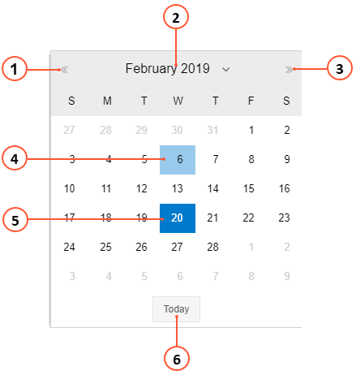
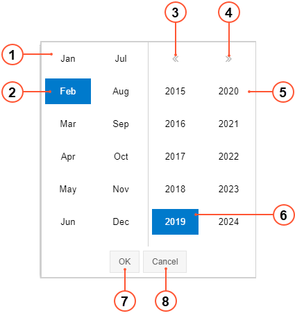

# Calendar Dialog Box {#_e4b875d1-b82e-4059-a4ab-b89200f95aab .concept}

The Calendar dialog box, which appears when you click a date on a calendar or map form, displays the calendar page of the month of the selected date, as shown in the following screenshot. You can use the Calendar dialog box to select the new date, which will appear under the **Date** or **Date Range** box. For details, see [To Select a Date on a Calendar Board or Map by Using the Calendar Dialog Box](UIG__HOW_To_Select_Date_on_CalendarMap.md).

1.  Previous Month button
2.  Selected Month and Year button
3.  Next Month button
4.  Current date
5.  Selected date
6.  **Today** button

If you click the Selected Month and Year button \(see 3 in the screenshot above\), the Month and Year dialog box appears \(see the screenshot below\), in which you can select the month and the year for which information will be displayed on the calendar or map.

1.  Month area
2.  Selected month
3.  Previous year
4.  Next year
5.  Year area
6.  Selected year
7.  **OK** button
8.  **Cancel** button

**Parent topic:**[Calendar and Map Elements](../InterfaceGuide/UIG__CON_Calendars_and_Maps_Elements.md)

