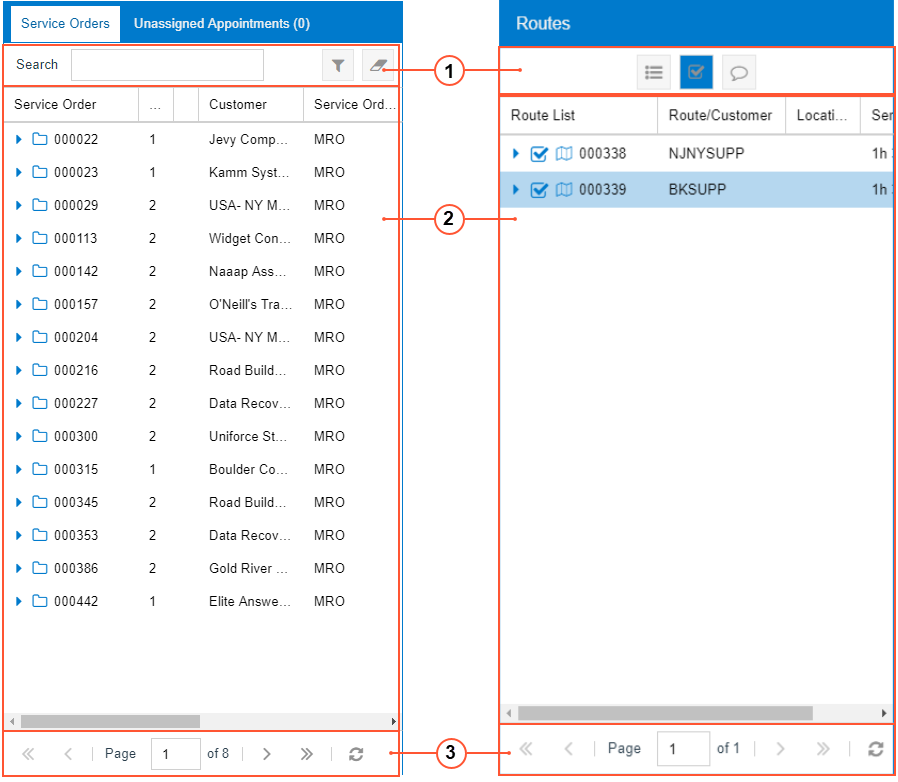
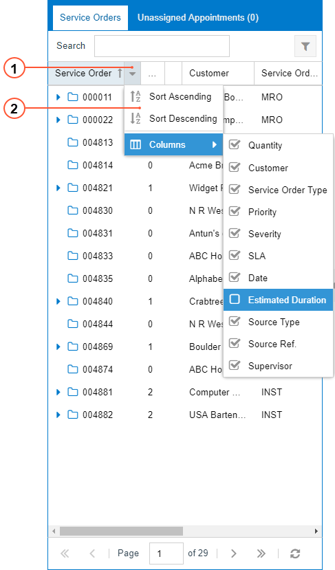
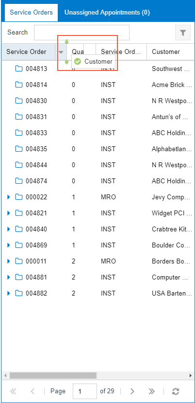

# Calendar Board and Map Tables {#_270796a9-7d32-47a9-9ce3-cd8a0a4b69f8 .concept}

Tabs and panes on the calendar boards and maps contain tables on the calendar boards and maps display relevant objects or details in each row and a key setting of the object or detail in each column. The forms provide interaction between the tables and the calendar or map \(such as when a service order is dragged to the appropriate day and time on the calendar\).

The table toolbar may have elements \(boxes and buttons\) you can use to filter the information that is displayed in the table. Also, the table footer may have navigation elements you can use if not all table rows can be viewed at the same time.

The following screenshot show examples of tables and their toolbars. The left table shows a list of service orders \(which spans multiple pages, as the table footer illustrates\), and the right lists routes.

1.  Table toolbar
2.  Table
3.  Footer

## Calendar and Map Table Toolbars {#_1ba8e708-1c86-4f61-95e8-14c96a94a9c8 .section}

A table toolbar, which contains standard elements and may contain elements specific to the table, is located above the table.

See below for a description of the standard table toolbar element on forms with calendar boards.

|Button|Icon|Description|
|------|----|-----------|
|**Search**|-|A box in which you can type multiple words or a part of a word to direct the system to search through the records in the table. As you type, the system filters the contents of the table accordingly.|

See below for descriptions of the standard table toolbar elements on forms with maps.

|Button|Icon|Description|
|------|----|-----------|
|**Expand All Routes**||A toggle button you click to turn on the expansion of all the routes listed in the table for staff members \(causing the button to be shaded\). If you click the button again, this expansion is turned off \(and the button is no longer shaded\).|
|**Show All Appointments**||A toggle button you click to turn on the display of all appointments on the map, selecting all the check boxes in the **Route List** column and causing the button to be shaded. If you click the button again, the system clears all the check boxes in the table so that all appointments are hidden on the map \(and the button is no longer shaded\).|
|**Show All Appointments Info on the Map**||A toggle button you click to turn on the display of appointment information on the map. The following information is shown: the identifier of the staff member assigned, and the number of the appointment. If you click the button again, this display of appointment information is turned off \(and the button is no longer shaded\).|
|**Show Suggested Route on Map**||A toggle button you click to turn on the display of the routes suggested by Azure Maps for all staff members and appointments selected in the **Staff** pane. If the user clicks the button again, the display of suggested routes is turned off.|
|**Show All Devices on Map**||A toggle button you click to turn on the display of the most recent staff member locations \(that is, the Driver Location icons\) on the map. If you click the button again, this display of appointment information is turned off \(and the button is no longer shaded|

## Calendar and Map Table Footer {#_44397b66-941d-4853-a9b4-48ed4921fd58 .section}

You use the elements of the table footer to browse the pages of the particular table, if there are too many table rows to fit on one page.

|Element|Icon|Description|
|-------|----|-----------|
|**First Page**||Displays the first page of the table.|
|**Previous Page**||Displays the previous page of the table.|
|**Page _N_ of _M_**|-|Indicates the current page \(*N*\) out of the total pages in the table \(*M*\). You can manually indicate the page by typing in the *N* box.|
|**Next Page**||Displays the next page of the table.|
|**Last Page**||Displays the last page of the table.|
|**Refresh**||Refreshes the table content.|

## Modification of the Layout of Tables { .section}

To modify the table columns, you use the Column Configuration dialog box \(see the screenshot below\). You can make the following changes:

-   Hide or display columns in the table \(for details, see [To Hide or Display Columns in a Table of a Calendar Board or Map](UIG__HOW_To_Hide_Display_Column.md)\)
-   Sort records in a particular table \(as described in [To Sort Table Rows Based on a Column](UIG__HOW_To_Sort_Columns.md)\)

To open the Column Configuration dialog box, click the Column Configuration button \(the arrow right of each column\), as shown in the following screenshot.

1.  Column Configuration button
2.  Column Configuration dialog box

The elements in the Column Configuration dialog box are described below.

|Element|Description|
|-------|-----------|
|**Sort Ascending**|Sorts the records based on the values in this column: from the lowest value to the highest value.|
|**Sort Descending**|Sorts the records based on the values in this column: from the highest value to the lowest value.|
|**Columns**|Opens the list of the table columns, where selected check boxes indicate columns to be displayed in the table.|

In each table, you can also change the width and order of columns. To change the width, Move the pointer over the column split line \(the line dividing two columns\). When the pointer becomes a double-headed arrow, drag the pointer left or right to move the line. To change the order of the columns, drag the column header to the desired position. Note the arrows that indicate the exact position where the column can be dropped \(see the screenshot below\).

**Parent topic:**[Calendar and Map Elements](../InterfaceGuide/UIG__CON_Calendars_and_Maps_Elements.md)

