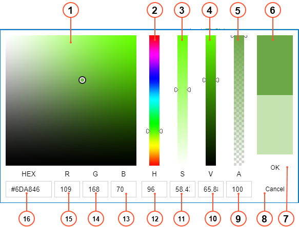

# Color Picker Dialog Box {#_cc4dbc77-a8bb-488e-b363-e9e28638e4f5 .concept}

You use the Color Picker dialog box to specify, select, and save a color. The dialog box appears when you click and open any color box in the **Background Color** or **Text Color** box on the [Calendar Preferences](../UserGuide/FS_10_05_00.md) \(FS100500\) form. This dialog box displays the color page for the selected color, as shown in the screenshot below.

1.  Color Picker area: You can click in the necessary area to select the necessary color. The circle shows the currently selected color.
2.  Hue slider: You can move the slider to select the necessary hue of the color.
3.  Saturation slider: You can move the slider to select the necessary saturation of the color.
4.  Value slider: You can move the slider to select the necessary lightness or darkness of the color.
5.  Alpha slider: You can move the slider to select the necessary transparency of the color.
6.  Color Preview box: In the upper half of the box, you can view the currently selected color and compare it with the previously selected color in the lower half of the box.
7.  **OK** button: You click it to select the color and close the color picker.
8.  **Cancel** button: You click it to close the color picker without making any changes.
9.  Alpha value box: You can view or set the numeric value of transparency of the color.
10. Value value box: You can view or set the numeric value of lightness or darkness of the color.
11. Saturation slider: You can view or set the numeric value of saturation of the color.
12. Hue slider: You can view or set the numeric value of hue of the color.
13. Blue color box: You can view or set the numeric value of blue component of the color in RGB color format.
14. Green color box: You can view or set the numeric value of green component of the color in RGB color format.
15. Red color box: You can view or set the numeric value of red component of the color in RGB color format.
16. RGB color box: You can view or set the hexadecimal number of the color in RGB color format.

**Parent topic:**[Calendar Boards and Maps](../InterfaceGuide/Calendars_and_Maps.md)

