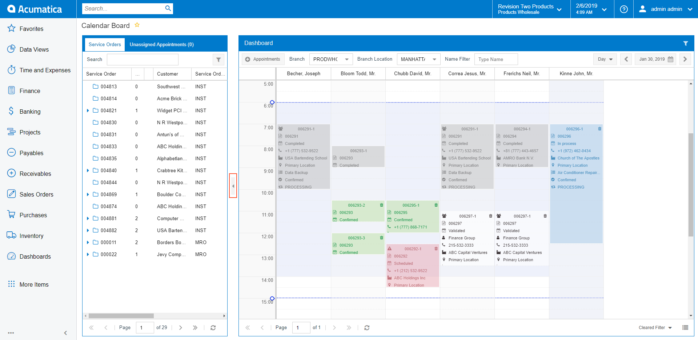
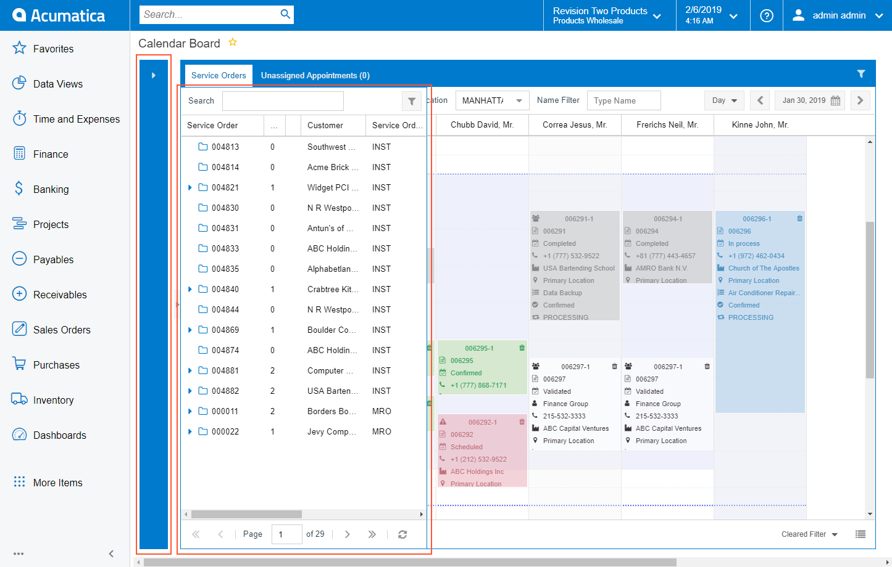
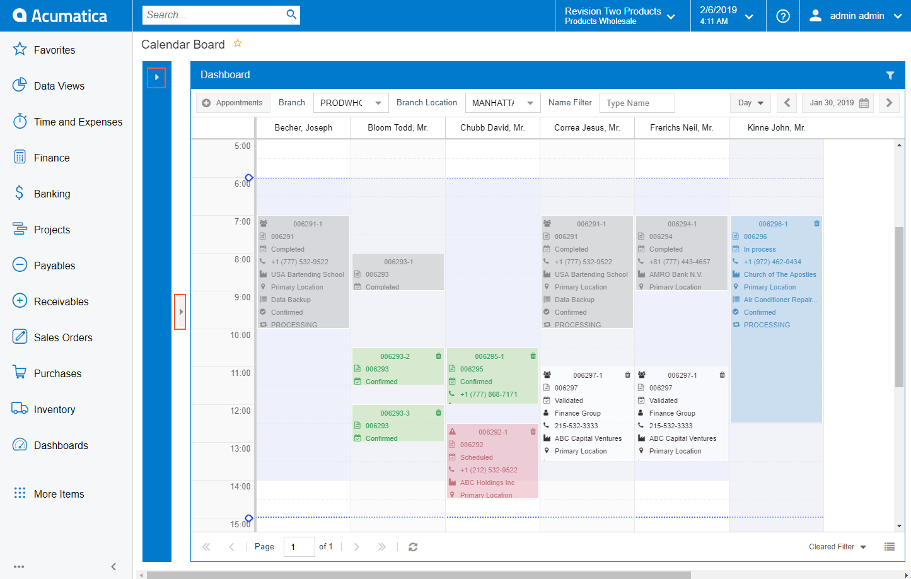

# Hide Button {#_488ba7f1-8140-457e-9846-d36fdb8cb83e .concept}

You can hide the Service Order and Unassigned Appointment pane on calendar boards; on maps, you can hide the pane listing appointments \(**Staff** or **Routes**\) and the pane with route information \(initially named **Route Information**\).

To hide a pane on a calendar or map, you click the Hide button \(that is, the arrow located right of the pane\), shown in the following screenshot.

If the pane is hidden, the rectangle is displayed to the right from the pane \(see the screenshot below\). You can make the system temporarily display the hidden pane by clicking the rectangle. The pane appears as shown in the following screenshot. \(If you click the rectangle again, the system removes this temporarily displayed pane.\)

To display the pane on the calendar or map again, you click the arrow at the top of the rectangle or the arrow right of the rectangle, as shown in the screenshot below.

On maps, similar button hides the **Appointment Information** pane, which is placed above the pane.

**Parent topic:**[Calendar and Map Elements](../InterfaceGuide/UIG__CON_Calendars_and_Maps_Elements.md)

