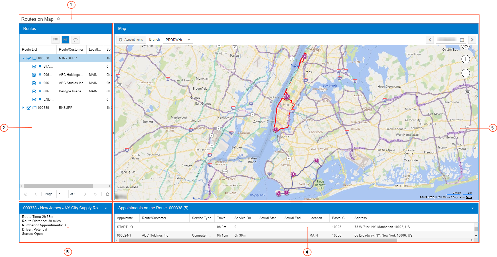

# Parts of a Map {#_3aaa2573-6d2a-4c6f-be8b-65950ccad05d .concept}

An Acumatica ERP form with a map consists of several basic parts. The following screenshot shows a typical Acumatica ERP form with the parts of a map on it.

1.  Form title bar
2.  Pane with appointments \(**Routes** or **Staff**\)
3.  Map pane
4.  Route Information pane
5.  Appointment Information pane

## Form Title Bar { .section}

This bar includes the title of the map.

## Pane with Appointments { .section}

This pane displays the list of appointments for a particular branch and a particular day, grouped by the staff member assigned to them or grouped by the route execution they are related to.

**Note:** This pane is named either **Staff** or **Routes**, depending on the particular map form and its contents.

You can hide this pane by clicking on the arrow right of the pane. For details, see [Hide Button](UIG__CON_Hide_Button.md).

## Map Pane {#_c5032161-3f1d-436c-aed5-2685d3dd988c .section}

The map pane contains the map area and the map toolbar. The map area displays the appointments of the selected day on an Azure map, filtered by the staff member or the route execution selected on the **Staff** or **Routes** tab.

The map toolbar can contain standard and form-specific elements. If a map toolbar includes specific elements, they are described in the relevant form reference topic. The following table describes the standard map buttons that may be found on a particular map toolbar.

|Button|Icon|Description|
|------|----|-----------|
|**Appointments**| |Opens the [Appointments](../UserGuide/FS_30_02_00.md) \(FS300200\) form, where you can create a new appointment.

 To create an appointment by using this button, a default service order type has to be specified on the [User Profile](../UserGuide/SM_20_30_10.md#) form or on the [Service Management Preferences](../UserGuide/FS_10_01_00.md) \(FS100100\) form.

|
|**Previous Day or Date Range**||Shows the map the day before the date indicated on the Day button \(if you are viewing a day\), a week before the date range indicated on the Date Range button \(if you are viewing a week\), or a month before the date range indicated on the Date Range button \(if you are viewing a month\).|
|**Date or Date Range**| |Displays the map for a particular date on the calendar. To manually change the date, click this button and change the date in the Calendar dialog box.

 For details, see [Calendar Dialog Box](UIG__CON_Calendar_Dialog_Box.md).

|
|**Next Day or Date Range**||Shows the map the day after the date indicated on the Day button \(if you are viewing a day\), a week after the date range indicated on the Date Range button \(if you are viewing a week\), or a month after the date range indicated on the Date Range button \(if you are viewing a month\).|

## Route Information Pane { .section}

On this pane, for the staff member or route execution you have selected in the pane with appointments \(**Staff** or **Routes**\), you can view data about the route, such as the route duration, distance, and number of appointments.

**Note:** The name of this pane is initially **Route Information**, and the pane contains no data. When you select a staff member or route execution, the system changes the name of the pane to reflect its contents.

You can hide this pane by clicking on the arrow right of the pane. For details, see [Hide Button](UIG__CON_Hide_Button.md).

## Appointment Information Pane { .section}

On this pane, you can view data \(such as appointment number, related customer, duration, and address\) on each appointment on the route of the staff member or route you have selected in the pane listing appointments \(**Staff** or **Routes**\). You have to select a staff member or a route execution to view this data.

**Note:** The name of this pane is initially **Appointment Information**, and the pane contains no data. When you select a staff member or route, the system changes the name of the pane to reflect its contents.

**Parent topic:**[Calendar Boards and Maps](../InterfaceGuide/Calendars_and_Maps.md)

