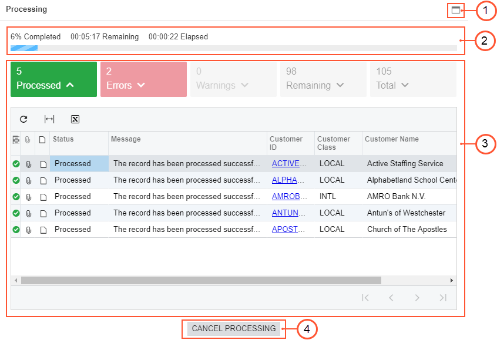
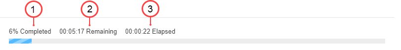
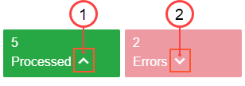
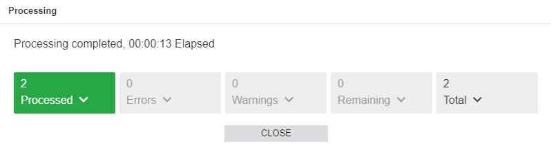
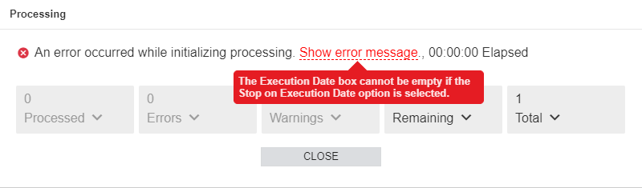
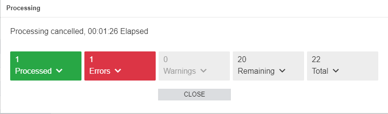

# Processing Pop-Up Window {#_6cf5a20d-1ada-4105-9ea6-4a60d3499029 .concept}

In Acumatica ERP, each form designed for the mass processing of data records displays the **Processing** pop-up window. This window provides the details of the process you are running in the system. The **Processing** pop-up window appears when you invoke the processing; you close the window manually. It consists of a process bar, tabs with statuses, and a table with details, as shown in the following screenshot.

1.  Maximize/Minimize button: You use this button to enlarge the pop-up window to the size of the form from which you invoked processing or to minimize the pop-up window if it has already been enlarged.
2.  Progress area: You use this area to see the progress of the process you are running in the system. It contains three measurements: the percentage of records that have been processed, the remaining time, and the elapsed time.
3.  Tabs area: You use these tabs to see the status of the records you are processing. This area contains tab tiles and tab details.
4.  **Cancel Processing** button: You click this button to stop the processing now.

## Progress Area { .section}

When you run the processing of any data records \(that is, documents or entities\), you can see what percentage of the data records have already been processed, how much time remains in the processing, and how much time has elapsed.

1.  Completed: Displays the percentage of records that have been processed.
2.  Remaining: Displays the time remaining until the process finishes running. The remaining time is displayed in the following time format: *hh:mm:ss*.
3.  Elapsed: Displays the time that the process takes. The elapsed time is displayed in the following time format: *hh:mm:ss*.

## Tabs Area { .section}

You use this area to view the details of the process you are running. In the Tabs area, you can see the following tabs:

-   **Processed**: Lists all the successfully processed records
-   **Errors**: Lists all the records that were processed with errors
-   **Warnings**: Lists all the records that were processed with warnings
-   **Remaining**: Lists all the remaining records to be processed
-   **Total**: Lists all the records included in the processing \(those that have been processed successfully, those for which warnings or errors have occurred, and those that need to be processed\)

By default, these tabs are closed. You can expand each of these tabs to open the details of the processed documents. In the following screenshot, the **Processed** tab is expanded \(1\), and the **Errors** tab is closed \(2\).

When you open any tab, the system displays a table with a list of processed records. The records in the lists of the tabs may have links. If you click a link in the list, the system opens the related record on the appropriate form in a new browser tab.

## The Results of Processing and Cancellation { .section}

When the processing of the records finishes, the system displays the results of the processing, whether it has been successful or unsuccessful. The following screenshot shows the **Processing** pop-up window when the processing has been successful.

The progress area informs you that the processing of the records has been completed and displays the time this process has taken. If the overall process was successful but there are some errors or warnings in the records, the system displays the *Process completed with errors* or *Process completed with warnings* message, respectively. The Tabs area sorts the records by statuses and provides details of these records.

While the system is preparing the records for processing or processing of the records, if an error occurs that is not directly connected with any record, the system will stop the processing and display the following error: *An error occurred while initializing processing. Show error message*. To find out why processing failed, you can click the *Show error message* link in the error message. The system will display the error message, as illustrated in the following screenshot. Error messages are unique to each process.

If you need to stop the processing of the records, you can click the **Cancel Processing** button. When you click this button, the system opens the **Confirmation** dialog box, which asks you to confirm that you want to stop processing the records. If you click **Yes**, the system will prevent the processing of the remaining records, and the **Processing** pop-up window will have a similar appearance to that of the window displayed in the following screenshot.

**Parent topic:**[Forms](../InterfaceGuide/Forms.md)

