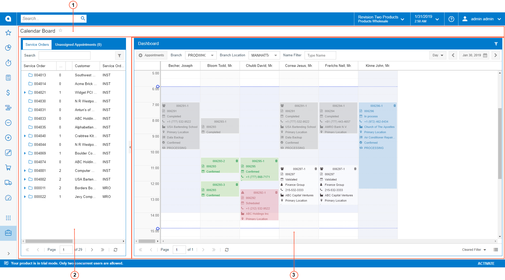

# Parts of a Calendar Board {#_13d98772-478b-4668-8c76-7b68524dabcf .concept}

Each Acumatica ERP calendar board consists of several basic parts. The following screenshot shows a typical Acumatica ERP form with the parts of a calendar board on it.

1.  Form title bar
2.  Service Orders and Unassigned Appointments pane
3.  Dashboard pane

## Form Title Bar { .section}

This bar includes the title of the specific calendar board.

## Service Order and Unassigned Appointment Pane { .section}

This pane contains the **Service Orders** and **Unassigned Appointments** tabs. You can drag any service order or appointment from these tabs to the needed time slot on the calendar to schedule an appointment. For more information, see [Service Order and Unassigned Appointments Pane](UIG__CON_ServiceOrder_and_UnassignedAppointment_Area.md).

## Dashboard Pane { .section}

This pane displays the events assigned to a specific staff member or to a specific room. The events can be either appointments or working schedule rules \(that is, the time area that indicates staff member's work times\), depending on the calendar board. For more information, see [Calendar Dashboards](UIG__CON_Calendar_Dashboards.md).

**Parent topic:**[Calendar Boards and Maps](../InterfaceGuide/Calendars_and_Maps.md)

