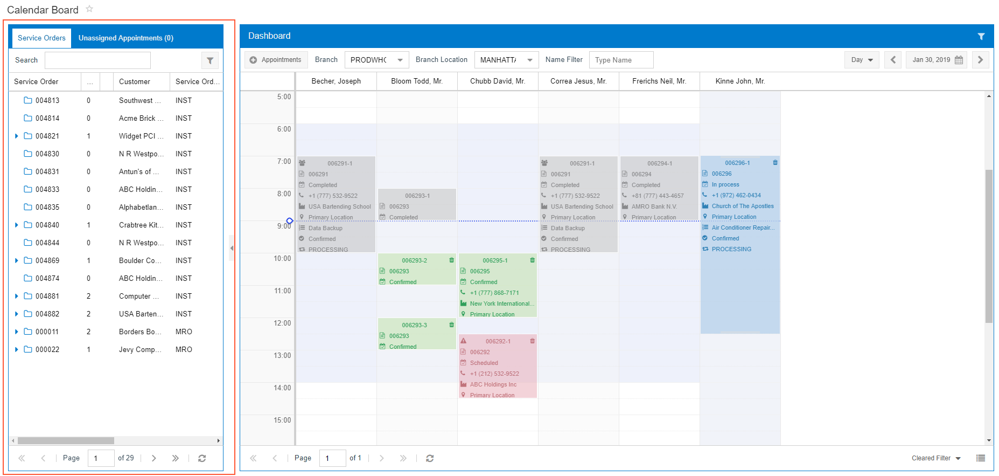
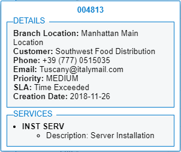

# Service Order and Unassigned Appointments Pane {#_643b2da4-59d5-4b69-b890-41f60f79e6d3 .concept}

The Service Order and Unassigned Appointments pane \(see the screenshot below\) is located in the left part of each calendar board. This pane contains the **Service Orders** and **Unassigned Appointments** tabs. These tabs consist of tables that list unassigned service orders and appointments, any of which can be dragged to the calendar to schedule the services included in the service order or appointment. For details on these tables, see [Calendar Board and Map Tables](UIG__CON_Calendar_Map_Tables.md).

The pane can be hidden by clicking the Hide button \(the arrow that is right of the pane\). For details, see [Hide Button](UIG__CON_Hide_Button.md).

## Viewing Details { .section}

If you double-click a row with a service order or appointment, the system displays key details of the service order \(shown in the following screenshot\) or appointment.

**Parent topic:**[Calendar Boards and Maps](../InterfaceGuide/Calendars_and_Maps.md)

