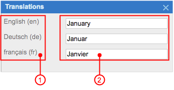

# Translations Dialog Box {#_29c5a338-6b62-49cf-85ec-bbc88a8eb833 .concept}

The **Translations** dialog box is a localization tool that you use to provide multiple translations for text that users enter in the text boxes of the system, as well as to view existing translations for the text. This dialog box is available for multiple text boxes in the system; these text boxes are listed in [Boxes That Have Multilanguage Support](../UserGuide/SM__CON_Boxes_MultiLanguage.md).

The **Translations** dialog box may contain one text box or multiple text boxes, with each box labeled with a language name, where you can enter translations, as shown in the screenshot below. You enter a translation or multiple translations, close the dialog box, and click **Save** on the form toolbar.

1.  Language labels
2.  Text boxes for entering translations

You can invoke the dialog box by clicking the link with an ISO code of a language next to a text box. Additionally, when you are editing a value in a cell \(of a table\) or a box that has multilanguage support, you can click `CTRL+SHIFT+L` to invoke the **Translations** dialog box.

The number of boxes in the **Translations** dialog box is defined by the number of languages that are used in localization of user input. For details, see [Locales and Languages](../UserGuide/SM__CON_Locales_and_Languages.md).

## The Order of the Languages in the Box {#_a8f85339-7996-465f-b4be-43ee1b833cb7 .section}

The order of the languages in the **Translations** dialog box depends on the locale you are currently logged in to. The system displays the languages of the boxes in the **Translations** dialog box in the following order:

1.  The language associated with a locale you are currently logged in to
2.  The language marked as the default on the [System Locales](../UserGuide/SM_20_05_50.md) \(SM200550\) form
3.  Alternative languages displayed in the sequence specified for them in the **Sequence** column on the [System Locales](../UserGuide/SM_20_05_50.md) form

The ISO code whose language is displayed as the link depends on the following factors:

-   Which locale you are currently logged in to
-   Whether there is a translation for the language associated with the locale
-   Whether there is a translation for the default language

The system determines which ISO code to display as follows:

1.  If a translation is available for the language associated with the locale to which the user is currently logged in, then the system does the following:
    -   Displays the translation in the text box that has multilanguage support
    -   Displays the ISO code of the language as a link that you can click to invoke the **Translations** dialog box
2.  If a translation for the locale language is not available, the system searches for a translation specified for the language marked as the default on the [System Locales](../UserGuide/SM_20_05_50.md) form. If a translation for the default language is available, the system does the following:
    -   Displays the default translation in the text box that has multilanguage support
    -   Displays the ISO code of the default language as a link that you can click to invoke the **Translations** dialog box
3.  If a translation for the default language is not available, the system searches for a translation specified for any language marked as an alternative on the [System Locales](../UserGuide/SM_20_05_50.md) form. If a translation for an alternative language is available, the system does the following:
    -   Displays the alternative translation in the text box that has multilanguage support
    -   Displays the ISO code of the corresponding alternative language as a link that you can click to invoke the **Translations** dialog box
4.  If there are no available translations, the system does the following:
    -   Displays no value in the text box that has multilanguage support
    -   Displays the ISO code of the language associated with the locale you are currently signed in with as a link that you can click to invoke the **Translations** dialog box

**Parent topic:**[Form Elements](../InterfaceGuide/Form_Fields.md)

